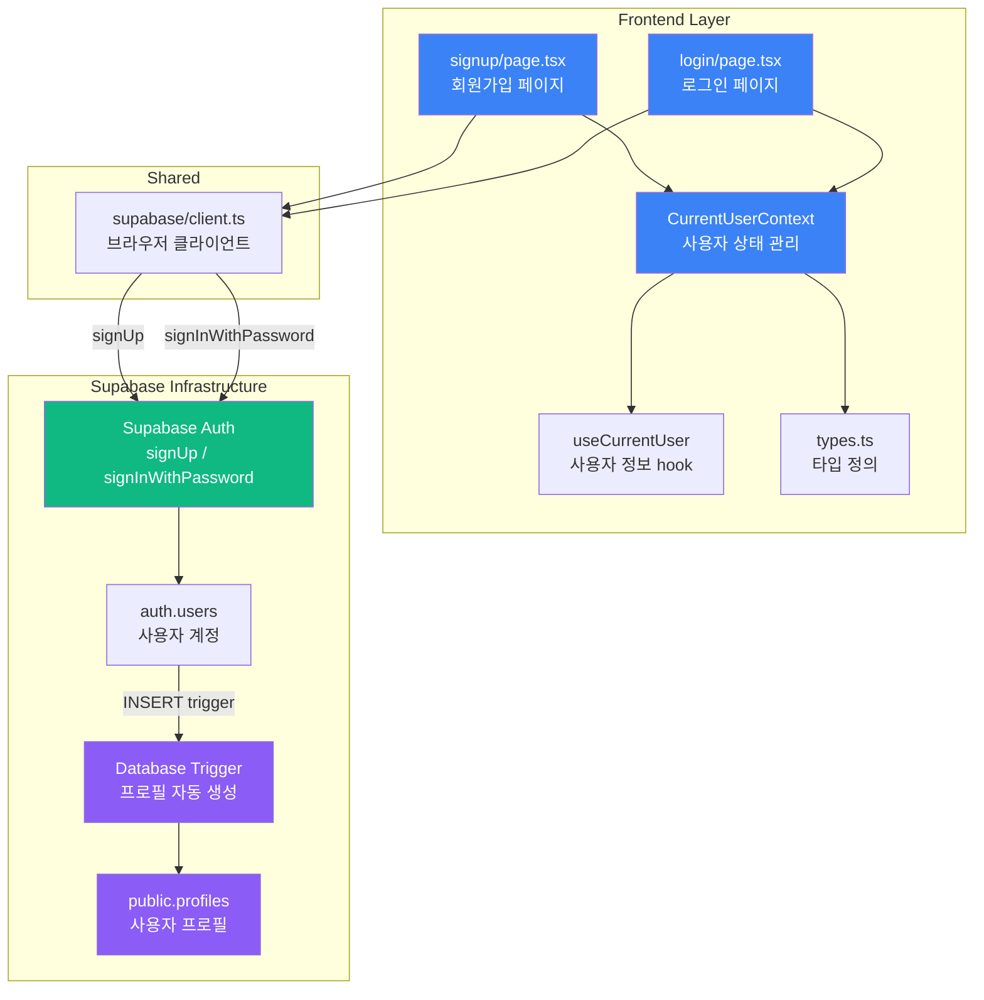

# UC-001: 인증 (회원가입 및 로그인) 기능 - 구현 계획

## 개요

UC-001 인증 기능은 Supabase Auth의 기본 기능을 활용하여 구현합니다. 별도의 백엔드 API를 구축하지 않고, Supabase Client SDK를 통해 직접 인증 로직을 처리하며, 프로필 생성은 Database Trigger를 통해 자동화합니다.

### 필요 모듈 목록

| 모듈 이름 | 위치 | 설명 |
|----------|------|------|
| **Database - Migration** | `supabase/migrations/0003_create_profiles_trigger.sql` | auth.users INSERT 시 profiles 자동 생성 트리거 |
| **Frontend - Context** | `src/features/auth/context/current-user-context.tsx` | 현재 사용자 상태 관리 (이미 존재) |
| **Frontend - Hook** | `src/features/auth/hooks/useCurrentUser.ts` | 현재 사용자 정보 접근 (이미 존재) |
| **Frontend - Page (회원가입)** | `src/app/signup/page.tsx` | 회원가입 페이지 (이미 존재) |
| **Frontend - Page (로그인)** | `src/app/login/page.tsx` | 로그인 페이지 (이미 존재) |
| **Shared - Supabase Client** | `src/lib/supabase/client.ts` | Supabase 브라우저 클라이언트 (이미 존재) |
| **Frontend - Types** | `src/features/auth/types.ts` | 인증 관련 타입 정의 (이미 존재) |

---

## Diagram



---

## Implementation Plan

### 1. Database - Migration (`supabase/migrations/0003_create_profiles_trigger.sql`)

**목적**: auth.users에 신규 사용자가 생성되면 자동으로 public.profiles 레코드 생성

**구현 내용**:
- `auth.users` INSERT 이벤트 감지 트리거 생성
- 신규 사용자 UUID를 사용하여 profiles 테이블에 자동 INSERT
- 닉네임은 이메일 @ 앞부분으로 자동 설정

```sql
-- 프로필 자동 생성 함수
CREATE OR REPLACE FUNCTION public.handle_new_user()
RETURNS TRIGGER AS $$
BEGIN
  INSERT INTO public.profiles (user_id, email, nickname, created_at, updated_at)
  VALUES (
    NEW.id,
    NEW.email,
    SPLIT_PART(NEW.email, '@', 1),
    NOW(),
    NOW()
  );
  RETURN NEW;
END;
$$ LANGUAGE plpgsql SECURITY DEFINER;

-- auth.users INSERT 트리거
CREATE TRIGGER on_auth_user_created
  AFTER INSERT ON auth.users
  FOR EACH ROW
  EXECUTE FUNCTION public.handle_new_user();
```

**Unit Test 시나리오**:
- [ ] auth.users에 신규 사용자 INSERT 시 profiles 레코드가 자동 생성된다
- [ ] 생성된 profiles의 user_id는 auth.users.id와 일치한다
- [ ] 생성된 profiles의 nickname은 이메일 @ 앞부분이다
- [ ] 이메일에 @가 없는 경우에도 트리거가 실패하지 않는다
- [ ] 트리거 실패 시 auth.users INSERT도 롤백된다 (SECURITY DEFINER 트랜잭션 보장)

---

### 2. Frontend - Context (`src/features/auth/context/current-user-context.tsx`)

**목적**: 현재 로그인 사용자의 인증 상태를 전역으로 관리

**구현 내용** (이미 존재):
- `CurrentUserProvider`: React Context Provider로 사용자 상태 제공
- `useCurrentUserContext`: Context 접근 hook
- `refresh()`: 현재 사용자 정보를 Supabase Auth에서 다시 가져오기
- 상태: `authenticated`, `unauthenticated`, `loading`

**핵심 로직**:
```typescript
const refresh = async () => {
  const supabase = getSupabaseBrowserClient();
  const result = await supabase.auth.getUser();

  // ts-pattern을 사용한 상태 매칭
  const nextSnapshot = match(result)
    .with({ data: { user: P.nonNullable } }, ({ data }) => ({
      status: "authenticated",
      user: { id, email, ... }
    }))
    .otherwise(() => ({ status: "unauthenticated", user: null }));

  setSnapshot(nextSnapshot);
};
```

**QA Sheet**:

| 테스트 케이스 | 초기 상태 | 예상 결과 |
|--------------|----------|----------|
| 로그인 사용자 | Supabase session 존재 | `isAuthenticated: true`, `user` 정보 존재 |
| 비로그인 사용자 | Supabase session 없음 | `isAuthenticated: false`, `user: null` |
| refresh 호출 | 로그인 상태 | 최신 사용자 정보로 업데이트 |
| Supabase 오류 | API 에러 발생 | `unauthenticated` 상태로 fallback |

---

### 3. Frontend - Hook (`src/features/auth/hooks/useCurrentUser.ts`)

**목적**: 컴포넌트에서 현재 사용자 정보에 쉽게 접근

**구현 내용** (이미 존재):
- `useCurrentUserContext`를 래핑하여 사용자 정보 반환
- `useMemo`를 사용하여 불필요한 리렌더링 방지

```typescript
export const useCurrentUser = () => {
  const context = useCurrentUserContext();

  return useMemo(
    () => ({
      user: context.user,
      status: context.status,
      isAuthenticated: context.isAuthenticated,
      isLoading: context.isLoading,
      refresh: context.refresh,
    }),
    [context]
  );
};
```

---

### 4. Frontend - Page (회원가입) (`src/app/signup/page.tsx`)

**목적**: 신규 사용자 회원가입 페이지

**구현 내용** (이미 존재):
- 이메일, 비밀번호, 비밀번호 확인 입력 필드
- Supabase Auth `signUp()` 호출
- 성공 시 이메일 인증 안내 또는 자동 로그인
- 실패 시 에러 메시지 표시
- 이미 로그인된 사용자는 자동 리다이렉트

**핵심 로직**:
```typescript
const handleSubmit = async (event) => {
  event.preventDefault();

  // 1. 비밀번호 확인 검증
  if (formState.password !== formState.confirmPassword) {
    setErrorMessage("비밀번호가 일치하지 않습니다.");
    return;
  }

  // 2. Supabase Auth 회원가입
  const supabase = getSupabaseBrowserClient();
  const result = await supabase.auth.signUp({
    email: formState.email,
    password: formState.password,
  });

  // 3. 에러 처리
  if (result.error) {
    setErrorMessage(result.error.message ?? "회원가입에 실패했습니다.");
    return;
  }

  // 4. 사용자 정보 refresh
  await refresh();

  // 5. 세션 있으면 자동 로그인, 없으면 이메일 인증 안내
  if (result.data.session) {
    router.replace(redirectedFrom);
  } else {
    setInfoMessage("확인 이메일을 보냈습니다. 이메일 인증 후 로그인해 주세요.");
  }
};
```

**QA Sheet**:

| 테스트 케이스 | 사용자 액션 | 예상 결과 |
|--------------|-----------|----------|
| 정상 회원가입 (이메일 인증 불필요) | 이메일/비밀번호 입력 → 회원가입 버튼 클릭 | 자동 로그인 후 메인 페이지(`/`)로 이동 |
| 정상 회원가입 (이메일 인증 필요) | 이메일/비밀번호 입력 → 회원가입 버튼 클릭 | "확인 이메일을 보냈습니다" 메시지 표시, 로그인 페이지로 prefetch |
| 비밀번호 불일치 | 비밀번호와 비밀번호 확인이 다름 | "비밀번호가 일치하지 않습니다" 에러 메시지 표시 |
| 중복 이메일 | 이미 사용 중인 이메일로 회원가입 시도 | Supabase Auth 에러 메시지 표시 |
| 이메일 형식 오류 | 잘못된 이메일 형식 입력 | HTML5 validation 또는 Supabase 에러 메시지 표시 |
| 비밀번호 강도 부족 | 6자 미만 비밀번호 입력 | Supabase Auth 에러 메시지 표시 |
| 네트워크 오류 | 오프라인 상태에서 회원가입 시도 | "회원가입 처리 중 문제가 발생했습니다" 에러 메시지 표시 |
| 이미 로그인된 사용자 | 로그인 상태에서 `/signup` 접근 | 메인 페이지(`/`)로 자동 리다이렉트 |
| 로딩 상태 | 회원가입 버튼 클릭 후 응답 대기 중 | 버튼 비활성화, "등록 중" 텍스트 표시 |
| 로그인 페이지 이동 | "로그인으로 이동" 링크 클릭 | `/login` 페이지로 이동 |

---

### 5. Frontend - Page (로그인) (`src/app/login/page.tsx`)

**목적**: 기존 사용자 로그인 페이지

**구현 내용** (이미 존재):
- 이메일, 비밀번호 입력 필드
- Supabase Auth `signInWithPassword()` 호출
- 성공 시 메인 페이지 또는 리다이렉트 URL로 이동
- 실패 시 에러 메시지 표시
- 이미 로그인된 사용자는 자동 리다이렉트

**핵심 로직**:
```typescript
const handleSubmit = async (event) => {
  event.preventDefault();

  // 1. Supabase Auth 로그인
  const supabase = getSupabaseBrowserClient();
  const result = await supabase.auth.signInWithPassword({
    email: formState.email,
    password: formState.password,
  });

  // 2. 에러 처리
  if (result.error) {
    setErrorMessage(result.error.message ?? "로그인에 실패했습니다.");
    return;
  }

  // 3. 사용자 정보 refresh 및 리다이렉트
  await refresh();
  const redirectedFrom = searchParams.get("redirectedFrom") ?? "/";
  router.replace(redirectedFrom);
};
```

**QA Sheet**:

| 테스트 케이스 | 사용자 액션 | 예상 결과 |
|--------------|-----------|----------|
| 정상 로그인 | 올바른 이메일/비밀번호 입력 → 로그인 버튼 클릭 | 메인 페이지(`/`)로 이동 |
| 잘못된 이메일/비밀번호 | 존재하지 않는 계정 정보 입력 | "로그인에 실패했습니다" 또는 Supabase Auth 에러 메시지 표시 |
| 이메일 미인증 (선택적) | 이메일 인증 안 된 계정으로 로그인 시도 | "이메일 인증이 필요합니다" 메시지 표시 (Supabase 설정에 따라) |
| 네트워크 오류 | 오프라인 상태에서 로그인 시도 | "로그인 처리 중 오류가 발생했습니다" 에러 메시지 표시 |
| 이미 로그인된 사용자 | 로그인 상태에서 `/login` 접근 | 메인 페이지(`/`)로 자동 리다이렉트 |
| redirectedFrom 파라미터 | `/login?redirectedFrom=/dashboard` 접근 후 로그인 | `/dashboard`로 이동 |
| 로딩 상태 | 로그인 버튼 클릭 후 응답 대기 중 | 버튼 비활성화, "로그인 중" 텍스트 표시 |
| 회원가입 페이지 이동 | "회원가입" 링크 클릭 | `/signup` 페이지로 이동 |

---

### 6. Shared - Supabase Client (`src/lib/supabase/client.ts`)

**목적**: 브라우저 환경에서 Supabase Client SDK 제공

**구현 내용** (이미 존재):
- `@supabase/ssr`의 `createBrowserClient` 사용
- 환경 변수에서 Supabase URL 및 Anon Key 가져오기

```typescript
import { createBrowserClient } from "@supabase/ssr";

export function createClient() {
  return createBrowserClient(
    process.env.NEXT_PUBLIC_SUPABASE_URL!,
    process.env.NEXT_PUBLIC_SUPABASE_ANON_KEY!
  );
}
```

---

### 7. Frontend - Types (`src/features/auth/types.ts`)

**목적**: 인증 관련 타입 정의

**구현 내용** (이미 존재):
- `CurrentUser`: 현재 사용자 정보 타입
- `CurrentUserSnapshot`: 사용자 상태 스냅샷 (authenticated / unauthenticated / loading)
- `CurrentUserContextValue`: Context 값 타입

```typescript
export type CurrentUser = {
  id: string;
  email: string | null;
  appMetadata: Record<string, unknown>;
  userMetadata: Record<string, unknown>;
};

export type CurrentUserSnapshot =
  | { status: "authenticated"; user: CurrentUser }
  | { status: "unauthenticated"; user: null }
  | { status: "loading"; user: CurrentUser | null };

export type CurrentUserContextValue = CurrentUserSnapshot & {
  refresh: () => Promise<void>;
  isAuthenticated: boolean;
  isLoading: boolean;
};
```

---

## 구현 순서

### Phase 1: Database 준비
1. **Migration 작성 및 적용**
   - `0003_create_profiles_trigger.sql` 작성
   - Supabase Dashboard에서 마이그레이션 적용 (사용자가 직접 실행)
   - 테스트: 신규 사용자 회원가입 시 profiles 자동 생성 확인

### Phase 2: Frontend 검증
2. **기존 코드 검증**
   - signup/login 페이지가 정상 동작하는지 확인
   - CurrentUserContext가 올바르게 사용자 상태를 반영하는지 확인
   - Supabase Auth 호출이 정상적으로 이루어지는지 확인

3. **통합 테스트**
   - E2E 시나리오 1: 회원가입 → 프로필 자동 생성 확인 → 로그인 → 메인 페이지 이동
   - E2E 시나리오 2: 로그인 → 채팅방 목록 페이지 이동
   - E2E 시나리오 3: 비로그인 상태에서 보호된 페이지 접근 → 로그인 페이지로 리다이렉트

---

## 공통 모듈 및 재사용 가능성

### Shared Utilities
- `createClient()`: 모든 Supabase 브라우저 작업에서 재사용
- `useCurrentUser()`: 인증이 필요한 모든 페이지에서 재사용

### Generic Patterns
- `CurrentUserContext` 패턴은 다른 전역 상태 관리에도 적용 가능
- `ts-pattern`을 사용한 상태 매칭 패턴은 다른 비동기 작업에도 재사용 가능
- `refresh()` 패턴은 다른 실시간 데이터 동기화에도 활용 가능

### Future Extensions
- 비밀번호 재설정 기능 (`/reset-password`)
- 프로필 수정 기능 (닉네임 변경 등)
- 소셜 로그인 추가 (Google, GitHub 등)
- 이메일 인증 강제 옵션 추가

---

## 추가 고려사항

### 1. Database Trigger vs Backend API

**현재 설계 (Database Trigger)**:
- ✅ 장점: 회원가입 즉시 프로필 생성, 추가 API 호출 불필요, 트랜잭션 보장
- ⚠️ 단점: 프로필 생성 실패 시 디버깅 어려움, 복잡한 비즈니스 로직 구현 제한

**대안 (Backend API)**:
- 별도의 `POST /auth/signup` API를 구현하여 프로필 생성 로직 포함
- 장점: 유연한 비즈니스 로직, 명시적 에러 처리
- 단점: 추가 API 호출 필요, 트랜잭션 관리 복잡

→ **결정**: 현재는 Database Trigger를 사용하되, 향후 복잡한 비즈니스 로직이 필요하면 Backend API로 전환 검토

### 2. 인증 상태 동기화

현재 `CurrentUserContext`는 페이지 로드 시 초기화되며, `refresh()`를 명시적으로 호출해야 최신 상태를 가져옵니다. 향후 다음과 같은 개선 사항을 고려할 수 있습니다:

- Supabase Auth `onAuthStateChange` 이벤트 리스너 추가하여 실시간 동기화
- 로그아웃 기능 추가 (`signOut()`)
- 세션 만료 시 자동 로그아웃

### 3. 에러 메시지 국제화

현재는 하드코딩된 한국어 에러 메시지를 사용하지만, 향후 다국어 지원을 위해 i18n 라이브러리 도입을 고려할 수 있습니다.

### 4. 프로필 기본값 커스터마이징

현재는 닉네임을 이메일 @ 앞부분으로 자동 설정하지만, 향후 다음과 같은 커스터마이징 옵션을 추가할 수 있습니다:

- 회원가입 시 닉네임 직접 입력
- 랜덤 닉네임 생성 (예: "사용자1234")
- 프로필 이미지 추가

### 5. 보안 강화

- 비밀번호 강도 검증 강화 (클라이언트 측)
- reCAPTCHA 추가 (봇 방지)
- 로그인 실패 횟수 제한
- 2FA (Two-Factor Authentication) 지원

---

## 결론

UC-001 인증 기능은 Supabase Auth의 기본 기능을 최대한 활용하여 최소한의 코드로 구현됩니다. 별도의 백엔드 API 없이 Supabase Client SDK를 통해 회원가입 및 로그인을 처리하며, Database Trigger를 통해 프로필 자동 생성을 보장합니다.

기존 코드베이스에 이미 대부분의 모듈이 구현되어 있으므로, 추가로 필요한 작업은 **Database Migration (프로필 자동 생성 트리거)** 작성 및 적용뿐입니다. 이 설계는 AGENTS.md의 코드베이스 구조를 준수하며, 향후 확장에도 유연하게 대응할 수 있습니다.
