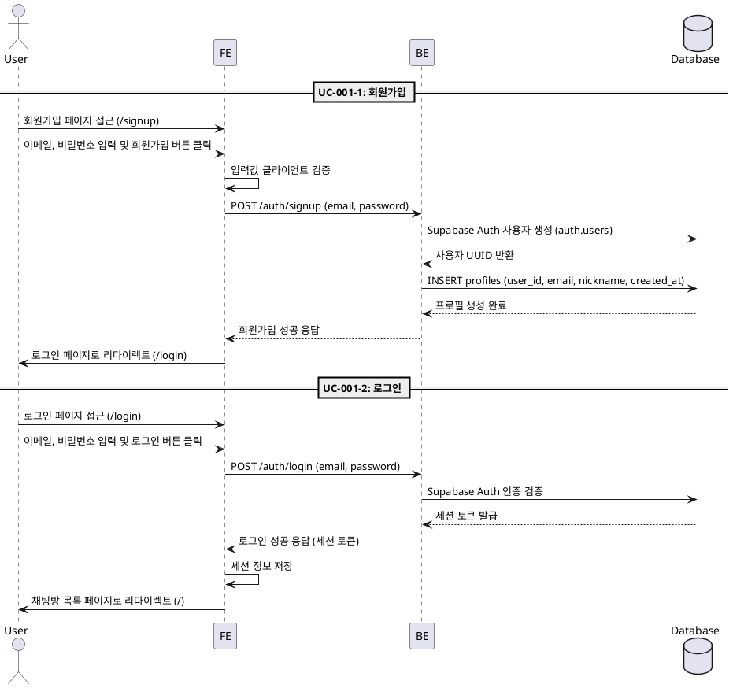

# UC-001: 인증 (회원가입 및 로그인)

## UC-001-1: 회원가입

### Primary Actor
신규 사용자

### Precondition
- 사용자가 아직 계정이 없음
- 회원가입 페이지(`/signup`)에 접근 가능

### Trigger
사용자가 회원가입 페이지에서 이메일과 비밀번호를 입력하고 회원가입 버튼 클릭

### Main Scenario
1. 사용자가 회원가입 페이지(`/signup`) 접근
2. 이메일 및 비밀번호 입력 필드에 정보 입력
3. '회원가입' 버튼 클릭
4. FE가 입력값 클라이언트 측 유효성 검증 수행
5. FE가 Supabase Auth 회원가입 API 호출
6. Supabase Auth가 신규 사용자 계정 생성 (`auth.users`)
7. BE가 신규 사용자 UUID를 획득하고 프로필 테이블에 레코드 생성
   - `user_id`: 사용자 UUID
   - `email`: 입력된 이메일
   - `nickname`: 이메일 @ 앞부분
   - `created_at`: 현재 시각
8. FE가 로그인 페이지(`/login`)로 리다이렉트

### Edge Cases
- **이메일 형식 오류**: Supabase Auth 기본 검증 오류 표시
- **비밀번호 강도 부족**: Supabase Auth 기본 오류 표시
- **중복 이메일**: Supabase Auth 오류 반환, "이미 사용 중인 이메일입니다" 메시지 표시
- **프로필 생성 실패**: DB 오류 발생 시 사용자에게 "회원가입 처리 중 오류가 발생했습니다" 메시지 표시
- **네트워크 오류**: "네트워크 연결을 확인해주세요" 메시지 표시

### Business Rules
- 이메일은 고유해야 함
- 비밀번호는 Supabase Auth 기본 정책 준수 (최소 6자)
- 회원가입 성공 시 자동으로 프로필 레코드 생성
- 초기 닉네임은 이메일 @ 앞부분으로 자동 설정
- 프로필 생성 실패 시 사용자 계정 롤백 (트랜잭션 처리 권장)

---

## UC-001-2: 로그인

### Primary Actor
등록된 사용자

### Precondition
- 사용자가 이미 회원가입 완료
- 로그인 페이지(`/login`)에 접근 가능

### Trigger
사용자가 로그인 페이지에서 이메일과 비밀번호를 입력하고 로그인 버튼 클릭

### Main Scenario
1. 사용자가 로그인 페이지(`/login`) 접근
2. 이메일 및 비밀번호 입력
3. '로그인' 버튼 클릭
4. FE가 Supabase Auth 로그인 API 호출
5. Supabase Auth가 인증 정보 검증
6. 세션 생성 및 토큰 발급
7. FE가 세션 정보를 로컬에 저장
8. FE가 채팅방 목록 페이지(`/`)로 리다이렉트

### Edge Cases
- **잘못된 이메일/비밀번호**: "이메일 또는 비밀번호가 올바르지 않습니다" 메시지 표시
- **이메일 미인증 (선택적)**: Supabase Auth 설정에 따라 "이메일 인증이 필요합니다" 메시지 표시
- **계정 잠금 (선택적)**: 다수 실패 시 일시적 잠금 메시지 표시
- **네트워크 오류**: "네트워크 연결을 확인해주세요" 메시지 표시

### Business Rules
- 로그인 성공 시 세션 토큰 생성 및 저장
- 로그인 후 채팅방 목록 페이지로 자동 이동
- 이미 로그인된 상태에서 로그인 페이지 접근 시 채팅방 목록으로 리다이렉트 (선택적)

---

## Sequence Diagram

