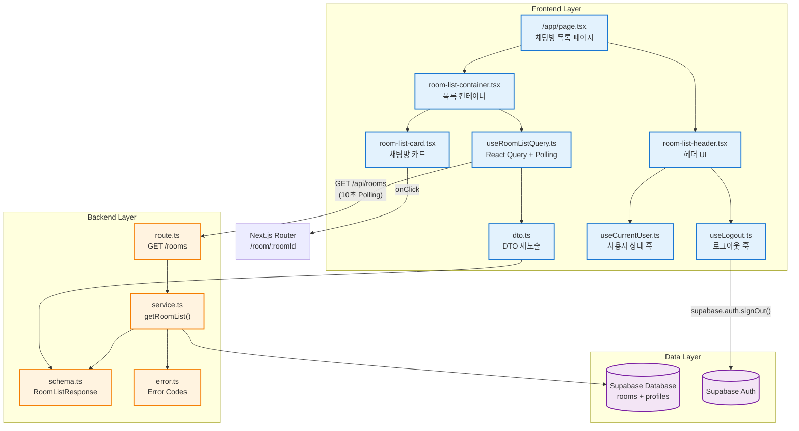

# UC-002: 채팅방 목록 페이지 구현 계획

## 개요

UC-002 채팅방 목록 페이지는 모든 사용자(로그인/비로그인)가 채팅방 목록을 조회하고, 로그인 사용자는 채팅방 생성 페이지로 이동하거나 로그아웃할 수 있는 기능을 제공합니다. 10초 간격 Polling을 통해 실시간으로 채팅방 목록을 갱신합니다.

### 모듈 목록

| 모듈명 | 위치 | 설명 |
|--------|------|------|
| **Backend - Route** | `src/features/rooms/backend/route.ts` | 채팅방 목록 조회 API 라우터 |
| **Backend - Service** | `src/features/rooms/backend/service.ts` | 채팅방 목록 Supabase 조회 로직 |
| **Backend - Schema** | `src/features/rooms/backend/schema.ts` | 채팅방 목록 응답 Zod 스키마 |
| **Backend - Error** | `src/features/rooms/backend/error.ts` | 채팅방 관련 에러 코드 정의 |
| **Frontend - DTO** | `src/features/rooms/lib/dto.ts` | Backend schema 재노출 |
| **Frontend - Hooks** | `src/features/rooms/hooks/useRoomListQuery.ts` | React Query 기반 채팅방 목록 조회 훅 (Polling 포함) |
| **Frontend - Components** | `src/features/rooms/components/room-list-header.tsx` | 헤더 UI (로그인 상태별 버튼) |
| **Frontend - Components** | `src/features/rooms/components/room-list-card.tsx` | 채팅방 카드 컴포넌트 |
| **Frontend - Components** | `src/features/rooms/components/room-list-container.tsx` | 채팅방 목록 컨테이너 (목록 렌더링, 빈 상태 처리) |
| **Frontend - Page** | `src/app/page.tsx` | 채팅방 목록 페이지 (루트 경로 `/`) |
| **Auth - Hooks** | `src/features/auth/hooks/useLogout.ts` | 로그아웃 훅 |

---

## Diagram



---

## Implementation Plan

### 1. Backend - Error 정의

**파일**: `src/features/rooms/backend/error.ts`

**목적**: 채팅방 관련 에러 코드 정의

**구현 내용**:
```typescript
export const roomErrorCodes = {
  fetchError: 'ROOM_FETCH_ERROR',
  notFound: 'ROOM_NOT_FOUND',
  validationError: 'ROOM_VALIDATION_ERROR',
} as const;

export type RoomServiceError = typeof roomErrorCodes[keyof typeof roomErrorCodes];
```

**Unit Test**:
- 에러 코드가 중복되지 않는지 확인
- 모든 에러 코드가 문자열인지 확인

---

### 2. Backend - Schema 정의

**파일**: `src/features/rooms/backend/schema.ts`

**목적**: 채팅방 목록 조회 요청/응답 스키마 정의

**구현 내용**:
```typescript
import { z } from 'zod';

// 테이블 row 스키마
export const RoomTableRowSchema = z.object({
  id: z.string().uuid(),
  name: z.string(),
  creator_id: z.string().uuid(),
  creator_nickname: z.string().nullable(),
  created_at: z.string(),
  updated_at: z.string(),
});

export type RoomTableRow = z.infer<typeof RoomTableRowSchema>;

// API 응답 스키마
export const RoomItemSchema = z.object({
  id: z.string().uuid(),
  name: z.string(),
  creatorNickname: z.string(),
  updatedAt: z.string(),
});

export type RoomItem = z.infer<typeof RoomItemSchema>;

export const RoomListResponseSchema = z.array(RoomItemSchema);

export type RoomListResponse = z.infer<typeof RoomListResponseSchema>;
```

**Unit Test**:
- RoomTableRowSchema가 DB row를 올바르게 파싱하는지 확인
- RoomItemSchema가 API 응답 형식을 올바르게 파싱하는지 확인
- 유효하지 않은 데이터에 대해 실패하는지 확인

---

### 3. Backend - Service 구현

**파일**: `src/features/rooms/backend/service.ts`

**목적**: Supabase를 통한 채팅방 목록 조회 로직

**구현 내용**:
```typescript
import type { SupabaseClient } from '@supabase/supabase-js';
import {
  failure,
  success,
  type HandlerResult,
} from '@/backend/http/response';
import {
  RoomTableRowSchema,
  RoomListResponseSchema,
  type RoomListResponse,
  type RoomTableRow,
} from './schema';
import {
  roomErrorCodes,
  type RoomServiceError,
} from './error';

const ROOMS_TABLE = 'rooms';
const PROFILES_TABLE = 'profiles';

export const getRoomList = async (
  client: SupabaseClient,
): Promise<HandlerResult<RoomListResponse, RoomServiceError, unknown>> => {
  const { data, error } = await client
    .from(ROOMS_TABLE)
    .select(`
      id,
      name,
      creator_id,
      created_at,
      updated_at,
      ${PROFILES_TABLE}:creator_id (
        nickname
      )
    `)
    .order('updated_at', { ascending: false });

  if (error) {
    return failure(500, roomErrorCodes.fetchError, error.message);
  }

  if (!data) {
    return success([]);
  }

  const mapped = data.map((row: any): RoomTableRow => ({
    id: row.id,
    name: row.name,
    creator_id: row.creator_id,
    creator_nickname: row.profiles?.nickname ?? null,
    created_at: row.created_at,
    updated_at: row.updated_at,
  }));

  const parsedRows = mapped.map(row => RoomTableRowSchema.safeParse(row));

  const invalidRow = parsedRows.find(p => !p.success);
  if (invalidRow && !invalidRow.success) {
    return failure(
      500,
      roomErrorCodes.validationError,
      'Room row validation failed.',
      invalidRow.error.format(),
    );
  }

  const rooms = mapped.map(row => ({
    id: row.id,
    name: row.name,
    creatorNickname: row.creator_nickname ?? 'Unknown',
    updatedAt: row.updated_at,
  }));

  const parsed = RoomListResponseSchema.safeParse(rooms);

  if (!parsed.success) {
    return failure(
      500,
      roomErrorCodes.validationError,
      'Room list validation failed.',
      parsed.error.format(),
    );
  }

  return success(parsed.data);
};
```

**Unit Test**:
- 채팅방이 없을 때 빈 배열 반환
- 채팅방이 있을 때 올바른 형식으로 반환
- Supabase 에러 시 fetchError 반환
- 잘못된 데이터 형식 시 validationError 반환
- creator_nickname이 null일 때 'Unknown' 반환

---

### 4. Backend - Route 구현

**파일**: `src/features/rooms/backend/route.ts`

**목적**: Hono 라우터 정의 (GET /rooms)

**구현 내용**:
```typescript
import type { Hono } from 'hono';
import { respond, type ErrorResult } from '@/backend/http/response';
import { getLogger, getSupabase, type AppEnv } from '@/backend/hono/context';
import { getRoomList } from './service';
import { roomErrorCodes, type RoomServiceError } from './error';

export const registerRoomRoutes = (app: Hono<AppEnv>) => {
  app.get('/rooms', async (c) => {
    const supabase = getSupabase(c);
    const logger = getLogger(c);

    const result = await getRoomList(supabase);

    if (!result.ok) {
      const errorResult = result as ErrorResult<RoomServiceError, unknown>;

      if (errorResult.error.code === roomErrorCodes.fetchError) {
        logger.error('Failed to fetch room list', errorResult.error.message);
      }

      return respond(c, result);
    }

    return respond(c, result);
  });
};
```

**Integration Test**:
- GET /api/rooms 호출 시 200 응답 반환
- 응답 데이터가 RoomListResponse 스키마와 일치하는지 확인
- Supabase 연결 실패 시 500 응답 반환

---

### 5. Backend - Hono App에 라우터 등록

**파일**: `src/backend/hono/app.ts`

**수정 내용**:
```typescript
// ... existing imports ...
import { registerRoomRoutes } from '@/features/rooms/backend/route';

// ... existing code ...

export const createHonoApp = (): Hono<AppEnv> => {
  // ... existing middleware setup ...

  registerExampleRoutes(app);
  registerRoomRoutes(app); // 추가

  return app;
};
```

---

### 6. Frontend - DTO 재노출

**파일**: `src/features/rooms/lib/dto.ts`

**목적**: Backend schema를 프론트엔드에서 재사용

**구현 내용**:
```typescript
export {
  RoomItemSchema,
  RoomListResponseSchema,
  type RoomItem,
  type RoomListResponse,
} from '@/features/rooms/backend/schema';
```

---

### 7. Frontend - React Query Hook (Polling 포함)

**파일**: `src/features/rooms/hooks/useRoomListQuery.ts`

**목적**: 채팅방 목록 조회 및 10초 Polling

**구현 내용**:
```typescript
'use client';

import { useQuery } from '@tanstack/react-query';
import { apiClient, extractApiErrorMessage } from '@/lib/remote/api-client';
import { RoomListResponseSchema } from '@/features/rooms/lib/dto';

const fetchRoomList = async () => {
  try {
    const { data } = await apiClient.get('/api/rooms');
    return RoomListResponseSchema.parse(data);
  } catch (error) {
    const message = extractApiErrorMessage(error, 'Failed to fetch room list.');
    throw new Error(message);
  }
};

export const useRoomListQuery = () =>
  useQuery({
    queryKey: ['rooms'],
    queryFn: fetchRoomList,
    refetchInterval: 10 * 1000,
    staleTime: 5 * 1000,
    retry: 3,
    retryDelay: (attemptIndex) => Math.min(1000 * 2 ** attemptIndex, 30000),
  });
```

**QA Sheet**:
- [ ] 초기 로드 시 채팅방 목록이 표시되는가?
- [ ] 10초마다 자동으로 목록이 갱신되는가?
- [ ] 페이지 이탈 시 Polling이 정리되는가?
- [ ] API 에러 시 에러 상태가 노출되는가?
- [ ] 네트워크 오류 시 재시도가 동작하는가?

---

### 8. Frontend - Logout Hook

**파일**: `src/features/auth/hooks/useLogout.ts`

**목적**: 로그아웃 기능 제공

**구현 내용**:
```typescript
'use client';

import { useCallback, useState } from 'react';
import { useRouter } from 'next/navigation';
import { getSupabaseBrowserClient } from '@/lib/supabase/browser-client';
import { useCurrentUser } from './useCurrentUser';

export const useLogout = () => {
  const [isLoading, setIsLoading] = useState(false);
  const [error, setError] = useState<string | null>(null);
  const router = useRouter();
  const { refresh } = useCurrentUser();

  const logout = useCallback(async () => {
    setIsLoading(true);
    setError(null);

    try {
      const supabase = getSupabaseBrowserClient();
      const { error: signOutError } = await supabase.auth.signOut();

      if (signOutError) {
        throw new Error(signOutError.message);
      }

      await refresh();
      router.refresh();
    } catch (err) {
      const message = err instanceof Error ? err.message : '로그아웃에 실패했습니다.';
      setError(message);
    } finally {
      setIsLoading(false);
    }
  }, [refresh, router]);

  return { logout, isLoading, error };
};
```

**QA Sheet**:
- [ ] 로그아웃 버튼 클릭 시 로그아웃이 되는가?
- [ ] 로그아웃 후 UI가 비로그인 상태로 전환되는가?
- [ ] 로그아웃 실패 시 에러 메시지가 표시되는가?
- [ ] 로그아웃 중 로딩 상태가 표시되는가?

---

### 9. Frontend - Room List Header Component

**파일**: `src/features/rooms/components/room-list-header.tsx`

**목적**: 헤더 UI (로그인 상태별 다른 버튼)

**구현 내용**:
```typescript
'use client';

import { Button } from '@/components/ui/button';
import { useRouter } from 'next/navigation';
import { useCurrentUser } from '@/features/auth/hooks/useCurrentUser';
import { useLogout } from '@/features/auth/hooks/useLogout';
import { LogOut, User } from 'lucide-react';

export const RoomListHeader = () => {
  const router = useRouter();
  const { user, isAuthenticated, isLoading } = useCurrentUser();
  const { logout, isLoading: isLoggingOut } = useLogout();

  const handleLoginClick = () => {
    router.push('/login');
  };

  const handleMyPageClick = () => {
    router.push('/dashboard');
  };

  const handleLogoutClick = async () => {
    await logout();
  };

  if (isLoading) {
    return (
      <header className="flex items-center justify-between border-b border-slate-800 bg-slate-950/60 px-6 py-4">
        <h1 className="text-2xl font-semibold text-slate-100">채팅방 목록</h1>
        <div className="h-10 w-32 animate-pulse rounded-lg bg-slate-800" />
      </header>
    );
  }

  return (
    <header className="flex items-center justify-between border-b border-slate-800 bg-slate-950/60 px-6 py-4">
      <h1 className="text-2xl font-semibold text-slate-100">채팅방 목록</h1>

      {isAuthenticated ? (
        <div className="flex items-center gap-3">
          <span className="text-sm text-slate-300">{user?.email}</span>
          <Button
            onClick={handleMyPageClick}
            variant="outline"
            size="sm"
            className="border-slate-600 bg-slate-800 text-slate-100 hover:bg-slate-700"
          >
            <User className="mr-2 h-4 w-4" />
            마이페이지
          </Button>
          <Button
            onClick={handleLogoutClick}
            disabled={isLoggingOut}
            variant="outline"
            size="sm"
            className="border-slate-600 bg-slate-800 text-slate-100 hover:bg-slate-700"
          >
            <LogOut className="mr-2 h-4 w-4" />
            {isLoggingOut ? '로그아웃 중...' : '로그아웃'}
          </Button>
        </div>
      ) : (
        <Button
          onClick={handleLoginClick}
          variant="default"
          size="sm"
          className="bg-blue-600 text-white hover:bg-blue-700"
        >
          로그인
        </Button>
      )}
    </header>
  );
};
```

**QA Sheet**:
- [ ] 로그인 상태에서 이메일, 마이페이지, 로그아웃 버튼이 표시되는가?
- [ ] 비로그인 상태에서 로그인 버튼만 표시되는가?
- [ ] 로그인 버튼 클릭 시 로그인 페이지로 이동하는가?
- [ ] 마이페이지 버튼 클릭 시 대시보드로 이동하는가?
- [ ] 로그아웃 버튼 클릭 시 로그아웃이 되는가?
- [ ] 로그아웃 중 버튼이 비활성화되는가?
- [ ] 로딩 상태에서 스켈레톤이 표시되는가?

---

### 10. Frontend - Room Card Component

**파일**: `src/features/rooms/components/room-list-card.tsx`

**목적**: 채팅방 카드 컴포넌트

**구현 내용**:
```typescript
'use client';

import { useRouter } from 'next/navigation';
import { formatDistanceToNow } from 'date-fns';
import { ko } from 'date-fns/locale';
import type { RoomItem } from '@/features/rooms/lib/dto';
import { MessageCircle, User } from 'lucide-react';

type RoomListCardProps = {
  room: RoomItem;
};

export const RoomListCard = ({ room }: RoomListCardProps) => {
  const router = useRouter();

  const handleClick = () => {
    router.push(`/room/${room.id}`);
  };

  const relativeTime = formatDistanceToNow(new Date(room.updatedAt), {
    addSuffix: true,
    locale: ko,
  });

  return (
    <article
      onClick={handleClick}
      className="cursor-pointer rounded-xl border border-slate-800 bg-slate-950/60 p-4 transition-all hover:border-slate-700 hover:bg-slate-900/60"
    >
      <div className="flex items-start justify-between">
        <div className="flex-1 space-y-2">
          <div className="flex items-center gap-2">
            <MessageCircle className="h-5 w-5 text-blue-400" />
            <h3 className="text-lg font-semibold text-slate-100">{room.name}</h3>
          </div>
          <div className="flex items-center gap-2 text-sm text-slate-400">
            <User className="h-4 w-4" />
            <span>{room.creatorNickname}</span>
          </div>
        </div>
        <time className="text-xs text-slate-500">{relativeTime}</time>
      </div>
    </article>
  );
};
```

**QA Sheet**:
- [ ] 채팅방 이름이 표시되는가?
- [ ] 생성자 닉네임이 표시되는가?
- [ ] 최종 수정 시간이 상대 시간으로 표시되는가?
- [ ] 카드 클릭 시 채팅방 페이지로 이동하는가?
- [ ] 호버 시 스타일이 변경되는가?

---

### 11. Frontend - Room List Container Component

**파일**: `src/features/rooms/components/room-list-container.tsx`

**목적**: 채팅방 목록 렌더링 및 빈 상태 처리

**구현 내용**:
```typescript
'use client';

import { useRouter } from 'next/navigation';
import { useRoomListQuery } from '@/features/rooms/hooks/useRoomListQuery';
import { RoomListCard } from './room-list-card';
import { Button } from '@/components/ui/button';
import { useCurrentUser } from '@/features/auth/hooks/useCurrentUser';
import { Plus, Loader2, AlertCircle } from 'lucide-react';

export const RoomListContainer = () => {
  const router = useRouter();
  const { isAuthenticated } = useCurrentUser();
  const { data, status, error } = useRoomListQuery();

  const handleCreateRoom = () => {
    router.push('/create-room');
  };

  if (status === 'pending') {
    return (
      <div className="flex min-h-[400px] items-center justify-center">
        <div className="text-center">
          <Loader2 className="mx-auto h-8 w-8 animate-spin text-slate-400" />
          <p className="mt-4 text-sm text-slate-400">채팅방 목록을 불러오는 중...</p>
        </div>
      </div>
    );
  }

  if (status === 'error') {
    return (
      <div className="flex min-h-[400px] items-center justify-center">
        <div className="text-center">
          <AlertCircle className="mx-auto h-8 w-8 text-rose-400" />
          <p className="mt-4 text-sm text-rose-300">
            {error instanceof Error ? error.message : '채팅방 목록을 불러올 수 없습니다.'}
          </p>
        </div>
      </div>
    );
  }

  const rooms = data ?? [];

  return (
    <div className="flex flex-col gap-6">
      {rooms.length === 0 ? (
        <div className="flex min-h-[400px] flex-col items-center justify-center gap-4">
          <p className="text-sm text-slate-400">아직 채팅방이 없습니다.</p>
          {isAuthenticated && (
            <Button
              onClick={handleCreateRoom}
              variant="default"
              className="bg-blue-600 text-white hover:bg-blue-700"
            >
              <Plus className="mr-2 h-4 w-4" />
              첫 채팅방 만들기
            </Button>
          )}
        </div>
      ) : (
        <>
          <div className="grid gap-4 sm:grid-cols-1 md:grid-cols-2 lg:grid-cols-3">
            {rooms.map((room) => (
              <RoomListCard key={room.id} room={room} />
            ))}
          </div>
          {isAuthenticated && (
            <div className="flex justify-center">
              <Button
                onClick={handleCreateRoom}
                variant="default"
                size="lg"
                className="bg-blue-600 text-white hover:bg-blue-700"
              >
                <Plus className="mr-2 h-5 w-5" />
                채팅방 추가하기
              </Button>
            </div>
          )}
        </>
      )}
    </div>
  );
};
```

**QA Sheet**:
- [ ] 로딩 중 스켈레톤이 표시되는가?
- [ ] 에러 발생 시 에러 메시지가 표시되는가?
- [ ] 채팅방이 없을 때 빈 상태 메시지가 표시되는가?
- [ ] 채팅방이 있을 때 카드가 그리드로 표시되는가?
- [ ] 로그인 사용자에게만 채팅방 추가 버튼이 표시되는가?
- [ ] 채팅방 추가 버튼 클릭 시 생성 페이지로 이동하는가?
- [ ] 반응형 레이아웃이 올바르게 동작하는가?

---

### 12. Frontend - Page 구현

**파일**: `src/app/page.tsx`

**목적**: 채팅방 목록 페이지 (루트 경로)

**구현 내용**:
```typescript
'use client';

import { RoomListHeader } from '@/features/rooms/components/room-list-header';
import { RoomListContainer } from '@/features/rooms/components/room-list-container';

export default function HomePage() {
  return (
    <div className="min-h-screen bg-slate-950">
      <RoomListHeader />
      <main className="container mx-auto px-4 py-8">
        <RoomListContainer />
      </main>
    </div>
  );
}
```

**QA Sheet**:
- [ ] 페이지가 올바르게 렌더링되는가?
- [ ] 헤더와 목록이 모두 표시되는가?
- [ ] 페이지 레이아웃이 반응형으로 동작하는가?

---

## 구현 순서

1. **Backend 레이어 구현**
   - Error 정의 → Schema 정의 → Service 구현 → Route 구현 → Hono App 등록

2. **Frontend Shared 구현**
   - DTO 재노출 → Logout Hook 구현

3. **Frontend Room Feature 구현**
   - React Query Hook → Card Component → Container Component → Header Component

4. **Page 통합**
   - Page 구현 및 전체 통합 테스트

5. **QA 및 Edge Case 검증**
   - 각 모듈의 QA Sheet 항목 검증
   - Polling 동작 확인
   - 로그인/비로그인 상태 전환 테스트
   - 에러 상태 테스트

---

## 추가 고려사항

### Shadcn-ui Components 설치

다음 컴포넌트가 필요합니다:

```bash
npx shadcn@latest add button
```

### 주요 라이브러리

- `date-fns`: 상대 시간 표시 (이미 설치되어 있음)
- `lucide-react`: 아이콘 (이미 설치되어 있음)
- `@tanstack/react-query`: React Query (이미 설치되어 있음)

### 성능 최적화

- React Query의 `refetchInterval`을 통한 Polling 구현
- `staleTime` 설정으로 불필요한 요청 방지
- 자동 재시도 및 Exponential Backoff 적용

### 접근성

- 시맨틱 HTML 사용 (`header`, `main`, `article`, `time`)
- 키보드 접근성 확보 (버튼, 카드 클릭)
- ARIA 레이블 필요 시 추가

### 보안

- Supabase Auth 세션 기반 인증
- RLS 비활성화 (Backend 레이어에서 접근 제어)
- XSS 방지 (React 기본 이스케이핑)
