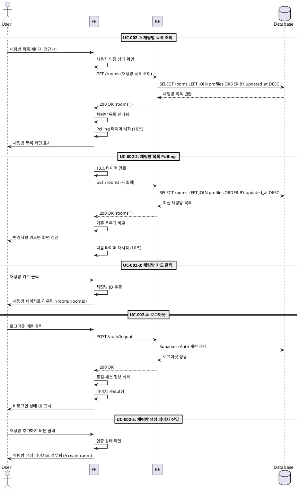

# UC-002: 채팅방 목록 페이지

## UC-002-1: 채팅방 목록 조회

### Primary Actor
모든 사용자 (로그인/비로그인 모두)

### Precondition
- 채팅방 목록 페이지(`/`)에 접근 가능

### Trigger
사용자가 채팅방 목록 페이지에 접근

### Main Scenario
1. 사용자가 채팅방 목록 페이지(`/`) 접근
2. FE가 사용자 인증 상태 확인 (Supabase Auth 세션)
3. FE가 채팅방 목록 조회 API 요청
4. BE가 데이터베이스에서 모든 채팅방 조회
   - `rooms` 테이블과 `profiles` 테이블 조인
   - `updated_at` 기준 내림차순 정렬
5. BE가 채팅방 목록 반환 (id, name, creator_nickname, updated_at)
6. FE가 채팅방 목록 화면에 렌더링
7. FE가 Polling 타이머 시작 (10초 간격)
8. FE가 헤더 UI 렌더링
   - **로그인 사용자**: 이메일, 마이페이지 버튼, 로그아웃 버튼
   - **비로그인 사용자**: 로그인 버튼만 표시
9. FE가 하단 액션 렌더링
   - **로그인 사용자**: '채팅방 추가하기' 버튼 표시

### Edge Cases
- **채팅방 없음**: 빈 목록 상태 메시지 표시 ("아직 채팅방이 없습니다")
- **조회 실패**: 오류 메시지 표시 ("채팅방 목록을 불러올 수 없습니다")
- **네트워크 오류**: "네트워크 연결을 확인해주세요" 메시지 표시

### Business Rules
- 모든 사용자가 채팅방 목록을 조회할 수 있음 (Public)
- 채팅방은 최신 수정일(`updated_at`) 기준 내림차순 정렬
- 각 채팅방 카드는 이름, 생성자 닉네임, 최종 수정 시간 표시
- 로그인 사용자만 채팅방 추가 버튼 및 마이페이지/로그아웃 버튼 표시

---

## UC-002-2: 채팅방 목록 Polling

### Primary Actor
시스템 (자동 트리거)

### Precondition
- 사용자가 채팅방 목록 페이지에 머물고 있음
- Polling 타이머가 시작되어 있음

### Trigger
10초 타이머 만료 (자동)

### Main Scenario
1. 10초 타이머 만료
2. FE가 채팅방 목록 조회 API 재요청
3. BE가 데이터베이스에서 모든 채팅방 재조회
   - `updated_at` 기준 내림차순 정렬
4. BE가 최신 채팅방 목록 반환
5. FE가 기존 목록과 비교하여 변경사항 확인
6. 변경사항이 있으면 화면 갱신
7. FE가 다음 Polling 타이머 재시작 (10초)

### Edge Cases
- **조회 실패**: 기존 목록 유지, 콘솔에 오류 로그 (사용자에게 미표시)
- **네트워크 오류**: 기존 목록 유지, 다음 Polling 계속 진행
- **페이지 이탈**: Polling 타이머 정리 (cleanup)

### Business Rules
- Polling은 10초 간격으로 자동 실행
- 조회 실패 시 기존 목록 유지, 사용자에게 오류 미표시
- 페이지 이탈 시 Polling 타이머 정리 필요
- 새 채팅방 추가, 채팅방 순서 변경 등 자동 반영

---

## UC-002-3: 채팅방 카드 클릭

### Primary Actor
모든 사용자

### Precondition
- 채팅방 목록이 화면에 표시되어 있음

### Trigger
사용자가 특정 채팅방 카드 클릭

### Main Scenario
1. 사용자가 채팅방 카드 클릭
2. FE가 클릭된 채팅방 ID 추출
3. FE가 채팅방 페이지(`/room/:roomId`)로 라우팅

### Edge Cases
- 없음 (단순 라우팅)

### Business Rules
- 모든 사용자가 채팅방 페이지로 이동 가능
- 채팅방 ID는 URL 파라미터로 전달

---

## UC-002-4: 로그아웃

### Primary Actor
로그인 사용자

### Precondition
- 사용자가 로그인 상태
- 채팅방 목록 페이지에 위치

### Trigger
사용자가 '로그아웃' 버튼 클릭

### Main Scenario
1. 사용자가 '로그아웃' 버튼 클릭
2. FE가 Supabase Auth 로그아웃 API 호출
3. Supabase Auth가 세션 정보 삭제
4. FE가 로컬 세션 정보 삭제
5. FE가 페이지 새로고침 (채팅방 목록 페이지 유지)
6. FE가 비로그인 상태 UI로 변경
   - 헤더에서 이메일, 마이페이지, 로그아웃 버튼 제거
   - '로그인' 버튼 표시
   - '채팅방 추가하기' 버튼 제거

### Edge Cases
- **로그아웃 실패**: "로그아웃에 실패했습니다" 오류 메시지 표시, 상태 유지
- **네트워크 오류**: "네트워크 연결을 확인해주세요" 메시지 표시

### Business Rules
- 로그아웃 성공 시 현재 페이지 유지 (채팅방 목록)
- 로그아웃 후 비로그인 상태 UI로 자동 전환
- 세션 정보 완전히 삭제

---

## UC-002-5: 채팅방 생성 페이지 진입

### Primary Actor
로그인 사용자

### Precondition
- 사용자가 로그인 상태

### Trigger
사용자가 '채팅방 추가하기' 버튼 클릭

### Main Scenario
1. 사용자가 '채팅방 추가하기' 버튼 클릭
2. FE가 인증 상태 확인
3. 로그인 상태 확인 완료
4. FE가 채팅방 생성 페이지(`/create-room`)로 라우팅

### Edge Cases
- **비로그인 상태**: 로그인 페이지(`/login`)로 리다이렉트 (발생하지 않아야 함, 버튼이 비표시되므로)

### Business Rules
- 로그인 사용자만 채팅방 생성 페이지 접근 가능
- 비로그인 시 로그인 페이지로 리다이렉트

---

## Sequence Diagram

