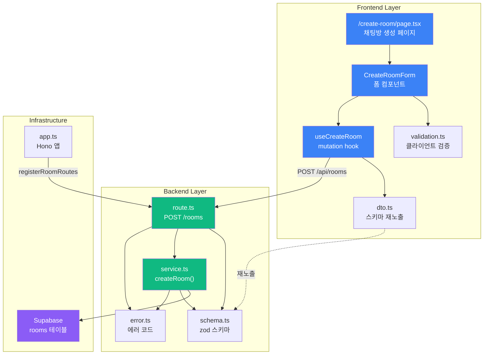

# UC-003: 채팅방 생성 기능 - 구현 계획

## 개요

UC-003 채팅방 생성 기능을 구현하기 위한 모듈화된 설계입니다. AGENTS.md의 코드베이스 구조를 준수하며, frontend와 backend를 명확히 분리합니다.

### 필요 모듈 목록

| 모듈 이름 | 위치 | 설명 |
|----------|------|------|
| **Backend - Route** | `src/features/room/backend/route.ts` | 채팅방 생성 API 라우터 (POST /rooms) |
| **Backend - Service** | `src/features/room/backend/service.ts` | 채팅방 생성 비즈니스 로직 및 Supabase 접근 |
| **Backend - Schema** | `src/features/room/backend/schema.ts` | 요청/응답 zod 스키마 정의 |
| **Backend - Error** | `src/features/room/backend/error.ts` | 채팅방 관련 에러 코드 정의 |
| **Frontend - DTO** | `src/features/room/lib/dto.ts` | 백엔드 스키마 재노출 |
| **Frontend - Hook** | `src/features/room/hooks/useCreateRoom.ts` | 채팅방 생성 React Query mutation hook |
| **Frontend - Page** | `src/app/create-room/page.tsx` | 채팅방 생성 페이지 |
| **Frontend - Component** | `src/features/room/components/create-room-form.tsx` | 채팅방 생성 폼 컴포넌트 |
| **Frontend - Validation** | `src/features/room/lib/validation.ts` | 클라이언트 측 입력값 검증 로직 |
| **Hono App Integration** | `src/backend/hono/app.ts` | room 라우터 등록 |

---

## Diagram



---

## Implementation Plan

### 1. Backend - Schema (`src/features/room/backend/schema.ts`)

**목적**: 채팅방 생성 요청 및 응답에 대한 zod 스키마 정의

**구현 내용**:
- `CreateRoomRequestSchema`: 채팅방 이름 입력값 검증 (최대 100자, 빈 값 불가)
- `RoomResponseSchema`: 생성된 채팅방 정보 응답 스키마
- `RoomTableRowSchema`: Supabase rooms 테이블 로우 스키마

```typescript
// CreateRoomRequestSchema
{
  name: string (1~100자)
}

// RoomResponseSchema
{
  id: UUID,
  name: string,
  creatorId: UUID,
  createdAt: string (ISO 8601),
  updatedAt: string (ISO 8601)
}

// RoomTableRowSchema
{
  id: UUID,
  name: string,
  creator_id: UUID,
  created_at: string,
  updated_at: string
}
```

**Unit Test 시나리오**:
- [ ] CreateRoomRequestSchema는 빈 문자열을 거부한다
- [ ] CreateRoomRequestSchema는 100자를 초과하는 문자열을 거부한다
- [ ] CreateRoomRequestSchema는 1~100자 문자열을 허용한다
- [ ] RoomResponseSchema는 유효한 UUID와 ISO 8601 날짜를 검증한다
- [ ] RoomTableRowSchema는 snake_case 필드를 올바르게 파싱한다

---

### 2. Backend - Error (`src/features/room/backend/error.ts`)

**목적**: 채팅방 생성 관련 에러 코드 정의

**구현 내용**:
```typescript
export const roomErrorCodes = {
  createFailed: 'ROOM_CREATE_FAILED',
  validationError: 'ROOM_VALIDATION_ERROR',
  unauthorized: 'ROOM_UNAUTHORIZED',
} as const;

export type RoomServiceError =
  (typeof roomErrorCodes)[keyof typeof roomErrorCodes];
```

---

### 3. Backend - Service (`src/features/room/backend/service.ts`)

**목적**: 채팅방 생성 비즈니스 로직 및 Supabase 접근

**구현 내용**:
- `createRoom(client, creatorId, name)`: 새 채팅방을 Supabase에 생성
- Supabase `rooms` 테이블에 INSERT 수행
- snake_case → camelCase 변환 로직
- zod 스키마를 사용한 응답 검증

**핵심 로직**:
```typescript
export const createRoom = async (
  client: SupabaseClient,
  creatorId: string,
  name: string,
): Promise<HandlerResult<RoomResponse, RoomServiceError, unknown>> => {
  // 1. Supabase INSERT
  // 2. RoomTableRowSchema 검증
  // 3. snake_case → camelCase 매핑
  // 4. RoomResponseSchema 검증
  // 5. success 또는 failure 반환
}
```

**Unit Test 시나리오**:
- [ ] 유효한 입력으로 채팅방이 성공적으로 생성된다
- [ ] Supabase 에러 발생 시 `ROOM_CREATE_FAILED`를 반환한다
- [ ] 생성된 데이터가 RoomTableRowSchema를 통과하지 못하면 `ROOM_VALIDATION_ERROR`를 반환한다
- [ ] 반환된 RoomResponse가 올바른 camelCase 형식을 갖는다
- [ ] creator_id가 올바르게 저장된다

---

### 4. Backend - Route (`src/features/room/backend/route.ts`)

**목적**: Hono 라우터에 채팅방 생성 API 엔드포인트 등록

**구현 내용**:
- `POST /rooms` 엔드포인트 정의
- 현재 로그인 사용자 확인 (인증 필수)
- `CreateRoomRequestSchema`를 사용한 요청 body 검증
- `createRoom` 서비스 호출
- `respond` 헬퍼를 사용한 응답 반환

**핵심 로직**:
```typescript
export const registerRoomRoutes = (app: Hono<AppEnv>) => {
  app.post('/rooms', async (c) => {
    // 1. 현재 사용자 확인 (c.get('userId') 또는 인증 미들웨어 사용)
    // 2. request body 파싱 및 검증
    // 3. createRoom 서비스 호출
    // 4. 에러 처리 및 응답 반환 (201 Created)
  });
};
```

**QA Sheet**:

| 테스트 케이스 | 요청 | 예상 응답 | 상태 코드 |
|--------------|------|----------|----------|
| 정상 생성 | `POST /rooms` body: `{ name: "새 채팅방" }` (로그인 사용자) | `{ id: UUID, name: "새 채팅방", creatorId: UUID, ... }` | 201 |
| 빈 이름 | `POST /rooms` body: `{ name: "" }` | `{ error: { code: "INVALID_ROOM_REQUEST", message: "..." } }` | 400 |
| 100자 초과 | `POST /rooms` body: `{ name: "a".repeat(101) }` | `{ error: { code: "INVALID_ROOM_REQUEST", message: "..." } }` | 400 |
| 미인증 사용자 | `POST /rooms` (비로그인) | `{ error: { code: "ROOM_UNAUTHORIZED", message: "..." } }` | 401 |
| Supabase 에러 | `POST /rooms` (DB 장애 시뮬레이션) | `{ error: { code: "ROOM_CREATE_FAILED", message: "..." } }` | 500 |

---

### 5. Hono App Integration (`src/backend/hono/app.ts`)

**목적**: room 라우터를 Hono 앱에 등록

**구현 내용**:
```typescript
import { registerRoomRoutes } from '@/features/room/backend/route';

// createHonoApp 함수 내부
registerRoomRoutes(app);
```

---

### 6. Frontend - DTO (`src/features/room/lib/dto.ts`)

**목적**: 백엔드 스키마를 프론트엔드에서 재사용

**구현 내용**:
```typescript
export {
  CreateRoomRequestSchema,
  RoomResponseSchema,
  type RoomResponse,
} from '@/features/room/backend/schema';
```

---

### 7. Frontend - Validation (`src/features/room/lib/validation.ts`)

**목적**: 클라이언트 측 입력값 검증 로직

**구현 내용**:
- `validateRoomName(name)`: 채팅방 이름 검증 (빈 값, 100자 초과)
- 에러 메시지 반환

```typescript
export const validateRoomName = (name: string): string | null => {
  if (name.trim().length === 0) {
    return "채팅방 이름을 입력해주세요";
  }
  if (name.length > 100) {
    return "채팅방 이름은 100자 이하로 입력해주세요";
  }
  return null;
};
```

---

### 8. Frontend - Hook (`src/features/room/hooks/useCreateRoom.ts`)

**목적**: 채팅방 생성 React Query mutation hook

**구현 내용**:
- `useMutation`을 사용하여 POST /api/rooms 요청
- `CreateRoomRequestSchema` 기반 타입 안정성
- 성공 시 라우팅 처리는 컴포넌트에 위임
- 에러 메시지 추출 (`extractApiErrorMessage`)

```typescript
import { useMutation } from '@tanstack/react-query';
import { apiClient, extractApiErrorMessage } from '@/lib/remote/api-client';
import {
  CreateRoomRequestSchema,
  RoomResponseSchema,
  type RoomResponse
} from '@/features/room/lib/dto';

const createRoom = async (name: string): Promise<RoomResponse> => {
  try {
    const body = CreateRoomRequestSchema.parse({ name });
    const { data } = await apiClient.post('/api/rooms', body);
    return RoomResponseSchema.parse(data);
  } catch (error) {
    const message = extractApiErrorMessage(error, '채팅방 생성에 실패했습니다');
    throw new Error(message);
  }
};

export const useCreateRoom = () =>
  useMutation({
    mutationFn: createRoom,
  });
```

---

### 9. Frontend - Component (`src/features/room/components/create-room-form.tsx`)

**목적**: 채팅방 생성 폼 UI 컴포넌트

**구현 내용**:
- `react-hook-form` + `zod` 기반 폼 관리
- `useCreateRoom` hook 사용
- 입력 필드 (채팅방 이름)
- 추가 / 취소 버튼
- 에러 메시지 표시
- 성공 시 라우팅 (`/room/:roomId`)

**Props**:
```typescript
type CreateRoomFormProps = {
  onCancel: () => void;
};
```

**핵심 로직**:
```typescript
'use client';

import { useForm } from 'react-hook-form';
import { zodResolver } from '@hookform/resolvers/zod';
import { useRouter } from 'next/navigation';
import { CreateRoomRequestSchema } from '@/features/room/lib/dto';
import { useCreateRoom } from '@/features/room/hooks/useCreateRoom';

export const CreateRoomForm = ({ onCancel }) => {
  const router = useRouter();
  const createRoomMutation = useCreateRoom();

  const form = useForm({
    resolver: zodResolver(CreateRoomRequestSchema),
    defaultValues: { name: '' },
  });

  const onSubmit = async (data) => {
    try {
      const room = await createRoomMutation.mutateAsync(data.name);
      router.push(`/room/${room.id}`);
    } catch (error) {
      // 에러는 mutation에서 처리됨
    }
  };

  // UI 렌더링
};
```

**QA Sheet**:

| 테스트 케이스 | 사용자 액션 | 예상 결과 |
|--------------|-----------|----------|
| 정상 생성 | 채팅방 이름 입력 → 추가 버튼 클릭 | 성공 메시지 없이 `/room/:id`로 즉시 이동 |
| 빈 값 입력 | 빈 필드로 추가 버튼 클릭 | "채팅방 이름을 입력해주세요" 에러 메시지 표시 (클라이언트 검증) |
| 100자 초과 | 101자 입력 후 추가 버튼 클릭 | "채팅방 이름은 100자 이하로 입력해주세요" 에러 메시지 표시 |
| 네트워크 에러 | 오프라인 상태에서 추가 버튼 클릭 | "네트워크 연결을 확인해주세요" 에러 메시지 표시 |
| 취소 버튼 | 취소 버튼 클릭 | `onCancel()` 콜백 실행 |
| 로딩 상태 | 추가 버튼 클릭 후 응답 대기 중 | 버튼 비활성화, 로딩 인디케이터 표시 |

---

### 10. Frontend - Page (`src/app/create-room/page.tsx`)

**목적**: 채팅방 생성 페이지

**구현 내용**:
- Client Component (`'use client'`)
- 인증 확인 (Supabase Auth 세션 체크)
- 미인증 사용자 로그인 페이지로 리다이렉트
- `CreateRoomForm` 컴포넌트 렌더링
- 뒤로가기 / 취소 버튼 → `/` (채팅방 목록)으로 이동

**핵심 로직**:
```typescript
'use client';

import { useRouter } from 'next/navigation';
import { useEffect, useState } from 'react';
import { createClient } from '@/lib/supabase/client';
import { CreateRoomForm } from '@/features/room/components/create-room-form';

export default function CreateRoomPage() {
  const router = useRouter();
  const [isAuthenticated, setIsAuthenticated] = useState<boolean | null>(null);

  useEffect(() => {
    const checkAuth = async () => {
      const supabase = createClient();
      const { data: { session } } = await supabase.auth.getSession();

      if (!session) {
        router.push('/login');
        return;
      }

      setIsAuthenticated(true);
    };

    checkAuth();
  }, [router]);

  if (isAuthenticated === null) {
    return <div>Loading...</div>;
  }

  return (
    <main>
      <header>
        <button onClick={() => router.back()}>뒤로가기</button>
        <h1>채팅방 생성</h1>
      </header>
      <CreateRoomForm onCancel={() => router.push('/')} />
    </main>
  );
}
```

**QA Sheet**:

| 테스트 케이스 | 사용자 상태 | 예상 결과 |
|--------------|-----------|----------|
| 로그인 사용자 접근 | 로그인 상태 | 채팅방 생성 폼 표시 |
| 비로그인 사용자 접근 | 비로그인 상태 | `/login`으로 리다이렉트 |
| 뒤로가기 버튼 | 뒤로가기 버튼 클릭 | 이전 페이지로 이동 (browser history back) |
| 취소 버튼 | 취소 버튼 클릭 | `/` (채팅방 목록 페이지)로 이동 |

---

## 구현 순서

1. **Backend 먼저 구현** (Bottom-up)
   1. Schema 정의
   2. Error 코드 정의
   3. Service 로직 구현 + Unit Test
   4. Route 정의 + QA
   5. Hono App 통합

2. **Frontend 구현**
   1. DTO 재노출
   2. Validation 유틸
   3. Hook 구현
   4. Component 구현 + QA
   5. Page 구현 + QA

3. **통합 테스트**
   - E2E 시나리오: 로그인 → 채팅방 생성 페이지 접근 → 채팅방 이름 입력 → 생성 → 채팅방 페이지 이동 확인

---

## 공통 모듈 및 재사용 가능성

### Shared Utilities
- `validateRoomName`: 향후 채팅방 이름 수정 기능에서도 재사용 가능
- `CreateRoomRequestSchema`: 다른 채팅방 관련 기능에서 확장 가능

### Generic Patterns
- `HandlerResult<TData, TCode, TDetails>` 패턴은 모든 기능에 일관되게 적용
- `success` / `failure` / `respond` 헬퍼는 공통 모듈로 이미 존재
- React Query mutation hook 패턴은 다른 CRUD 기능에서도 재사용

### Future Extensions
- `room` feature는 향후 다음 기능들을 포함할 수 있음:
  - `useGetRooms`: 채팅방 목록 조회
  - `useUpdateRoom`: 채팅방 정보 수정
  - `useDeleteRoom`: 채팅방 삭제

---

## 추가 고려사항

### 인증 미들웨어
현재는 라우터 레벨에서 인증을 확인하지만, 향후 다음과 같은 공통 미들웨어를 구현할 수 있습니다:
```typescript
// src/backend/middleware/auth.ts
export const withAuth = async (c, next) => {
  const userId = await verifyUser(c);
  if (!userId) {
    return c.json({ error: { code: 'UNAUTHORIZED' } }, 401);
  }
  c.set('userId', userId);
  await next();
};
```

### 채팅방 이름 중복 확인
현재 스펙에는 없지만, 향후 필요 시 중복 확인 로직을 추가할 수 있습니다.

### Optimistic Update
채팅방 생성 후 목록 페이지의 캐시를 즉시 업데이트하여 사용자 경험을 개선할 수 있습니다.

---

## 결론

이 설계는 AGENTS.md의 코드베이스 구조를 엄격히 준수하며, 기존 `example` 기능의 패턴을 따릅니다. Backend와 Frontend가 명확히 분리되어 있으며, zod 스키마를 통해 타입 안정성을 보장합니다. 각 모듈은 독립적으로 테스트 가능하며, 향후 확장에도 유연하게 대응할 수 있습니다.
