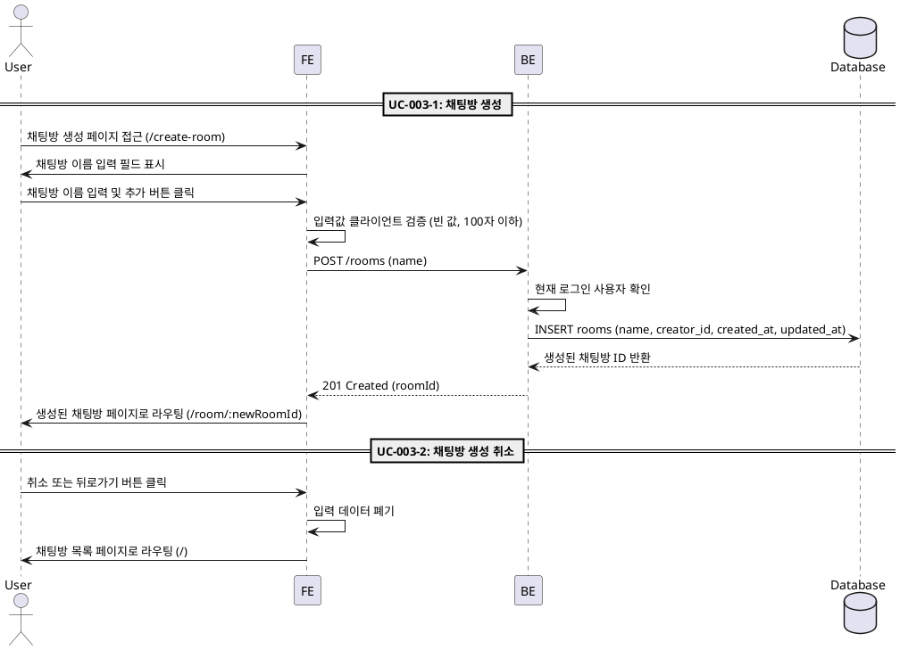

# UC-003: 채팅방 생성

## UC-003-1: 채팅방 생성

### Primary Actor
로그인 사용자

### Precondition
- 사용자가 로그인 상태
- 채팅방 생성 페이지(`/create-room`)에 접근

### Trigger
사용자가 채팅방 이름을 입력하고 '추가' 버튼 클릭

### Main Scenario
1. 사용자가 채팅방 생성 페이지에서 채팅방 이름 입력
2. 사용자가 '추가' 버튼 클릭
3. FE가 입력값 유효성 검증
   - 빈 값 여부 확인
   - 100자 이하 확인
4. FE가 채팅방 생성 API 요청
5. BE가 현재 로그인 사용자 정보 확인
6. BE가 데이터베이스에 새 채팅방 생성
   - `name`: 입력된 채팅방 이름
   - `creator_id`: 현재 사용자 UUID
   - `created_at`, `updated_at`: 현재 시각
7. BE가 생성된 채팅방 ID 반환
8. FE가 생성된 채팅방 페이지(`/room/:newRoomId`)로 라우팅

### Edge Cases
- **빈 값 입력**: "채팅방 이름을 입력해주세요" 메시지 표시
- **100자 초과**: "채팅방 이름은 100자 이하로 입력해주세요" 메시지 표시
- **생성 실패**: "채팅방 생성에 실패했습니다" 오류 메시지 표시
- **네트워크 오류**: "네트워크 연결을 확인해주세요" 메시지 표시
- **인증 실패**: 로그인 페이지로 리다이렉트

### Business Rules
- 로그인 사용자만 채팅방 생성 가능
- 채팅방 이름은 필수 입력 (빈 값 불가)
- 채팅방 이름은 최대 100자
- 생성 성공 시 해당 채팅방 페이지로 자동 이동
- 생성자 정보는 현재 로그인 사용자로 자동 설정

---

## UC-003-2: 채팅방 생성 취소

### Primary Actor
로그인 사용자

### Precondition
- 사용자가 채팅방 생성 페이지에 위치

### Trigger
사용자가 '취소' 버튼 또는 '뒤로가기' 버튼 클릭

### Main Scenario
1. 사용자가 '취소' 또는 '뒤로가기' 버튼 클릭
2. FE가 입력된 데이터 폐기
3. FE가 채팅방 목록 페이지(`/`)로 라우팅

### Edge Cases
- 없음 (단순 라우팅)

### Business Rules
- 입력된 데이터는 저장되지 않음
- 취소 시 채팅방 목록 페이지로 이동

---

## Sequence Diagram

