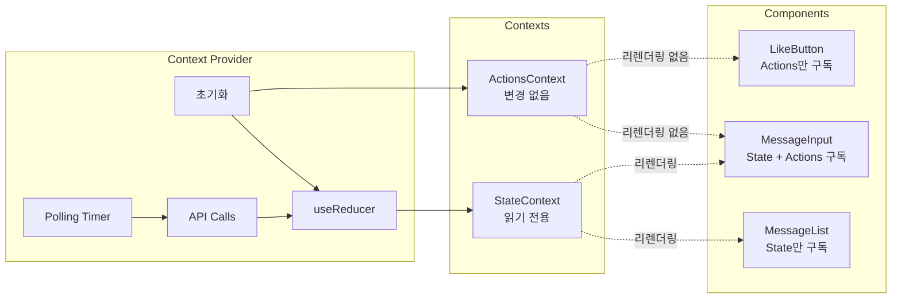
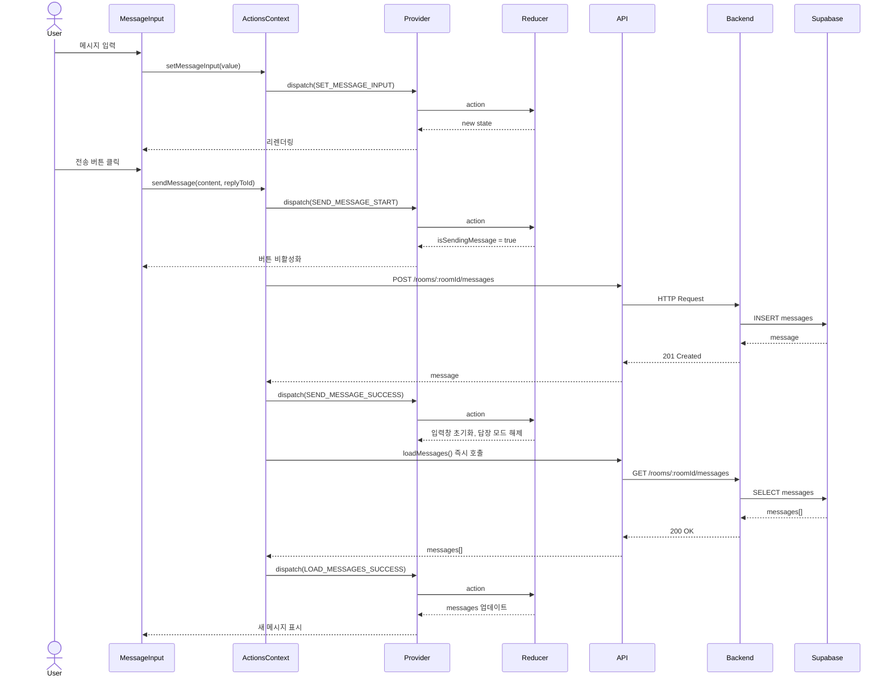
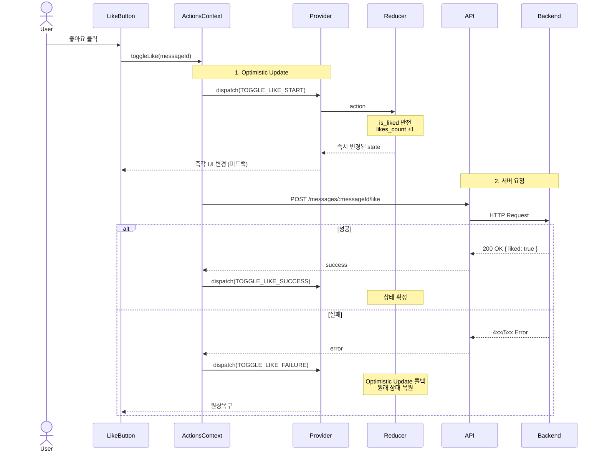
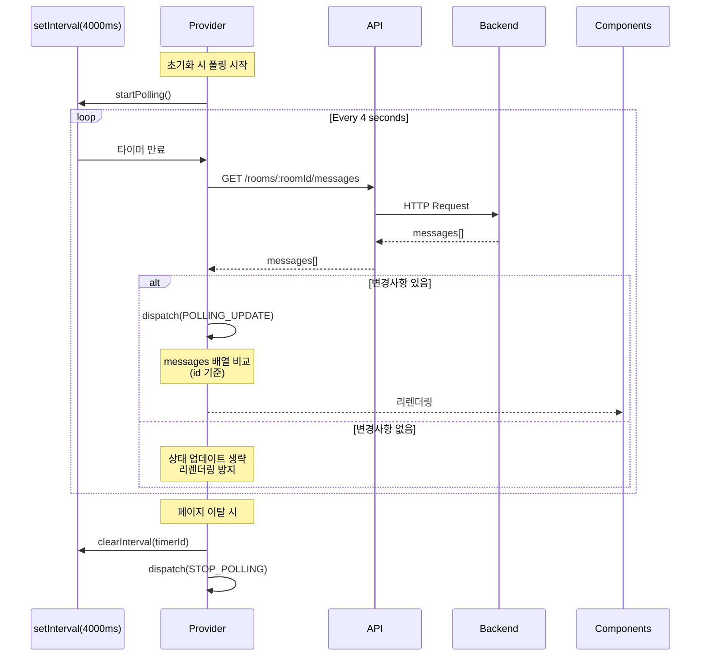

# UC-004 채팅방 페이지 구현 계획

## 목차
1. [개요](#개요)
2. [모듈 목록](#모듈-목록)
3. [아키텍처 다이어그램](#아키텍처-다이어그램)
4. [구현 계획](#구현-계획)

---

## 개요

### 기능 요약
UC-004 채팅방 페이지는 실시간 메시지 조회, 전송, 좋아요, 답장, 삭제 기능을 제공하는 채팅 인터페이스입니다. Context 기반 상태 관리와 폴링 메커니즘을 통해 실시간성을 구현합니다.

### 핵심 설계 원칙
- **Context 분리**: State와 Actions를 별도 Context로 분리하여 성능 최적화
- **useReducer 기반 상태 관리**: 복잡한 상태 로직을 순수 함수로 관리
- **Optimistic Update**: 좋아요/삭제 시 즉각적인 UI 피드백 제공
- **Polling 메커니즘**: 3-5초 간격으로 메시지 자동 갱신
- **타입 안전성**: Zod 스키마 기반 런타임 검증

### 기술 스택
- **Frontend**: React Context API + useReducer, TypeScript, Tailwind CSS, shadcn-ui
- **Backend**: Hono + Next.js Route Handler, Supabase (PostgreSQL)
- **Validation**: Zod
- **HTTP Client**: Axios
- **Date Handling**: date-fns
- **Utilities**: es-toolkit, ts-pattern

---

## 모듈 목록

### Backend Modules

#### 1. `/src/features/chat-room/backend/schema.ts`
**책임**: 요청/응답 스키마 정의 및 타입 추론
- Zod 스키마 정의 (메시지 조회, 전송, 삭제, 좋아요 등)
- TypeScript 타입 추출
- 데이터베이스 Row 스키마 정의

#### 2. `/src/features/chat-room/backend/error.ts`
**책임**: 에러 코드 상수 관리
- 채팅방/메시지 관련 에러 코드 정의
- 타입 안전한 에러 처리

#### 3. `/src/features/chat-room/backend/service.ts`
**책임**: Supabase 데이터베이스 접근 및 비즈니스 로직
- 채팅방 정보 조회
- 메시지 목록 조회 (JOIN 포함)
- 메시지 생성/삭제
- 좋아요 토글 (추가/취소)

#### 4. `/src/features/chat-room/backend/route.ts`
**책임**: Hono 라우터 정의 및 HTTP 엔드포인트 노출
- `GET /rooms/:roomId` - 채팅방 정보 조회
- `GET /rooms/:roomId/messages` - 메시지 목록 조회
- `POST /rooms/:roomId/messages` - 메시지 전송
- `DELETE /messages/:messageId` - 메시지 삭제
- `POST /messages/:messageId/like` - 좋아요 토글

---

### Frontend Modules

#### 5. `/src/features/chat-room/types/state.ts`
**책임**: 상태 타입 정의
- `ChatRoomState` - 전체 상태 구조
- `Message`, `ReplyMode`, `LoadingStates`, `ErrorState` 등 하위 타입

#### 6. `/src/features/chat-room/types/actions.ts`
**책임**: 액션 타입 정의
- `ChatRoomActionTypes` - 액션 타입 상수
- `ChatRoomAction` - 액션 Union 타입

#### 7. `/src/features/chat-room/reducer/chat-room-reducer.ts`
**책임**: 상태 변환 로직 (순수 함수)
- 모든 액션에 대한 상태 변환 구현
- Optimistic Update 로직
- 불변성 유지

#### 8. `/src/features/chat-room/context/chat-room-state-context.ts`
**책임**: State Context 정의
- 읽기 전용 상태 제공
- Context 생성

#### 9. `/src/features/chat-room/context/chat-room-actions-context.ts`
**책임**: Actions Context 정의
- 액션 함수 인터페이스 제공
- Context 생성

#### 10. `/src/features/chat-room/context/chat-room-provider.tsx`
**책임**: Context Provider 구현
- useReducer 초기화
- 폴링 메커니즘 구현
- API 호출 및 상태 업데이트
- 초기화 로직 (인증, 채팅방 정보 조회 등)
- Cleanup 로직 (폴링 타이머 정리)

#### 11. `/src/features/chat-room/hooks/use-chat-room-state.ts`
**책임**: State 구독 Hook
- State Context 접근
- Provider 외부 호출 방지

#### 12. `/src/features/chat-room/hooks/use-chat-room-actions.ts`
**책임**: Actions 구독 Hook
- Actions Context 접근
- Provider 외부 호출 방지

#### 13. `/src/features/chat-room/hooks/use-chat-room.ts`
**책임**: 통합 Hook (편의성)
- State + Actions 동시 구독

#### 14. `/src/features/chat-room/lib/api.ts`
**책임**: API 호출 함수
- axios 기반 HTTP 요청
- 에러 핸들링

#### 15. `/src/features/chat-room/lib/dto.ts`
**책임**: 클라이언트 측 DTO 재노출
- backend/schema.ts의 타입 재노출

---

### UI Components

#### 16. `/src/features/chat-room/components/chat-room-page.tsx`
**책임**: 페이지 컨테이너
- 레이아웃 구성
- 에러 처리 UI

#### 17. `/src/features/chat-room/components/chat-room-header.tsx`
**책임**: 채팅방 헤더
- 채팅방 제목 표시
- 뒤로가기 버튼

#### 18. `/src/features/chat-room/components/message-list.tsx`
**책임**: 메시지 목록 렌더링
- 메시지 리스트 표시
- 빈 상태 처리
- 로딩 상태 표시

#### 19. `/src/features/chat-room/components/message-item.tsx`
**책임**: 개별 메시지 표시
- 본인/타인 메시지 구분 렌더링
- 답장 대상 정보 표시
- 액션 버튼 (좋아요, 답장, 삭제)

#### 20. `/src/features/chat-room/components/message-bubble.tsx`
**책임**: 메시지 말풍선 UI
- 내용 렌더링
- 스타일링 (본인/타인 구분)

#### 21. `/src/features/chat-room/components/reply-preview.tsx`
**책임**: 답장 대상 미리보기
- 답장 대상 메시지 정보 표시 (메시지 내부)

#### 22. `/src/features/chat-room/components/message-actions.tsx`
**책임**: 메시지 액션 버튼 그룹
- 좋아요, 답장, 삭제 버튼

#### 23. `/src/features/chat-room/components/like-button.tsx`
**책임**: 좋아요 버튼
- 좋아요 수 표시
- 좋아요 상태 표시
- 로딩 상태

#### 24. `/src/features/chat-room/components/reply-bar.tsx`
**책임**: 답장 대상 표시 영역 (입력창 상단)
- 답장 모드 시 표시
- 취소 버튼

#### 25. `/src/features/chat-room/components/message-input.tsx`
**책임**: 메시지 입력 영역
- 입력창 (Textarea)
- 전송 버튼
- 로딩/비활성화 상태 처리

#### 26. `/src/features/chat-room/components/error-state.tsx`
**책임**: 에러 상태 UI
- 에러 메시지 표시
- 재시도 버튼

#### 27. `/src/features/chat-room/components/empty-state.tsx`
**책임**: 빈 채팅방 UI
- 메시지 없음 안내

#### 28. `/src/features/chat-room/components/delete-confirm-dialog.tsx`
**책임**: 메시지 삭제 확인 다이얼로그
- shadcn-ui Dialog 사용

---

### App Router Integration

#### 29. `/src/app/room/[roomId]/layout.tsx`
**책임**: 채팅방 레이아웃
- ChatRoomProvider로 하위 컴포넌트 감싸기

#### 30. `/src/app/room/[roomId]/page.tsx`
**책임**: 채팅방 페이지 엔트리
- ChatRoomPage 컴포넌트 렌더링

---

## 아키텍처 다이어그램

### 전체 아키텍처

```mermaid
graph TB
    subgraph "App Router Layer"
        Layout[/src/app/room/[roomId]/layout.tsx]
        Page[/src/app/room/[roomId]/page.tsx]
    end

    subgraph "Context Layer"
        Provider[ChatRoomProvider]
        StateCtx[ChatRoomStateContext]
        ActionsCtx[ChatRoomActionsContext]
    end

    subgraph "State Management Layer"
        Reducer[chatRoomReducer]
        State[ChatRoomState]
        Actions[Action Types]
    end

    subgraph "API Layer"
        APILib[lib/api.ts]
        APIClient[apiClient axios]
    end

    subgraph "Backend Layer"
        Route[backend/route.ts]
        Service[backend/service.ts]
        Schema[backend/schema.ts]
        Error[backend/error.ts]
    end

    subgraph "Database Layer"
        Supabase[(Supabase PostgreSQL)]
    end

    subgraph "Component Layer"
        ChatRoomPage[ChatRoomPage]
        Header[ChatRoomHeader]
        MessageList[MessageList]
        MessageItem[MessageItem]
        MessageInput[MessageInput]
        ReplyBar[ReplyBar]
    end

    Layout --> Provider
    Page --> ChatRoomPage
    Provider --> StateCtx
    Provider --> ActionsCtx
    Provider --> Reducer
    Provider --> APILib
    Reducer --> State
    Reducer --> Actions

    StateCtx --> ChatRoomPage
    StateCtx --> Header
    StateCtx --> MessageList
    StateCtx --> MessageItem
    StateCtx --> MessageInput
    StateCtx --> ReplyBar

    ActionsCtx --> ChatRoomPage
    ActionsCtx --> MessageItem
    ActionsCtx --> MessageInput
    ActionsCtx --> ReplyBar

    APILib --> APIClient
    APIClient --> Route
    Route --> Service
    Route --> Schema
    Route --> Error
    Service --> Supabase
    Service --> Schema

    ChatRoomPage --> Header
    ChatRoomPage --> MessageList
    ChatRoomPage --> MessageInput
    MessageList --> MessageItem
    MessageInput --> ReplyBar
```

### Context 아키텍처 상세



### 데이터 흐름 - 메시지 전송



### 데이터 흐름 - 좋아요 Optimistic Update



### 폴링 메커니즘



---

## 구현 계획

### Phase 1: Backend API 구축

#### 1.1. Schema 정의 (`backend/schema.ts`)

**구현 내용**:
- 채팅방 정보 스키마
  - `RoomParamsSchema`: roomId 파라미터 검증
  - `RoomResponseSchema`: 채팅방 정보 응답
  - `RoomTableRowSchema`: DB Row 타입
- 메시지 스키마
  - `MessageParamsSchema`: messageId 파라미터
  - `MessagesResponseSchema`: 메시지 목록 응답
  - `MessageItemSchema`: 개별 메시지 (발신자, 답장 대상, 좋아요 포함)
  - `CreateMessageSchema`: 메시지 생성 요청 body
  - `MessageTableRowSchema`: DB Row 타입
- 좋아요 스키마
  - `ToggleLikeResponseSchema`: 좋아요 토글 응답

**데이터 구조 예시**:
```typescript
// 메시지 응답 구조
{
  id: "uuid",
  room_id: "uuid",
  sender_id: "uuid",
  content: "메시지 내용",
  reply_to_id: "uuid | null",
  created_at: "timestamp",
  sender: {
    id: "uuid",
    nickname: "닉네임",
    avatar_url: "url | null"
  },
  reply_to: {
    id: "uuid",
    content: "답장 대상 내용",
    sender: {
      nickname: "답장 대상 발신자"
    }
  } | null,
  likes_count: 5,
  is_liked_by_current_user: true
}
```

**검증 포인트**:
- UUID 형식 검증
- 필수 필드 존재 여부
- 문자열 길이 제한 (필요 시)

---

#### 1.2. Error Codes 정의 (`backend/error.ts`)

**구현 내용**:
```typescript
export const chatRoomErrorCodes = {
  // 채팅방
  roomNotFound: 'CHAT_ROOM_NOT_FOUND',
  roomFetchError: 'CHAT_ROOM_FETCH_ERROR',

  // 메시지
  messageFetchError: 'MESSAGE_FETCH_ERROR',
  messageCreateError: 'MESSAGE_CREATE_ERROR',
  messageDeleteError: 'MESSAGE_DELETE_ERROR',
  messageNotFound: 'MESSAGE_NOT_FOUND',

  // 좋아요
  likeFetchError: 'LIKE_FETCH_ERROR',
  likeToggleError: 'LIKE_TOGGLE_ERROR',

  // 권한
  unauthorizedDelete: 'UNAUTHORIZED_MESSAGE_DELETE',

  // 검증
  validationError: 'CHAT_ROOM_VALIDATION_ERROR',
} as const;
```

---

#### 1.3. Service 구현 (`backend/service.ts`)

**구현 함수 목록**:

1. **getRoomById**
   - **입력**: `SupabaseClient`, `roomId: string`
   - **출력**: `HandlerResult<RoomResponse, ChatRoomServiceError>`
   - **로직**:
     - rooms 테이블에서 roomId로 조회
     - 존재하지 않으면 `roomNotFound` 에러
     - Row 검증 → Response 변환

2. **getMessagesByRoomId**
   - **입력**: `SupabaseClient`, `roomId: string`, `userId: string | null`
   - **출력**: `HandlerResult<MessageItem[], ChatRoomServiceError>`
   - **로직**:
     ```sql
     SELECT
       m.*,
       sender.id as sender_id,
       sender.nickname as sender_nickname,
       sender.avatar_url as sender_avatar_url,
       reply_msg.id as reply_to_id,
       reply_msg.content as reply_to_content,
       reply_sender.nickname as reply_to_sender_nickname,
       COUNT(likes.id) as likes_count,
       (CASE WHEN user_like.id IS NOT NULL THEN true ELSE false END) as is_liked_by_current_user
     FROM messages m
     LEFT JOIN profiles sender ON m.sender_id = sender.user_id
     LEFT JOIN messages reply_msg ON m.reply_to_id = reply_msg.id
     LEFT JOIN profiles reply_sender ON reply_msg.sender_id = reply_sender.user_id
     LEFT JOIN likes ON m.id = likes.message_id
     LEFT JOIN likes user_like ON m.id = user_like.message_id AND user_like.user_id = :userId
     WHERE m.room_id = :roomId
     GROUP BY m.id, sender.id, reply_msg.id, reply_sender.id, user_like.id
     ORDER BY m.created_at ASC
     ```
   - **주의**: Supabase client API로 복잡한 JOIN 구현 필요 (RPC 사용 가능)

3. **createMessage**
   - **입력**: `SupabaseClient`, `{ roomId, senderId, content, replyToId }`
   - **출력**: `HandlerResult<MessageItem, ChatRoomServiceError>`
   - **로직**:
     - messages 테이블에 INSERT
     - rooms 테이블의 updated_at 갱신
     - 생성된 메시지 반환

4. **deleteMessage**
   - **입력**: `SupabaseClient`, `messageId: string`, `userId: string`
   - **출력**: `HandlerResult<void, ChatRoomServiceError>`
   - **로직**:
     - 메시지 존재 여부 확인
     - sender_id === userId 확인 (권한 검증)
     - 불일치 시 `unauthorizedDelete` 에러
     - DELETE 실행 (CASCADE로 likes도 삭제됨)

5. **toggleLike**
   - **입력**: `SupabaseClient`, `messageId: string`, `userId: string`
   - **출력**: `HandlerResult<{ liked: boolean }, ChatRoomServiceError>`
   - **로직**:
     - likes 테이블에서 (message_id, user_id) 조회
     - 존재하면 DELETE → `{ liked: false }` 반환
     - 존재하지 않으면 INSERT → `{ liked: true }` 반환

**Unit Test 시나리오**:
- ✅ 정상 조회/생성/삭제/토글
- ❌ 존재하지 않는 roomId/messageId
- ❌ 권한 없는 삭제 시도
- ❌ DB 에러 (mock)

---

#### 1.4. Route 구현 (`backend/route.ts`)

**엔드포인트 목록**:

1. **GET /rooms/:roomId**
   - **Handler**: `getRoomById` 호출
   - **응답**: `RoomResponse | ErrorResult`

2. **GET /rooms/:roomId/messages**
   - **Handler**:
     - 헤더/쿠키에서 userId 추출 (optional, 비로그인 지원)
     - `getMessagesByRoomId` 호출
   - **응답**: `MessageItem[] | ErrorResult`

3. **POST /rooms/:roomId/messages**
   - **Handler**:
     - 인증 필수 (userId 없으면 401)
     - body 검증 (`CreateMessageSchema`)
     - `createMessage` 호출
   - **응답**: `MessageItem | ErrorResult`

4. **DELETE /messages/:messageId**
   - **Handler**:
     - 인증 필수
     - `deleteMessage` 호출
   - **응답**: `204 No Content | ErrorResult`

5. **POST /messages/:messageId/like**
   - **Handler**:
     - 인증 필수
     - `toggleLike` 호출
   - **응답**: `{ liked: boolean } | ErrorResult`

**에러 처리**:
- 파라미터 검증 실패 → 400
- 인증 실패 → 401
- 권한 없음 → 403
- 리소스 없음 → 404
- DB 에러 → 500

**Integration Test QA Sheet**:
- ✅ 각 엔드포인트 정상 응답
- ✅ 파라미터 검증 실패 시 400
- ✅ 비로그인 사용자 메시지 조회 가능
- ✅ 비로그인 사용자 메시지 전송 불가 (401)
- ✅ 타인 메시지 삭제 불가 (403)

---

### Phase 2: Frontend State Management

#### 2.1. Types 정의 (`types/state.ts`, `types/actions.ts`)

**state.ts 구현**:
- `Message` 인터페이스
- `ReplyMode` 인터페이스
- `LoadingStates` 인터페이스
- `ErrorState` 인터페이스
- `AuthState` 인터페이스
- `RoomInfo` 인터페이스
- `PollingState` 인터페이스
- `ChatRoomState` 전체 상태
- `initialChatRoomState` 초기값

**actions.ts 구현**:
- `ChatRoomActionTypes` 상수 객체
- `ChatRoomAction` Union 타입 (모든 액션 포함)

**검증 포인트**:
- 모든 상태 필드에 명확한 주석
- 초기값이 올바른지 확인
- Action payload 타입 정확성

---

#### 2.2. Reducer 구현 (`reducer/chat-room-reducer.ts`)

**구현 내용**:
```typescript
export function chatRoomReducer(
  state: ChatRoomState,
  action: ChatRoomAction
): ChatRoomState
```

**핵심 액션 처리 로직**:

1. **LOAD_MESSAGES_SUCCESS**:
   - `messages` 배열 교체
   - `loadingStates.isInitialLoading = false`

2. **SEND_MESSAGE_START**:
   - `loadingStates.isSendingMessage = true`

3. **SEND_MESSAGE_SUCCESS**:
   - `loadingStates.isSendingMessage = false`
   - `messageInput = ""`
   - `replyMode` 초기화

4. **TOGGLE_LIKE_START** (Optimistic Update):
   - `messages` 배열에서 해당 메시지 찾기
   - `is_liked_by_current_user` 반전
   - `likes_count` ±1
   - `loadingStates.togglingLikeMessageId = messageId`

5. **TOGGLE_LIKE_SUCCESS**:
   - `loadingStates.togglingLikeMessageId = null`
   - 서버 응답으로 상태 확정 (이미 Optimistic으로 변경했으므로 생략 가능)

6. **TOGGLE_LIKE_FAILURE**:
   - `messages` 배열 롤백 (원래 상태로 복원)
   - `loadingStates.togglingLikeMessageId = null`

7. **DELETE_MESSAGE_START** (Optimistic Update):
   - `messages` 배열에서 해당 메시지 제거
   - `loadingStates.deletingMessageId = messageId`

8. **DELETE_MESSAGE_FAILURE**:
   - `messages` 배열에 메시지 다시 추가 (롤백)
   - `loadingStates.deletingMessageId = null`

9. **START_REPLY**:
   - `replyMode.isReplying = true`
   - `replyMode.targetMessage = payload`

10. **POLLING_UPDATE**:
    - 기존 `messages`와 새 `payload` 비교 (id 기준)
    - 변경사항 있으면 배열 교체, 없으면 상태 유지

**Unit Test 시나리오**:
- ✅ 각 액션별 상태 변화 검증
- ✅ Optimistic Update 정상 동작
- ✅ 롤백 로직 정상 동작
- ✅ 불변성 유지 (원본 state 변경 안됨)

---

#### 2.3. API Client 구현 (`lib/api.ts`)

**구현 함수 목록**:
```typescript
export const chatRoomApi = {
  getRoomInfo: (roomId: string) =>
    apiClient.get<RoomResponse>(`/api/rooms/${roomId}`),

  getMessages: (roomId: string) =>
    apiClient.get<MessageItem[]>(`/api/rooms/${roomId}/messages`),

  sendMessage: (roomId: string, body: CreateMessageBody) =>
    apiClient.post<MessageItem>(`/api/rooms/${roomId}/messages`, body),

  deleteMessage: (messageId: string) =>
    apiClient.delete(`/api/messages/${messageId}`),

  toggleLike: (messageId: string) =>
    apiClient.post<{ liked: boolean }>(`/api/messages/${messageId}/like`),
};
```

**에러 핸들링**:
- `extractApiErrorMessage` 사용
- axios error → ErrorState 변환

---

#### 2.4. Context 구현

##### 2.4.1. State Context (`context/chat-room-state-context.ts`)

**구현 내용**:
```typescript
export interface ChatRoomStateContextValue {
  messages: Message[];
  roomInfo: RoomInfo | null;
  replyMode: ReplyMode;
  messageInput: string;
  pollingState: PollingState;
  loadingStates: LoadingStates;
  errorState: ErrorState;
  authState: AuthState;

  // 파생 데이터
  sortedMessages: Message[];
  myMessageIds: Set<string>;
  isMessageInputEmpty: boolean;
  canSendMessage: boolean;
}

export const ChatRoomStateContext = createContext<ChatRoomStateContextValue | null>(null);
```

##### 2.4.2. Actions Context (`context/chat-room-actions-context.ts`)

**구현 내용**:
```typescript
export interface ChatRoomActionsContextValue {
  loadMessages: () => Promise<void>;
  sendMessage: (content: string, replyToId?: string | null) => Promise<void>;
  deleteMessage: (messageId: string) => Promise<void>;
  toggleLike: (messageId: string) => Promise<void>;
  startReply: (messageId: string) => void;
  cancelReply: () => void;
  setMessageInput: (value: string) => void;
  clearMessageInput: () => void;
  startPolling: () => void;
  stopPolling: () => void;
  clearError: () => void;
}

export const ChatRoomActionsContext = createContext<ChatRoomActionsContextValue | null>(null);
```

##### 2.4.3. Provider 구현 (`context/chat-room-provider.tsx`)

**핵심 로직**:

1. **초기화 (useEffect)**:
   ```typescript
   useEffect(() => {
     // 1. 인증 상태 확인
     const userId = getCurrentUserId(); // localStorage or cookie
     dispatch({ type: 'SET_AUTH_STATE', payload: { isAuthenticated: !!userId, userId } });

     // 2. 채팅방 정보 조회
     const fetchRoom = async () => {
       try {
         const { data } = await chatRoomApi.getRoomInfo(roomId);
         dispatch({ type: 'SET_ROOM_INFO', payload: data });
       } catch (error) {
         dispatch({ type: 'SET_ERROR', payload: { type: 'room_not_found', message: '...' } });
         return;
       }

       // 3. 메시지 조회
       await loadMessages();

       // 4. 폴링 시작
       startPolling();
     };

     fetchRoom();

     // 5. Cleanup
     return () => {
       stopPolling();
     };
   }, [roomId]);
   ```

2. **loadMessages 구현**:
   ```typescript
   const loadMessages = useCallback(async () => {
     dispatch({ type: 'LOAD_MESSAGES_START' });
     try {
       const { data } = await chatRoomApi.getMessages(roomId);
       dispatch({ type: 'LOAD_MESSAGES_SUCCESS', payload: data });
     } catch (error) {
       dispatch({ type: 'LOAD_MESSAGES_FAILURE', payload: extractApiErrorMessage(error) });
     }
   }, [roomId]);
   ```

3. **sendMessage 구현** (Optimistic Update 없음, 즉시 재조회):
   ```typescript
   const sendMessage = useCallback(async (content: string, replyToId?: string | null) => {
     if (!content.trim()) return;

     dispatch({ type: 'SEND_MESSAGE_START' });
     try {
       await chatRoomApi.sendMessage(roomId, { content, reply_to_id: replyToId });
       dispatch({ type: 'SEND_MESSAGE_SUCCESS' });
       await loadMessages(); // 즉시 재조회
     } catch (error) {
       dispatch({ type: 'SEND_MESSAGE_FAILURE', payload: extractApiErrorMessage(error) });
     }
   }, [roomId, loadMessages]);
   ```

4. **toggleLike 구현** (Optimistic Update):
   ```typescript
   const toggleLike = useCallback(async (messageId: string) => {
     dispatch({ type: 'TOGGLE_LIKE_START', payload: messageId });
     try {
       const { data } = await chatRoomApi.toggleLike(messageId);
       dispatch({ type: 'TOGGLE_LIKE_SUCCESS', payload: { messageId, liked: data.liked } });
     } catch (error) {
       dispatch({ type: 'TOGGLE_LIKE_FAILURE', payload: messageId });
     }
   }, []);
   ```

5. **deleteMessage 구현** (Optimistic Update):
   ```typescript
   const deleteMessage = useCallback(async (messageId: string) => {
     const message = state.messages.find(m => m.id === messageId);
     if (!message) return;

     dispatch({ type: 'DELETE_MESSAGE_START', payload: messageId });
     try {
       await chatRoomApi.deleteMessage(messageId);
       dispatch({ type: 'DELETE_MESSAGE_SUCCESS', payload: messageId });
     } catch (error) {
       dispatch({ type: 'DELETE_MESSAGE_FAILURE', payload: { messageId, message } });
     }
   }, [state.messages]);
   ```

6. **startPolling 구현**:
   ```typescript
   const startPolling = useCallback(() => {
     const timerId = setInterval(() => {
       loadMessages();
     }, 4000); // 4초 간격

     dispatch({ type: 'SET_TIMER_ID', payload: timerId });
     dispatch({ type: 'START_POLLING' });
   }, [loadMessages]);
   ```

7. **Context 제공**:
   ```typescript
   const stateValue: ChatRoomStateContextValue = useMemo(() => ({
     ...state,
     sortedMessages: state.messages.sort((a, b) =>
       new Date(a.created_at).getTime() - new Date(b.created_at).getTime()
     ),
     myMessageIds: new Set(state.messages.filter(m => m.sender_id === state.authState.userId).map(m => m.id)),
     isMessageInputEmpty: !state.messageInput.trim(),
     canSendMessage: !!state.messageInput.trim() && !state.loadingStates.isSendingMessage && state.authState.isAuthenticated,
   }), [state]);

   const actionsValue: ChatRoomActionsContextValue = useMemo(() => ({
     loadMessages,
     sendMessage,
     deleteMessage,
     toggleLike,
     startReply,
     cancelReply,
     setMessageInput,
     clearMessageInput,
     startPolling,
     stopPolling,
     clearError,
   }), [/* all callbacks */]);

   return (
     <ChatRoomStateContext.Provider value={stateValue}>
       <ChatRoomActionsContext.Provider value={actionsValue}>
         {children}
       </ChatRoomActionsContext.Provider>
     </ChatRoomStateContext.Provider>
   );
   ```

**Integration Test QA Sheet**:
- ✅ Provider 마운트 시 초기화 로직 실행
- ✅ 폴링 타이머 정상 동작 (4초마다 API 호출)
- ✅ Unmount 시 폴링 타이머 정리
- ✅ 메시지 전송 후 즉시 목록 재조회
- ✅ Optimistic Update 정상 동작 (좋아요/삭제)

---

#### 2.5. Hooks 구현

**구현 내용**:
```typescript
// use-chat-room-state.ts
export function useChatRoomState() {
  const context = useContext(ChatRoomStateContext);
  if (!context) {
    throw new Error('useChatRoomState must be used within ChatRoomProvider');
  }
  return context;
}

// use-chat-room-actions.ts
export function useChatRoomActions() {
  const context = useContext(ChatRoomActionsContext);
  if (!context) {
    throw new Error('useChatRoomActions must be used within ChatRoomProvider');
  }
  return context;
}

// use-chat-room.ts
export function useChatRoom() {
  const state = useChatRoomState();
  const actions = useChatRoomActions();
  return [state, actions] as const;
}
```

---

### Phase 3: UI Components

#### 3.1. Layout 및 페이지 (`app/room/[roomId]/`)

**layout.tsx**:
```tsx
'use client';

import { ChatRoomProvider } from '@/features/chat-room/context/chat-room-provider';
import { use } from 'react';

export default function ChatRoomLayout({
  children,
  params,
}: {
  children: React.ReactNode;
  params: Promise<{ roomId: string }>;
}) {
  const { roomId } = use(params);

  return (
    <ChatRoomProvider roomId={roomId}>
      {children}
    </ChatRoomProvider>
  );
}
```

**page.tsx**:
```tsx
'use client';

import { ChatRoomPage } from '@/features/chat-room/components/chat-room-page';

export default function RoomPage() {
  return <ChatRoomPage />;
}
```

---

#### 3.2. 핵심 컴포넌트 구현

##### 3.2.1. ChatRoomPage (`components/chat-room-page.tsx`)

**책임**:
- 전체 레이아웃 구성
- 에러 상태 처리

**구현 내용**:
```tsx
'use client';

import { useChatRoomState } from '../hooks/use-chat-room-state';
import { ChatRoomHeader } from './chat-room-header';
import { MessageList } from './message-list';
import { MessageInput } from './message-input';
import { ErrorState } from './error-state';

export function ChatRoomPage() {
  const { errorState, roomInfo } = useChatRoomState();

  if (errorState.type === 'room_not_found') {
    return <ErrorState />;
  }

  return (
    <div className="flex flex-col h-screen">
      <ChatRoomHeader />
      <MessageList />
      <MessageInput />
    </div>
  );
}
```

---

##### 3.2.2. ChatRoomHeader (`components/chat-room-header.tsx`)

**구현 내용**:
```tsx
'use client';

import { useChatRoomState } from '../hooks/use-chat-room-state';
import { ArrowLeft } from 'lucide-react';
import { useRouter } from 'next/navigation';

export function ChatRoomHeader() {
  const { roomInfo } = useChatRoomState();
  const router = useRouter();

  return (
    <header className="border-b px-4 py-3 flex items-center gap-3">
      <button onClick={() => router.back()}>
        <ArrowLeft className="w-6 h-6" />
      </button>
      <h1 className="text-lg font-semibold">
        {roomInfo?.name || '채팅방'}
      </h1>
    </header>
  );
}
```

---

##### 3.2.3. MessageList (`components/message-list.tsx`)

**구현 내용**:
```tsx
'use client';

import { useChatRoomState } from '../hooks/use-chat-room-state';
import { MessageItem } from './message-item';
import { EmptyState } from './empty-state';
import { useEffect, useRef } from 'react';

export function MessageList() {
  const { sortedMessages, loadingStates } = useChatRoomState();
  const listRef = useRef<HTMLDivElement>(null);

  useEffect(() => {
    // 메시지 추가 시 스크롤 최하단 이동 (선택적)
    if (listRef.current) {
      listRef.current.scrollTop = listRef.current.scrollHeight;
    }
  }, [sortedMessages]);

  if (loadingStates.isInitialLoading) {
    return (
      <div className="flex-1 flex items-center justify-center">
        <p className="text-muted-foreground">메시지를 불러오는 중...</p>
      </div>
    );
  }

  if (sortedMessages.length === 0) {
    return <EmptyState />;
  }

  return (
    <div ref={listRef} className="flex-1 overflow-y-auto px-4 py-4 space-y-4">
      {sortedMessages.map((message) => (
        <MessageItem key={message.id} message={message} />
      ))}
    </div>
  );
}
```

---

##### 3.2.4. MessageItem (`components/message-item.tsx`)

**구현 내용**:
```tsx
'use client';

import { useChatRoomState } from '../hooks/use-chat-room-state';
import { MessageBubble } from './message-bubble';
import { MessageActions } from './message-actions';
import { ReplyPreview } from './reply-preview';
import { Avatar } from '@/components/ui/avatar';
import type { Message } from '../types/state';

interface MessageItemProps {
  message: Message;
}

export function MessageItem({ message }: MessageItemProps) {
  const { authState, myMessageIds } = useChatRoomState();
  const isMine = myMessageIds.has(message.id);

  return (
    <div className={`flex gap-2 ${isMine ? 'flex-row-reverse' : 'flex-row'}`}>
      {!isMine && (
        <Avatar className="w-10 h-10">
          
        </Avatar>
      )}

      <div className={`flex-1 ${isMine ? 'items-end' : 'items-start'} flex flex-col`}>
        {!isMine && (
          <p className="text-sm font-medium mb-1">{message.sender.nickname}</p>
        )}

        {message.reply_to && <ReplyPreview replyTo={message.reply_to} />}

        <MessageBubble content={message.content} isMine={isMine} />

        <MessageActions message={message} />
      </div>
    </div>
  );
}
```

**QA Sheet**:
- ✅ 본인/타인 메시지 구분 렌더링
- ✅ 아바타 표시 (타인만)
- ✅ 답장 대상 미리보기 표시
- ✅ 메시지 액션 버튼 표시

---

##### 3.2.5. MessageActions (`components/message-actions.tsx`)

**구현 내용**:
```tsx
'use client';

import { useChatRoomState } from '../hooks/use-chat-room-state';
import { useChatRoomActions } from '../hooks/use-chat-room-actions';
import { LikeButton } from './like-button';
import { Button } from '@/components/ui/button';
import { MessageSquare, Trash2 } from 'lucide-react';
import { useState } from 'react';
import { DeleteConfirmDialog } from './delete-confirm-dialog';
import type { Message } from '../types/state';

interface MessageActionsProps {
  message: Message;
}

export function MessageActions({ message }: MessageActionsProps) {
  const { authState, myMessageIds } = useChatRoomState();
  const { startReply, deleteMessage } = useChatRoomActions();
  const [showDeleteDialog, setShowDeleteDialog] = useState(false);

  const isMine = myMessageIds.has(message.id);

  if (!authState.isAuthenticated) {
    return null; // 비로그인 사용자는 액션 버튼 없음
  }

  return (
    <div className="flex items-center gap-2 mt-1">
      <LikeButton message={message} />

      <Button variant="ghost" size="sm" onClick={() => startReply(message.id)}>
        <MessageSquare className="w-4 h-4" />
      </Button>

      {isMine && (
        <>
          <Button variant="ghost" size="sm" onClick={() => setShowDeleteDialog(true)}>
            <Trash2 className="w-4 h-4" />
          </Button>

          <DeleteConfirmDialog
            open={showDeleteDialog}
            onOpenChange={setShowDeleteDialog}
            onConfirm={() => deleteMessage(message.id)}
          />
        </>
      )}
    </div>
  );
}
```

---

##### 3.2.6. LikeButton (`components/like-button.tsx`)

**구현 내용**:
```tsx
'use client';

import { useChatRoomState } from '../hooks/use-chat-room-state';
import { useChatRoomActions } from '../hooks/use-chat-room-actions';
import { Button } from '@/components/ui/button';
import { Heart } from 'lucide-react';
import type { Message } from '../types/state';

interface LikeButtonProps {
  message: Message;
}

export function LikeButton({ message }: LikeButtonProps) {
  const { loadingStates } = useChatRoomState();
  const { toggleLike } = useChatRoomActions();

  const isLoading = loadingStates.togglingLikeMessageId === message.id;

  return (
    <Button
      variant={message.is_liked_by_current_user ? 'default' : 'ghost'}
      size="sm"
      onClick={() => toggleLike(message.id)}
      disabled={isLoading}
    >
      <Heart className={`w-4 h-4 ${message.is_liked_by_current_user ? 'fill-current' : ''}`} />
      <span className="ml-1">{message.likes_count}</span>
    </Button>
  );
}
```

**QA Sheet**:
- ✅ 좋아요 수 표시
- ✅ 좋아요 상태 시각적 구분 (채워진 하트)
- ✅ 클릭 시 Optimistic Update 동작
- ✅ 로딩 중 버튼 비활성화

---

##### 3.2.7. ReplyBar (`components/reply-bar.tsx`)

**구현 내용**:
```tsx
'use client';

import { useChatRoomState } from '../hooks/use-chat-room-state';
import { useChatRoomActions } from '../hooks/use-chat-room-actions';
import { X } from 'lucide-react';
import { Button } from '@/components/ui/button';

export function ReplyBar() {
  const { replyMode } = useChatRoomState();
  const { cancelReply } = useChatRoomActions();

  if (!replyMode.isReplying || !replyMode.targetMessage) {
    return null;
  }

  return (
    <div className="bg-muted px-4 py-2 flex items-center gap-2">
      <div className="flex-1">
        <p className="text-sm font-medium">
          {replyMode.targetMessage.sender.nickname}에게 답장
        </p>
        <p className="text-sm text-muted-foreground truncate">
          {replyMode.targetMessage.content}
        </p>
      </div>
      <Button variant="ghost" size="sm" onClick={cancelReply}>
        <X className="w-4 h-4" />
      </Button>
    </div>
  );
}
```

---

##### 3.2.8. MessageInput (`components/message-input.tsx`)

**구현 내용**:
```tsx
'use client';

import { useChatRoomState } from '../hooks/use-chat-room-state';
import { useChatRoomActions } from '../hooks/use-chat-room-actions';
import { ReplyBar } from './reply-bar';
import { Textarea } from '@/components/ui/textarea';
import { Button } from '@/components/ui/button';
import { Send } from 'lucide-react';
import { useRouter } from 'next/navigation';

export function MessageInput() {
  const { messageInput, canSendMessage, loadingStates, authState, replyMode } = useChatRoomState();
  const { setMessageInput, sendMessage } = useChatRoomActions();
  const router = useRouter();

  const handleSend = () => {
    if (!canSendMessage) return;
    sendMessage(messageInput, replyMode.targetMessage?.id);
  };

  const handleClick = () => {
    if (!authState.isAuthenticated) {
      router.push('/login');
    }
  };

  return (
    <div className="border-t">
      <ReplyBar />
      <div className="px-4 py-3 flex gap-2">
        <Textarea
          value={messageInput}
          onChange={(e) => setMessageInput(e.target.value)}
          onKeyDown={(e) => {
            if (e.key === 'Enter' && !e.shiftKey) {
              e.preventDefault();
              handleSend();
            }
          }}
          onClick={handleClick}
          placeholder={authState.isAuthenticated ? '메시지를 입력하세요...' : '로그인이 필요합니다'}
          disabled={loadingStates.isSendingMessage || !authState.isAuthenticated}
          className="flex-1"
        />
        <Button
          onClick={handleSend}
          disabled={!canSendMessage}
        >
          {loadingStates.isSendingMessage ? '전송 중...' : <Send className="w-4 h-4" />}
        </Button>
      </div>
    </div>
  );
}
```

**QA Sheet**:
- ✅ 비로그인 사용자 클릭 시 로그인 페이지 이동
- ✅ Enter 키로 전송, Shift+Enter로 줄바꿈
- ✅ 전송 중 입력창 비활성화
- ✅ 전송 후 입력창 초기화
- ✅ 답장 모드 시 ReplyBar 표시

---

##### 3.2.9. ErrorState (`components/error-state.tsx`)

**구현 내용**:
```tsx
'use client';

import { useChatRoomState } from '../hooks/use-chat-room-state';
import { useChatRoomActions } from '../hooks/use-chat-room-actions';
import { Button } from '@/components/ui/button';
import { useRouter } from 'next/navigation';

export function ErrorState() {
  const { errorState } = useChatRoomState();
  const { clearError } = useChatRoomActions();
  const router = useRouter();

  return (
    <div className="flex flex-col items-center justify-center h-screen gap-4">
      <p className="text-lg font-semibold">오류가 발생했습니다</p>
      <p className="text-muted-foreground">{errorState.message}</p>

      {errorState.type === 'room_not_found' && (
        <Button onClick={() => router.push('/rooms')}>
          채팅방 목록으로 돌아가기
        </Button>
      )}

      {errorState.type !== 'room_not_found' && (
        <Button onClick={clearError}>닫기</Button>
      )}
    </div>
  );
}
```

---

##### 3.2.10. EmptyState (`components/empty-state.tsx`)

**구현 내용**:
```tsx
'use client';

export function EmptyState() {
  return (
    <div className="flex-1 flex items-center justify-center">
      <p className="text-muted-foreground">첫 메시지를 작성해보세요</p>
    </div>
  );
}
```

---

##### 3.2.11. DeleteConfirmDialog (`components/delete-confirm-dialog.tsx`)

**구현 내용**:
```tsx
'use client';

import {
  Dialog,
  DialogContent,
  DialogDescription,
  DialogFooter,
  DialogHeader,
  DialogTitle,
} from '@/components/ui/dialog';
import { Button } from '@/components/ui/button';

interface DeleteConfirmDialogProps {
  open: boolean;
  onOpenChange: (open: boolean) => void;
  onConfirm: () => void;
}

export function DeleteConfirmDialog({
  open,
  onOpenChange,
  onConfirm,
}: DeleteConfirmDialogProps) {
  const handleConfirm = () => {
    onConfirm();
    onOpenChange(false);
  };

  return (
    <Dialog open={open} onOpenChange={onOpenChange}>
      <DialogContent>
        <DialogHeader>
          <DialogTitle>메시지 삭제</DialogTitle>
          <DialogDescription>
            이 메시지를 삭제하시겠습니까? 이 작업은 되돌릴 수 없습니다.
          </DialogDescription>
        </DialogHeader>
        <DialogFooter>
          <Button variant="ghost" onClick={() => onOpenChange(false)}>
            취소
          </Button>
          <Button variant="destructive" onClick={handleConfirm}>
            삭제
          </Button>
        </DialogFooter>
      </DialogContent>
    </Dialog>
  );
}
```

---

### Phase 4: Integration & Testing

#### 4.1. Backend Integration Test

**테스트 시나리오**:
1. ✅ 채팅방 정보 조회 성공
2. ✅ 존재하지 않는 채팅방 조회 시 404
3. ✅ 비로그인 사용자 메시지 조회 성공
4. ✅ 메시지 전송 성공 (인증 필요)
5. ✅ 비로그인 사용자 메시지 전송 시 401
6. ✅ 좋아요 토글 성공 (추가/취소)
7. ✅ 메시지 삭제 성공 (본인만)
8. ✅ 타인 메시지 삭제 시 403
9. ✅ 답장 메시지 전송 성공

**테스트 도구**:
- Postman or cURL
- Jest + Supertest (선택적)

---

#### 4.2. Frontend Integration Test

**테스트 시나리오**:
1. ✅ Provider 마운트 시 초기화 로직 실행
2. ✅ 채팅방 정보 및 메시지 목록 렌더링
3. ✅ 폴링 타이머 정상 동작 (4초마다 API 호출)
4. ✅ 메시지 전송 후 목록 갱신
5. ✅ 좋아요 클릭 시 Optimistic Update 동작
6. ✅ 답장 모드 활성화/취소
7. ✅ 메시지 삭제 시 Optimistic Update 및 롤백
8. ✅ 비로그인 사용자 입력창 클릭 시 로그인 페이지 이동
9. ✅ 에러 발생 시 ErrorState 렌더링

**테스트 도구**:
- React Testing Library + Jest (선택적)
- 수동 QA

---

#### 4.3. End-to-End Test

**시나리오**:
1. 사용자 A가 채팅방 진입 → 기존 메시지 조회
2. 사용자 A가 메시지 전송 → 목록에 즉시 표시
3. 사용자 B가 동일 채팅방 진입 → 사용자 A의 메시지 조회
4. 사용자 B가 사용자 A의 메시지에 좋아요 → 폴링으로 A도 확인
5. 사용자 A가 사용자 B의 메시지에 답장 → 답장 대상 정보 표시
6. 사용자 A가 본인 메시지 삭제 → 목록에서 제거
7. 비로그인 사용자가 채팅방 진입 → 읽기 전용 모드

---

### Phase 5: Optimization & Polish

#### 5.1. 성능 최적화

**적용 내용**:
1. **React.memo** 적용:
   - `MessageItem` 컴포넌트 메모이제이션
   - props 변경 시에만 리렌더링

2. **useMemo** 적용:
   - `sortedMessages` 계산 캐싱
   - `myMessageIds` Set 생성 캐싱

3. **Context 분리 효과 검증**:
   - Actions만 구독하는 컴포넌트는 상태 변경 시 리렌더링 안됨

4. **폴링 최적화**:
   - 변경사항 없으면 상태 업데이트 생략
   - 배열 비교 로직 최적화 (id 기준)

---

#### 5.2. UI/UX 개선

**적용 내용**:
1. 스크롤 자동 이동 (새 메시지 추가 시)
2. 로딩 스피너 추가
3. 토스트 메시지 (에러 알림)
4. 좋아요 애니메이션 (선택적)
5. 메시지 시간 표시 (date-fns 사용)
6. 아바타 fallback 이미지

---

#### 5.3. Accessibility

**적용 내용**:
1. 키보드 네비게이션 지원
2. ARIA 속성 추가
3. 포커스 관리 (답장 모드 시 입력창 포커스)
4. 스크린 리더 지원

---

## 추가 고려사항

### shadcn-ui 컴포넌트 설치

다음 컴포넌트들이 필요합니다:

```bash
npx shadcn@latest add avatar
npx shadcn@latest add button
npx shadcn@latest add textarea
npx shadcn@latest add dialog
```

### Database Migration 확인

기존 마이그레이션 파일 `/supabase/migrations/0002_create_vmc_chat_schema.sql`이 이미 존재하므로 추가 마이그레이션 불필요. 단, Supabase에 적용되었는지 확인 필요.

### 환경 변수 설정

`.env.local`:
```
NEXT_PUBLIC_API_BASE_URL=/api
```

### 인증 로직 통합

기존 `useCurrentUser` 훅을 ChatRoomProvider에서 활용하여 인증 상태 확인.

---

## 구현 체크리스트

### Backend
- [ ] schema.ts 정의
- [ ] error.ts 정의
- [ ] service.ts 구현 (5개 함수)
- [ ] route.ts 구현 (5개 엔드포인트)
- [ ] Hono 앱에 라우터 등록
- [ ] Unit Test 작성
- [ ] Integration Test 수행

### Frontend - State Management
- [ ] types/state.ts 정의
- [ ] types/actions.ts 정의
- [ ] reducer/chat-room-reducer.ts 구현
- [ ] lib/api.ts 구현
- [ ] context/chat-room-state-context.ts 정의
- [ ] context/chat-room-actions-context.ts 정의
- [ ] context/chat-room-provider.tsx 구현
- [ ] hooks 구현 (3개)
- [ ] Reducer Unit Test 작성
- [ ] Provider Integration Test 수행

### Frontend - UI Components
- [ ] chat-room-page.tsx 구현
- [ ] chat-room-header.tsx 구현
- [ ] message-list.tsx 구현
- [ ] message-item.tsx 구현
- [ ] message-bubble.tsx 구현
- [ ] reply-preview.tsx 구현
- [ ] message-actions.tsx 구현
- [ ] like-button.tsx 구현
- [ ] reply-bar.tsx 구현
- [ ] message-input.tsx 구현
- [ ] error-state.tsx 구현
- [ ] empty-state.tsx 구현
- [ ] delete-confirm-dialog.tsx 구현
- [ ] app/room/[roomId]/layout.tsx 구현
- [ ] app/room/[roomId]/page.tsx 구현
- [ ] Component QA Sheet 검증

### Integration & Testing
- [ ] Backend Integration Test 수행
- [ ] Frontend Integration Test 수행
- [ ] End-to-End Test 수행
- [ ] 성능 최적화 적용
- [ ] UI/UX 개선
- [ ] Accessibility 검증

### Documentation
- [ ] API 문서 작성 (선택적)
- [ ] Component 사용 가이드 (선택적)
- [ ] Troubleshooting 가이드 (선택적)

---

## 예상 소요 시간

- **Phase 1 (Backend)**: 4-6시간
- **Phase 2 (State Management)**: 4-6시간
- **Phase 3 (UI Components)**: 6-8시간
- **Phase 4 (Integration & Testing)**: 3-4시간
- **Phase 5 (Optimization & Polish)**: 2-3시간

**총 예상 시간**: 19-27시간

---

## 주의사항

1. **타입 안전성**: 모든 모듈에서 TypeScript 타입 체크 통과 필수
2. **불변성 유지**: Reducer에서 상태 변경 시 원본 수정 금지
3. **에러 핸들링**: 모든 API 호출에 try-catch 적용
4. **Cleanup**: Provider unmount 시 폴링 타이머 정리 필수
5. **성능**: Context 분리 효과 검증, 불필요한 리렌더링 방지
6. **테스트**: 핵심 로직은 Unit Test 필수, Integration Test 권장

---

## 참고 문서

- [UC-004 기능 명세서](/docs/004/spec.md)
- [UC-004 상태 관리 설계](/docs/004/state-management.md)
- [AGENTS.md](/AGENTS.md)
- [Supabase Migration 가이드](/supabase/migrations/0002_create_vmc_chat_schema.sql)
