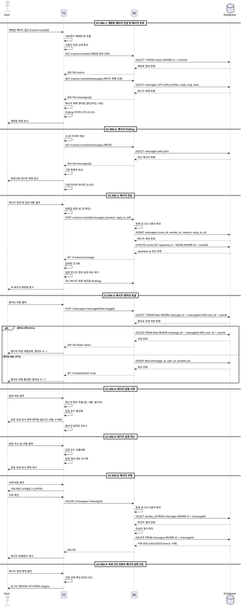

# UC-004: 채팅방 페이지

## UC-004-1: 채팅방 페이지 진입 및 메시지 조회

### Primary Actor
모든 사용자 (로그인/비로그인 모두)

### Precondition
- 채팅방이 존재함
- 채팅방 페이지(`/room/:roomId`) 접근 가능

### Trigger
사용자가 채팅방 페이지에 접근

### Main Scenario
1. 사용자가 채팅방 페이지(`/room/:roomId`) 접근
2. FE가 URL에서 채팅방 ID 추출
3. FE가 사용자 인증 상태 확인
4. FE가 채팅방 정보 조회 API 요청
5. BE가 채팅방 존재 여부 확인
6. FE가 메시지 목록 조회 API 요청
7. BE가 데이터베이스에서 해당 채팅방의 메시지 조회
   - `messages` 테이블과 `profiles` 테이블 조인 (발신자)
   - 답장 대상 메시지 및 발신자 정보 조인
   - 좋아요 수 집계 (LEFT JOIN)
   - `created_at` 기준 오름차순 정렬
8. 로그인 사용자인 경우: 각 메시지에 대한 본인의 좋아요 여부 확인
9. BE가 메시지 목록 반환
10. FE가 메시지 목록 렌더링
    - 본인 메시지: 오른쪽 정렬
    - 타인 메시지: 왼쪽 정렬
    - 답장 메시지: 답장 대상 정보 함께 표시
11. FE가 Polling 타이머 시작 (3-5초 간격)

### Edge Cases
- **채팅방 없음**: 404 오류 메시지 표시, "채팅방 목록으로 돌아가기" 버튼 제공
- **메시지 없음**: 빈 채팅방 상태 표시 ("첫 메시지를 작성해보세요")
- **조회 실패**: "메시지를 불러올 수 없습니다" 오류 메시지 표시
- **네트워크 오류**: "네트워크 연결을 확인해주세요" 메시지 표시

### Business Rules
- 모든 사용자가 메시지 읽기 가능 (Public)
- 메시지는 시간순(`created_at`) 오름차순 정렬
- 로그인 사용자는 좋아요/답장/삭제 버튼 표시
- 비로그인 사용자는 읽기 전용
- 3-5초 간격으로 자동 Polling

---

## UC-004-2: 메시지 Polling

### Primary Actor
시스템 (자동 트리거)

### Precondition
- 사용자가 채팅방 페이지에 머물고 있음
- Polling 타이머가 시작되어 있음

### Trigger
3-5초 타이머 만료 (자동)

### Main Scenario
1. 3-5초 타이머 만료
2. FE가 메시지 목록 조회 API 재요청
3. BE가 데이터베이스에서 메시지 재조회
   - 발신자 정보, 답장 대상, 좋아요 수 포함
4. 로그인 사용자인 경우: 각 메시지의 본인 좋아요 여부 확인
5. BE가 최신 메시지 목록 반환
6. FE가 기존 목록과 비교
   - 새 메시지 추가
   - 좋아요 수 변경 갱신
   - 삭제된 메시지 제거
7. 변경사항 있으면 화면 갱신
8. FE가 다음 Polling 타이머 재시작 (3-5초)

### Edge Cases
- **조회 실패**: 기존 목록 유지, 콘솔에 오류 로그 (사용자에게 미표시)
- **네트워크 오류**: 기존 목록 유지, 다음 Polling 계속 진행
- **페이지 이탈**: Polling 타이머 정리 (cleanup)

### Business Rules
- Polling은 3-5초 간격으로 자동 실행
- 조회 실패 시 기존 목록 유지, 사용자에게 오류 미표시
- 새 메시지 추가 시 스크롤 최하단 이동 (선택적)
- 페이지 이탈 시 Polling 타이머 정리 필요

---

## UC-004-3: 메시지 전송

### Primary Actor
로그인 사용자

### Precondition
- 사용자가 로그인 상태
- 채팅방 페이지에 위치

### Trigger
사용자가 메시지를 입력하고 '전송' 버튼 클릭 또는 Enter 키 입력

### Main Scenario
1. 사용자가 메시지 입력 영역에 텍스트 입력
2. 사용자가 '전송' 버튼 클릭 또는 Enter 키 입력
3. FE가 입력값 유효성 검증
   - 빈 값 또는 공백만 있는지 확인
4. FE가 답장 모드 여부 확인 (답장 대상 메시지 ID)
5. FE가 메시지 전송 API 요청
6. BE가 현재 로그인 사용자 확인
7. BE가 데이터베이스에 새 메시지 생성
   - `room_id`: 현재 채팅방 ID
   - `sender_id`: 현재 사용자 UUID
   - `content`: 입력된 메시지 내용
   - `reply_to_id`: 답장 대상 메시지 ID (선택적)
   - `created_at`: 현재 시각
8. BE가 채팅방의 `updated_at`을 현재 시각으로 갱신
9. BE가 생성된 메시지 정보 반환
10. FE가 메시지 입력창 초기화
11. 답장 모드인 경우: 답장 대상 표시 영역 제거
12. FE가 즉시 메시지 목록 재조회 (Polling 실행)

### Edge Cases
- **빈 값 입력**: 아무 동작 없음 (전송 차단)
- **공백만 입력**: 아무 동작 없음 (전송 차단)
- **전송 실패**: "메시지 전송에 실패했습니다" 오류 메시지 표시
- **네트워크 오류**: "네트워크 연결을 확인해주세요" 메시지 표시
- **인증 실패**: 로그인 페이지로 리다이렉트

### Business Rules
- 로그인 사용자만 메시지 전송 가능
- 빈 값 또는 공백만 있는 메시지는 전송 불가
- 메시지 전송 시 채팅방 `updated_at` 자동 갱신
- 전송 성공 시 입력창 초기화
- 답장 모드인 경우 답장 대상 정보 포함
- 전송 후 즉시 Polling 실행하여 화면 갱신

---

## UC-004-4: 메시지 좋아요 토글

### Primary Actor
로그인 사용자

### Precondition
- 사용자가 로그인 상태
- 채팅방 페이지에 메시지가 표시되어 있음

### Trigger
사용자가 특정 메시지의 '좋아요' 버튼 클릭

### Main Scenario
1. 사용자가 메시지의 '좋아요' 버튼 클릭
2. FE가 현재 메시지의 좋아요 상태 확인 (이미 좋아요 눌렀는지)
3. FE가 좋아요 토글 API 요청
4. BE가 데이터베이스에서 해당 메시지에 대한 본인의 좋아요 확인
5. **좋아요가 이미 존재하는 경우 (좋아요 취소)**:
   - BE가 `likes` 테이블에서 레코드 삭제
   - BE가 삭제 성공 응답 반환
   - FE가 좋아요 버튼 비활성화 상태로 변경
   - FE가 좋아요 수 1 감소 표시
6. **좋아요가 존재하지 않는 경우 (좋아요 추가)**:
   - BE가 `likes` 테이블에 새 레코드 생성
     - `message_id`: 클릭된 메시지 ID
     - `user_id`: 현재 사용자 UUID
     - `created_at`: 현재 시각
   - BE가 생성 성공 응답 반환
   - FE가 좋아요 버튼 활성화 상태로 변경
   - FE가 좋아요 수 1 증가 표시

### Edge Cases
- **중복 좋아요**: DB UNIQUE 제약으로 방지
- **좋아요 실패**: "좋아요 처리에 실패했습니다" 오류 메시지 표시, 버튼 상태 원복
- **네트워크 오류**: "네트워크 연결을 확인해주세요" 메시지 표시
- **인증 실패**: 로그인 페이지로 리다이렉트

### Business Rules
- 로그인 사용자만 좋아요 가능
- 사용자당 메시지 1개에 1개의 좋아요만 가능 (UNIQUE 제약)
- 좋아요 토글 시 실시간 UI 반영
- 좋아요 수는 집계하여 표시

---

## UC-004-5: 메시지 답장 시작

### Primary Actor
로그인 사용자

### Precondition
- 사용자가 로그인 상태
- 채팅방 페이지에 메시지가 표시되어 있음

### Trigger
사용자가 특정 메시지의 '답장' 버튼 클릭

### Main Scenario
1. 사용자가 메시지의 '답장' 버튼 클릭
2. FE가 클릭된 메시지 정보 추출
   - 메시지 ID
   - 내용
   - 발신자 닉네임
3. FE가 답장 모드 상태 활성화
4. FE가 답장 대상 메시지 정보 저장
5. FE가 메시지 입력 영역 상단에 답장 대상 표시 영역 렌더링
   - 답장 대상 발신자 닉네임 표시
   - 답장 대상 메시지 내용 일부 표시 (길면 축약)
   - 'X' 취소 버튼 표시
6. FE가 메시지 입력창에 포커스 이동

### Edge Cases
- 없음 (단순 UI 상태 변경)

### Business Rules
- 로그인 사용자만 답장 가능
- 답장 대상 정보는 UI에 명확히 표시
- 답장 취소 버튼 제공

---

## UC-004-6: 메시지 답장 취소

### Primary Actor
로그인 사용자

### Precondition
- 답장 모드가 활성화되어 있음

### Trigger
사용자가 답장 대상 표시 영역의 'X' 취소 버튼 클릭

### Main Scenario
1. 사용자가 'X' 취소 버튼 클릭
2. FE가 답장 모드 상태 비활성화
3. FE가 답장 대상 메시지 정보 초기화
4. FE가 답장 대상 표시 영역 제거
5. 메시지 입력창 상태는 유지 (입력된 텍스트 보존)

### Edge Cases
- 없음 (단순 UI 상태 변경)

### Business Rules
- 답장 취소 시 입력된 메시지는 보존
- 답장 대상 정보만 초기화

---

## UC-004-7: 메시지 답장 전송

### Primary Actor
로그인 사용자

### Precondition
- 답장 모드가 활성화되어 있음
- 사용자가 로그인 상태

### Trigger
사용자가 답장 모드에서 메시지를 입력하고 '전송' 버튼 클릭 또는 Enter 키 입력

### Main Scenario
- **UC-004-3 (메시지 전송)과 동일**
- 단, `reply_to_id`에 답장 대상 메시지 ID 포함
- 전송 성공 시 답장 대상 표시 영역 제거

### Edge Cases
- **UC-004-3과 동일**

### Business Rules
- **UC-004-3과 동일**
- 추가로 답장 대상 표시 영역 제거

---

## UC-004-8: 메시지 삭제

### Primary Actor
로그인 사용자 (메시지 작성자)

### Precondition
- 사용자가 로그인 상태
- 사용자가 해당 메시지의 작성자

### Trigger
사용자가 본인이 작성한 메시지의 '삭제' 버튼 클릭

### Main Scenario
1. 사용자가 본인 메시지의 '삭제' 버튼 클릭
2. 삭제 확인 다이얼로그 표시 (선택적)
3. 사용자가 삭제 확인
4. FE가 메시지 삭제 API 요청
5. BE가 현재 로그인 사용자 확인
6. BE가 메시지 작성자 확인
7. 작성자가 본인이 맞으면: BE가 데이터베이스에서 메시지 삭제
8. BE가 삭제 성공 응답 반환
9. FE가 메시지 목록에서 해당 메시지 제거

### Edge Cases
- **작성자 불일치**: "본인이 작성한 메시지만 삭제할 수 있습니다" 오류 메시지 표시 (발생하지 않아야 함, 버튼이 비표시되므로)
- **삭제 실패**: "메시지 삭제에 실패했습니다" 오류 메시지 표시
- **네트워크 오류**: "네트워크 연결을 확인해주세요" 메시지 표시
- **인증 실패**: 로그인 페이지로 리다이렉트

### Business Rules
- 본인이 작성한 메시지만 삭제 가능
- 삭제 시 데이터베이스에서 완전히 제거
- 답장 대상이었던 메시지 삭제 시: 답장 메시지의 `reply_to_id`는 NULL로 설정 (ON DELETE SET NULL)
- 메시지 삭제 시 연관된 좋아요도 함께 삭제 (ON DELETE CASCADE)

---

## UC-004-9: 비로그인 사용자 메시지 입력 시도

### Primary Actor
비로그인 사용자

### Precondition
- 사용자가 비로그인 상태
- 채팅방 페이지에 위치

### Trigger
사용자가 메시지 입력 영역 클릭

### Main Scenario
1. 사용자가 메시지 입력 영역 클릭
2. FE가 인증 상태 확인
3. 비로그인 상태 확인
4. FE가 로그인 페이지(`/login`)로 리다이렉트
5. 로그인 후 원래 채팅방으로 돌아올 수 있도록 리다이렉트 경로 저장 (선택적)

### Edge Cases
- 없음 (단순 리다이렉트)

### Business Rules
- 비로그인 사용자는 메시지 입력 불가
- 입력 시도 시 로그인 페이지로 리다이렉트
- 로그인 후 원래 페이지로 복귀 (선택적)

---

## Sequence Diagram

