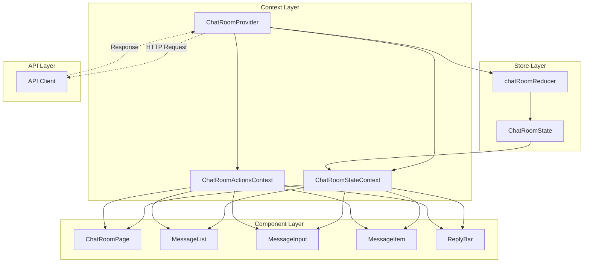
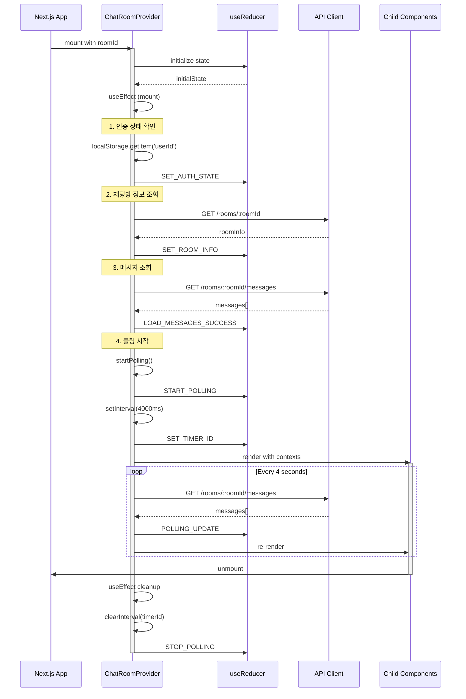
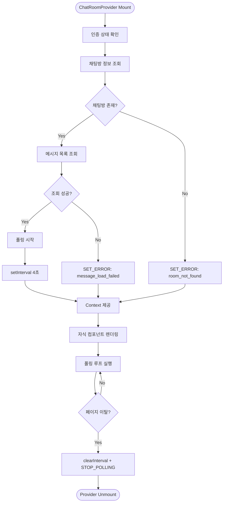
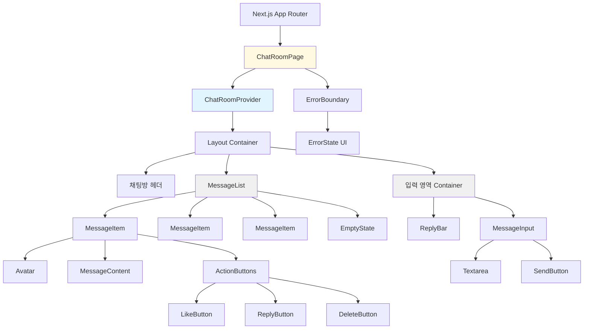
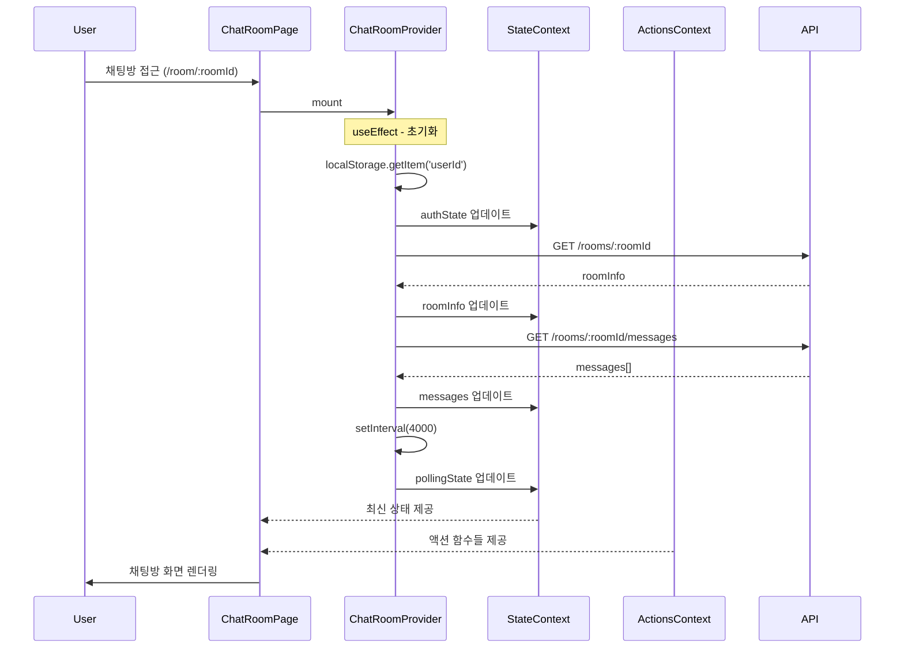
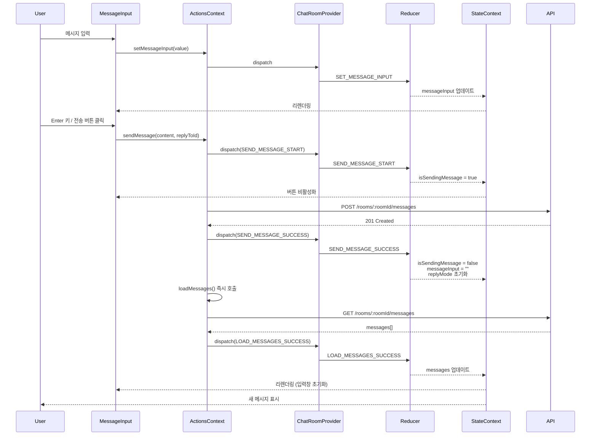
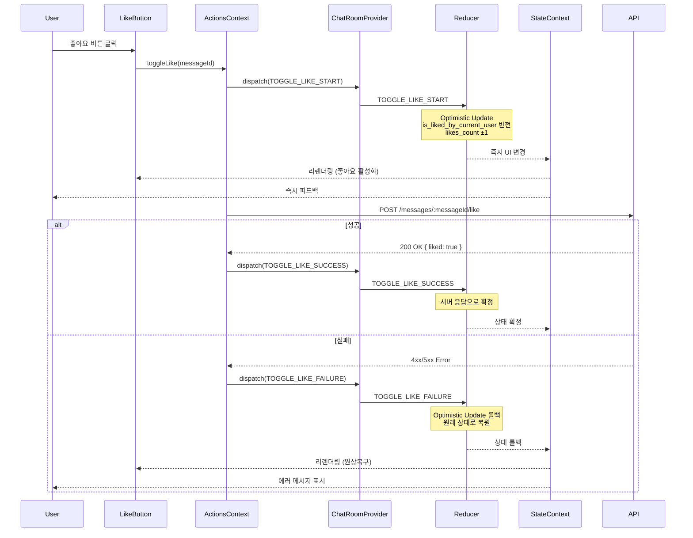
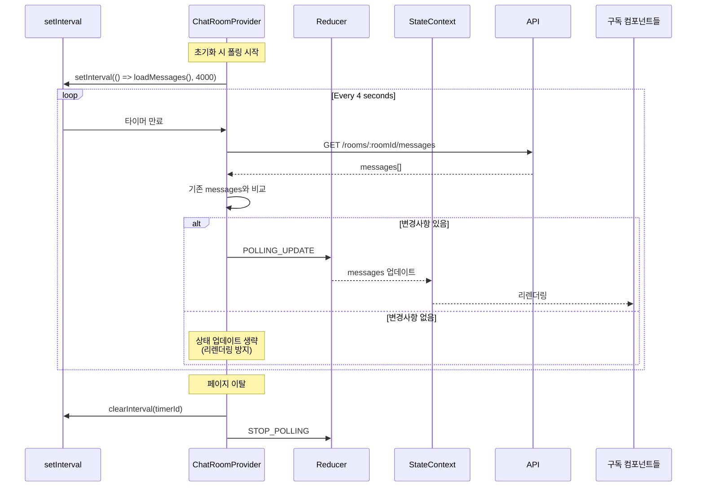
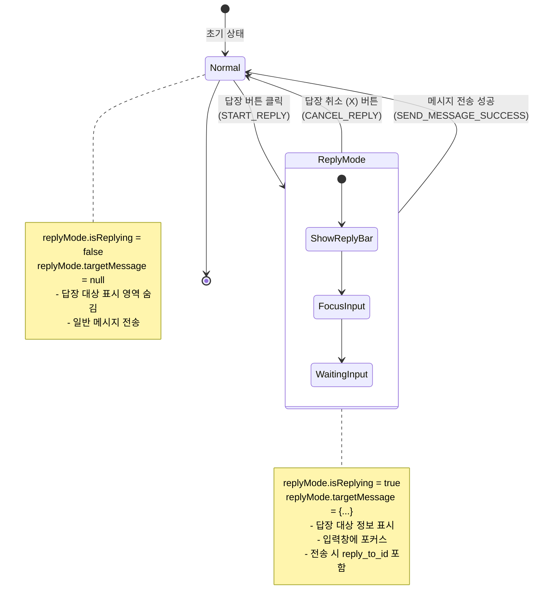
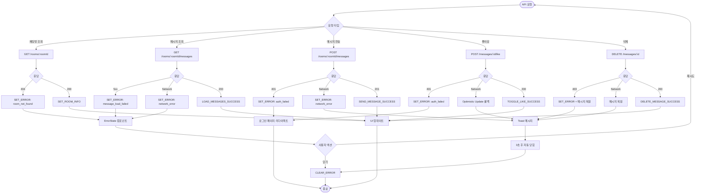

# UC-004 채팅방 페이지 상태 관리 설계

## 목차
1. [개요](#개요)
2. [Context 아키텍처](#context-아키텍처)
3. [상태 구조](#상태-구조)
4. [Context Provider 흐름](#context-provider-흐름)
5. [노출 인터페이스](#노출-인터페이스)
6. [컴포넌트 계층 구조](#컴포넌트-계층-구조)
7. [데이터 흐름 시각화](#데이터-흐름-시각화)

---

## 개요

### 설계 원칙
- **단일 책임 원칙**: 각 Context는 명확한 책임을 가짐
- **단방향 데이터 흐름**: Action → Reducer → State → View
- **불변성 유지**: 모든 상태 변경은 새로운 객체 생성
- **타입 안정성**: TypeScript를 활용한 타입 안전성 보장
- **성능 최적화**: Context 분리를 통한 불필요한 리렌더링 방지

### Context 분리 전략
채팅방 페이지의 상태는 변경 빈도와 관심사에 따라 2개의 Context로 분리:

1. **ChatRoomStateContext**: 채팅방 데이터 및 UI 상태 (읽기 전용)
2. **ChatRoomActionsContext**: 상태 변경 함수들 (변경 없음, 메모이제이션)

---

## Context 아키텍처



### Context 역할 정의

#### 1. ChatRoomStateContext (읽기 전용)
- **목적**: 모든 상태 데이터를 하위 컴포넌트에 제공
- **특징**:
  - 상태가 변경될 때마다 구독 컴포넌트 리렌더링
  - 불변 객체로 관리
  - selector 패턴으로 부분 구독 가능 (선택적)

#### 2. ChatRoomActionsContext (액션만)
- **목적**: 상태 변경 함수들을 하위 컴포넌트에 제공
- **특징**:
  - 절대 변경되지 않음 (useCallback으로 메모이제이션)
  - 액션 호출해도 이 Context 구독자는 리렌더링 안됨
  - 성능 최적화 핵심

---

## 상태 구조

### 전체 상태 타입 정의

```typescript
// src/features/chat-room/types/state.ts

/**
 * 메시지 엔티티
 */
export interface Message {
  id: string;
  room_id: string;
  sender_id: string;
  content: string;
  reply_to_id: string | null;
  created_at: string;

  // 조인된 데이터
  sender: {
    id: string;
    nickname: string;
    avatar_url: string | null;
  };

  // 답장 대상 메시지 (optional)
  reply_to?: {
    id: string;
    content: string;
    sender: {
      nickname: string;
    };
  } | null;

  // 좋아요 관련
  likes_count: number;
  is_liked_by_current_user: boolean;
}

/**
 * 답장 모드 상태
 */
export interface ReplyMode {
  isReplying: boolean;
  targetMessage: Message | null;
}

/**
 * 로딩 상태 (각 액션별로 분리)
 */
export interface LoadingStates {
  isInitialLoading: boolean;        // 최초 메시지 조회
  isSendingMessage: boolean;        // 메시지 전송 중
  deletingMessageId: string | null; // 삭제 중인 메시지 ID
  togglingLikeMessageId: string | null; // 좋아요 토글 중인 메시지 ID
}

/**
 * 에러 상태
 */
export interface ErrorState {
  type: 'room_not_found' | 'message_load_failed' | 'network_error' | 'auth_failed' | null;
  message: string | null;
}

/**
 * 인증 상태
 */
export interface AuthState {
  isAuthenticated: boolean;
  userId: string | null;
}

/**
 * 채팅방 정보
 */
export interface RoomInfo {
  id: string;
  title: string;
  updated_at: string;
}

/**
 * 폴링 상태
 */
export interface PollingState {
  isPolling: boolean;
  timerId: number | null;
}

/**
 * 전체 채팅방 상태
 */
export interface ChatRoomState {
  // 핵심 데이터
  messages: Message[];
  roomInfo: RoomInfo | null;

  // UI 상태
  replyMode: ReplyMode;
  messageInput: string;

  // 시스템 상태
  pollingState: PollingState;
  loadingStates: LoadingStates;
  errorState: ErrorState;
  authState: AuthState;
}

/**
 * 초기 상태
 */
export const initialChatRoomState: ChatRoomState = {
  messages: [],
  roomInfo: null,
  replyMode: {
    isReplying: false,
    targetMessage: null,
  },
  messageInput: '',
  pollingState: {
    isPolling: false,
    timerId: null,
  },
  loadingStates: {
    isInitialLoading: false,
    isSendingMessage: false,
    deletingMessageId: null,
    togglingLikeMessageId: null,
  },
  errorState: {
    type: null,
    message: null,
  },
  authState: {
    isAuthenticated: false,
    userId: null,
  },
};
```

### Action 타입 정의

```typescript
// src/features/chat-room/types/actions.ts

/**
 * Action Type Constants
 */
export const ChatRoomActionTypes = {
  // 메시지 조회
  LOAD_MESSAGES_START: 'LOAD_MESSAGES_START',
  LOAD_MESSAGES_SUCCESS: 'LOAD_MESSAGES_SUCCESS',
  LOAD_MESSAGES_FAILURE: 'LOAD_MESSAGES_FAILURE',

  // 메시지 전송
  SEND_MESSAGE_START: 'SEND_MESSAGE_START',
  SEND_MESSAGE_SUCCESS: 'SEND_MESSAGE_SUCCESS',
  SEND_MESSAGE_FAILURE: 'SEND_MESSAGE_FAILURE',

  // 메시지 삭제
  DELETE_MESSAGE_START: 'DELETE_MESSAGE_START',
  DELETE_MESSAGE_SUCCESS: 'DELETE_MESSAGE_SUCCESS',
  DELETE_MESSAGE_FAILURE: 'DELETE_MESSAGE_FAILURE',

  // 좋아요 토글
  TOGGLE_LIKE_START: 'TOGGLE_LIKE_START',
  TOGGLE_LIKE_SUCCESS: 'TOGGLE_LIKE_SUCCESS',
  TOGGLE_LIKE_FAILURE: 'TOGGLE_LIKE_FAILURE',

  // 답장 모드
  START_REPLY: 'START_REPLY',
  CANCEL_REPLY: 'CANCEL_REPLY',

  // 메시지 입력
  SET_MESSAGE_INPUT: 'SET_MESSAGE_INPUT',
  CLEAR_MESSAGE_INPUT: 'CLEAR_MESSAGE_INPUT',

  // 폴링
  START_POLLING: 'START_POLLING',
  STOP_POLLING: 'STOP_POLLING',
  SET_TIMER_ID: 'SET_TIMER_ID',
  POLLING_UPDATE: 'POLLING_UPDATE',

  // 에러 처리
  SET_ERROR: 'SET_ERROR',
  CLEAR_ERROR: 'CLEAR_ERROR',

  // 인증 상태
  SET_AUTH_STATE: 'SET_AUTH_STATE',

  // 채팅방 정보
  SET_ROOM_INFO: 'SET_ROOM_INFO',
} as const;

/**
 * Action Union Type
 */
export type ChatRoomAction =
  // 메시지 조회
  | { type: typeof ChatRoomActionTypes.LOAD_MESSAGES_START }
  | { type: typeof ChatRoomActionTypes.LOAD_MESSAGES_SUCCESS; payload: Message[] }
  | { type: typeof ChatRoomActionTypes.LOAD_MESSAGES_FAILURE; payload: string }

  // 메시지 전송
  | { type: typeof ChatRoomActionTypes.SEND_MESSAGE_START }
  | { type: typeof ChatRoomActionTypes.SEND_MESSAGE_SUCCESS }
  | { type: typeof ChatRoomActionTypes.SEND_MESSAGE_FAILURE; payload: string }

  // 메시지 삭제
  | { type: typeof ChatRoomActionTypes.DELETE_MESSAGE_START; payload: string }
  | { type: typeof ChatRoomActionTypes.DELETE_MESSAGE_SUCCESS; payload: string }
  | {
      type: typeof ChatRoomActionTypes.DELETE_MESSAGE_FAILURE;
      payload: { messageId: string; message: Message }
    }

  // 좋아요 토글
  | { type: typeof ChatRoomActionTypes.TOGGLE_LIKE_START; payload: string }
  | {
      type: typeof ChatRoomActionTypes.TOGGLE_LIKE_SUCCESS;
      payload: { messageId: string; liked: boolean }
    }
  | { type: typeof ChatRoomActionTypes.TOGGLE_LIKE_FAILURE; payload: string }

  // 답장 모드
  | { type: typeof ChatRoomActionTypes.START_REPLY; payload: Message }
  | { type: typeof ChatRoomActionTypes.CANCEL_REPLY }

  // 메시지 입력
  | { type: typeof ChatRoomActionTypes.SET_MESSAGE_INPUT; payload: string }
  | { type: typeof ChatRoomActionTypes.CLEAR_MESSAGE_INPUT }

  // 폴링
  | { type: typeof ChatRoomActionTypes.START_POLLING }
  | { type: typeof ChatRoomActionTypes.STOP_POLLING }
  | { type: typeof ChatRoomActionTypes.SET_TIMER_ID; payload: number }
  | { type: typeof ChatRoomActionTypes.POLLING_UPDATE; payload: Message[] }

  // 에러 처리
  | {
      type: typeof ChatRoomActionTypes.SET_ERROR;
      payload: {
        type: 'room_not_found' | 'message_load_failed' | 'network_error' | 'auth_failed';
        message: string
      }
    }
  | { type: typeof ChatRoomActionTypes.CLEAR_ERROR }

  // 인증 상태
  | {
      type: typeof ChatRoomActionTypes.SET_AUTH_STATE;
      payload: { isAuthenticated: boolean; userId: string | null }
    }

  // 채팅방 정보
  | { type: typeof ChatRoomActionTypes.SET_ROOM_INFO; payload: RoomInfo };
```

---

## Context Provider 흐름

### Provider 생명주기



### Provider 초기화 흐름



---

## 노출 인터페이스

### 1. State Context 인터페이스

```typescript
// src/features/chat-room/context/chat-room-state-context.ts

/**
 * State Context에서 제공하는 읽기 전용 상태
 */
export interface ChatRoomStateContextValue {
  // ========== 핵심 데이터 ==========
  /**
   * 현재 채팅방의 메시지 목록
   * - created_at 기준 오름차순 정렬
   * - 폴링으로 자동 갱신
   */
  messages: Message[];

  /**
   * 현재 채팅방 정보
   * - null: 아직 로드되지 않음
   * - 404 시 errorState 확인 필요
   */
  roomInfo: RoomInfo | null;

  // ========== UI 상태 ==========
  /**
   * 답장 모드 상태
   * - isReplying: true일 때 답장 대상 표시 영역 렌더링
   * - targetMessage: 답장 대상 메시지 정보
   */
  replyMode: ReplyMode;

  /**
   * 메시지 입력창의 현재 값
   */
  messageInput: string;

  // ========== 시스템 상태 ==========
  /**
   * 폴링 상태
   * - isPolling: 폴링 활성화 여부
   * - timerId: setInterval ID (cleanup용)
   */
  pollingState: PollingState;

  /**
   * 로딩 상태 (각 액션별로 분리)
   * - isInitialLoading: 최초 메시지 조회 중
   * - isSendingMessage: 메시지 전송 중
   * - deletingMessageId: 삭제 중인 메시지 ID (null이 아니면 로딩 표시)
   * - togglingLikeMessageId: 좋아요 토글 중인 메시지 ID
   */
  loadingStates: LoadingStates;

  /**
   * 에러 상태
   * - type: 에러 타입 (null이면 에러 없음)
   * - message: 사용자에게 표시할 에러 메시지
   */
  errorState: ErrorState;

  /**
   * 인증 상태
   * - isAuthenticated: 로그인 여부
   * - userId: 현재 사용자 UUID (비로그인 시 null)
   */
  authState: AuthState;

  // ========== 파생 데이터 (Selector 패턴) ==========
  /**
   * 정렬된 메시지 목록 (created_at 오름차순)
   * - 메모이제이션 권장
   */
  sortedMessages: Message[];

  /**
   * 현재 사용자가 작성한 메시지 ID 목록
   * - 삭제 버튼 표시 여부 판단에 사용
   */
  myMessageIds: Set<string>;

  /**
   * 입력창 비어있음 여부
   * - 전송 버튼 활성화 판단에 사용
   */
  isMessageInputEmpty: boolean;

  /**
   * 전송 가능 여부
   * - 입력값 있음 && 전송 중 아님 && 로그인 상태
   */
  canSendMessage: boolean;
}
```

### 2. Actions Context 인터페이스

```typescript
// src/features/chat-room/context/chat-room-actions-context.ts

/**
 * Actions Context에서 제공하는 상태 변경 함수들
 * - 모든 함수는 useCallback으로 메모이제이션
 * - 이 Context는 절대 변경되지 않으므로 구독해도 리렌더링 없음
 */
export interface ChatRoomActionsContextValue {
  // ========== 메시지 관련 액션 ==========
  /**
   * 메시지 목록 조회 (수동 호출)
   * - 폴링과 별개로 수동 새로고침 시 사용
   * @returns Promise<void>
   */
  loadMessages: () => Promise<void>;

  /**
   * 새 메시지 전송
   * @param content - 메시지 내용 (빈 값 검증은 내부에서 수행)
   * @param replyToId - 답장 대상 메시지 ID (optional)
   * @returns Promise<void>
   * @throws {Error} 전송 실패 시 에러 발생, errorState에 자동 설정
   */
  sendMessage: (content: string, replyToId?: string | null) => Promise<void>;

  /**
   * 메시지 삭제
   * - Optimistic Update 적용 (즉시 UI에서 제거)
   * - 실패 시 자동 롤백
   * @param messageId - 삭제할 메시지 ID
   * @returns Promise<void>
   */
  deleteMessage: (messageId: string) => Promise<void>;

  // ========== 좋아요 관련 액션 ==========
  /**
   * 좋아요 토글 (추가/취소)
   * - Optimistic Update 적용
   * - 실패 시 자동 롤백
   * @param messageId - 좋아요 토글할 메시지 ID
   * @returns Promise<void>
   */
  toggleLike: (messageId: string) => Promise<void>;

  // ========== 답장 모드 관련 액션 ==========
  /**
   * 답장 모드 시작
   * @param messageId - 답장 대상 메시지 ID
   * @returns void
   */
  startReply: (messageId: string) => void;

  /**
   * 답장 모드 취소
   * - 입력된 메시지는 유지
   * @returns void
   */
  cancelReply: () => void;

  // ========== 메시지 입력 관련 액션 ==========
  /**
   * 메시지 입력값 변경
   * @param value - 새 입력값
   * @returns void
   */
  setMessageInput: (value: string) => void;

  /**
   * 메시지 입력값 초기화
   * @returns void
   */
  clearMessageInput: () => void;

  // ========== 폴링 관련 액션 ==========
  /**
   * 폴링 시작
   * - 4초 간격으로 메시지 재조회
   * - Provider 내부에서 자동 호출 (수동 호출 불필요)
   * @returns void
   */
  startPolling: () => void;

  /**
   * 폴링 중지
   * - Provider unmount 시 자동 호출 (수동 호출 불필요)
   * @returns void
   */
  stopPolling: () => void;

  // ========== 에러 관련 액션 ==========
  /**
   * 에러 상태 초기화
   * - 에러 메시지 닫기 버튼 클릭 시 사용
   * @returns void
   */
  clearError: () => void;
}
```

### 3. Hook 인터페이스

```typescript
// src/features/chat-room/hooks/use-chat-room-state.ts

/**
 * State Context를 구독하는 Hook
 * @returns ChatRoomStateContextValue
 * @throws {Error} Provider 외부에서 호출 시 에러
 */
export function useChatRoomState(): ChatRoomStateContextValue;

// src/features/chat-room/hooks/use-chat-room-actions.ts

/**
 * Actions Context를 구독하는 Hook
 * @returns ChatRoomActionsContextValue
 * @throws {Error} Provider 외부에서 호출 시 에러
 */
export function useChatRoomActions(): ChatRoomActionsContextValue;

// src/features/chat-room/hooks/use-chat-room.ts

/**
 * State + Actions를 한번에 구독하는 편의 Hook
 * @returns [state, actions]
 */
export function useChatRoom(): [ChatRoomStateContextValue, ChatRoomActionsContextValue];
```

---

## 컴포넌트 계층 구조

### 컴포넌트 트리



### 각 컴포넌트의 Context 사용

| 컴포넌트 | State 구독 | Actions 구독 | 비고 |
|---------|-----------|-------------|------|
| **ChatRoomPage** | ✅ `errorState`, `roomInfo` | ✅ `clearError` | 에러 처리 및 페이지 레이아웃 |
| **채팅방 헤더** | ✅ `roomInfo` | ❌ | 채팅방 제목 표시 |
| **MessageList** | ✅ `messages`, `loadingStates.isInitialLoading` | ❌ | 메시지 목록 렌더링 |
| **MessageItem** | ✅ `authState`, `loadingStates` | ✅ `toggleLike`, `startReply`, `deleteMessage` | 개별 메시지 표시 및 액션 |
| **LikeButton** | ✅ `loadingStates.togglingLikeMessageId` | ✅ `toggleLike` | 좋아요 버튼 |
| **ReplyButton** | ❌ | ✅ `startReply` | 답장 버튼 |
| **DeleteButton** | ✅ `loadingStates.deletingMessageId` | ✅ `deleteMessage` | 삭제 버튼 (본인 메시지만) |
| **ReplyBar** | ✅ `replyMode` | ✅ `cancelReply` | 답장 대상 표시 영역 |
| **MessageInput** | ✅ `messageInput`, `loadingStates.isSendingMessage`, `authState`, `canSendMessage` | ✅ `setMessageInput`, `sendMessage` | 메시지 입력 및 전송 |
| **EmptyState** | ✅ `messages.length` | ❌ | 빈 채팅방 상태 |
| **ErrorState** | ✅ `errorState` | ✅ `clearError` | 에러 메시지 표시 |

---

## 데이터 흐름 시각화

### 1. 페이지 진입 및 초기화



### 2. 메시지 전송 흐름



### 3. 좋아요 토글 (Optimistic Update)



### 4. 폴링 메커니즘



### 5. 답장 모드 흐름



### 6. 에러 처리 흐름



---

## 성능 최적화 전략

### 1. Context 분리
- **State Context**: 상태가 변경될 때마다 구독 컴포넌트 리렌더링
- **Actions Context**: 절대 변경되지 않으므로 구독해도 리렌더링 없음
- **효과**: 액션만 필요한 컴포넌트는 불필요한 리렌더링 방지

### 2. Selector 패턴 (선택적)
```typescript
// src/features/chat-room/hooks/use-chat-room-selector.ts

/**
 * State의 일부만 구독하는 Selector Hook
 * - 관심있는 상태만 추출
 * - 해당 상태 변경 시에만 리렌더링
 */
export function useChatRoomSelector<T>(
  selector: (state: ChatRoomStateContextValue) => T
): T;

// 사용 예시
const messages = useChatRoomSelector(state => state.messages);
const isLoading = useChatRoomSelector(state => state.loadingStates.isInitialLoading);
```

### 3. 메모이제이션
- **useMemo**: 파생 데이터 계산 캐싱 (sortedMessages, myMessageIds 등)
- **useCallback**: 모든 액션 함수 메모이제이션
- **React.memo**: MessageItem 등 리스트 항목 컴포넌트 메모이제이션

### 4. 폴링 최적화
- 변경사항 없으면 상태 업데이트 생략 (리렌더링 방지)
- 네트워크 오류 시 기존 상태 유지 (사용자에게 에러 미표시)
- 페이지 이탈 시 자동 cleanup

---

## 디렉토리 구조

```
src/features/chat-room/
├── types/
│   ├── state.ts                 # 상태 타입 정의
│   └── actions.ts               # 액션 타입 정의
│
├── context/
│   ├── chat-room-provider.tsx   # Provider 구현
│   ├── chat-room-state-context.ts    # State Context 정의
│   └── chat-room-actions-context.ts  # Actions Context 정의
│
├── reducer/
│   └── chat-room-reducer.ts     # Reducer 구현
│
├── hooks/
│   ├── use-chat-room-state.ts   # State Hook
│   ├── use-chat-room-actions.ts # Actions Hook
│   ├── use-chat-room.ts         # 통합 Hook
│   └── use-chat-room-selector.ts # Selector Hook (선택적)
│
├── components/
│   ├── chat-room-page.tsx       # 페이지 컴포넌트
│   ├── message-list.tsx         # 메시지 목록
│   ├── message-item.tsx         # 개별 메시지
│   ├── message-input.tsx        # 입력 영역
│   ├── reply-bar.tsx            # 답장 대상 표시
│   ├── error-state.tsx          # 에러 상태 UI
│   └── empty-state.tsx          # 빈 채팅방 UI
│
└── lib/
    └── api.ts                   # API 호출 함수들
```

---

## 사용 예시

### Provider 적용

```typescript
// src/app/room/[roomId]/layout.tsx
import { ChatRoomProvider } from '@/features/chat-room/context/chat-room-provider';

export default function ChatRoomLayout({
  children,
  params,
}: {
  children: React.ReactNode;
  params: Promise<{ roomId: string }>;
}) {
  const { roomId } = use(params);

  return (
    <ChatRoomProvider roomId={roomId}>
      {children}
    </ChatRoomProvider>
  );
}
```

### 컴포넌트에서 사용

```typescript
// src/features/chat-room/components/message-input.tsx
'use client';

import { useChatRoomState } from '../hooks/use-chat-room-state';
import { useChatRoomActions } from '../hooks/use-chat-room-actions';

export function MessageInput() {
  const {
    messageInput,
    canSendMessage,
    loadingStates,
    replyMode,
  } = useChatRoomState();

  const {
    setMessageInput,
    sendMessage,
  } = useChatRoomActions();

  const handleSend = () => {
    if (!canSendMessage) return;
    sendMessage(messageInput, replyMode.targetMessage?.id);
  };

  return (
    <div>
      <textarea
        value={messageInput}
        onChange={(e) => setMessageInput(e.target.value)}
        onKeyDown={(e) => {
          if (e.key === 'Enter' && !e.shiftKey) {
            e.preventDefault();
            handleSend();
          }
        }}
        disabled={loadingStates.isSendingMessage}
      />
      <button
        onClick={handleSend}
        disabled={!canSendMessage}
      >
        {loadingStates.isSendingMessage ? '전송 중...' : '전송'}
      </button>
    </div>
  );
}
```

---

## 테스트 전략

### 1. Reducer 테스트
- 각 액션별로 상태 변화 검증
- Optimistic Update 로직 검증
- 에러 케이스 검증

### 2. Provider 테스트
- 초기화 로직 검증
- API 호출 검증 (mock)
- 폴링 메커니즘 검증
- Cleanup 로직 검증

### 3. Hook 테스트
- Context 외부에서 호출 시 에러 발생 검증
- 정상적인 값 반환 검증

### 4. 컴포넌트 통합 테스트
- Provider로 감싼 상태에서 전체 흐름 테스트
- 사용자 인터랙션 시나리오 테스트

---

## 마이그레이션 가이드

### React Query에서 Context로 전환 시
1. **장점**:
   - 더 직관적인 상태 관리
   - 폴링 로직 완전 제어
   - Optimistic Update 구현 용이

2. **단점**:
   - 캐싱 기능 직접 구현 필요
   - 백그라운드 동기화 직접 구현
   - 더 많은 보일러플레이트 코드

3. **권장 사항**:
   - 단순 CRUD는 React Query 사용
   - 복잡한 상태 로직 (폴링, Optimistic Update 등)은 Context 사용
   - 혼용 가능: 채팅방 정보는 React Query, 메시지 목록은 Context

---

## 추가 고려사항

### 1. WebSocket으로 전환 시
- 폴링 로직 제거
- WebSocket 이벤트 리스너 추가
- 실시간 메시지 수신 시 `POLLING_UPDATE` 대신 `WS_MESSAGE_RECEIVED` 액션 사용

### 2. 메시지 무한 스크롤
- `messages` 배열에 페이지네이션 메타데이터 추가
- `loadMoreMessages` 액션 추가
- `hasMore`, `isLoadingMore` 상태 추가

### 3. 메시지 검색
- `searchQuery` 상태 추가
- `filteredMessages` 파생 데이터 추가
- `searchMessages` 액션 추가

### 4. 읽음/안읽음 표시
- `lastReadAt` 상태 추가
- `unreadCount` 파생 데이터 추가
- `markAsRead` 액션 추가
