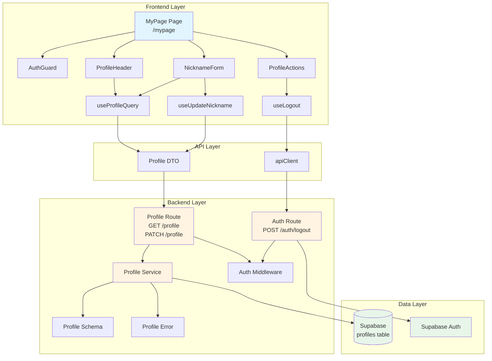

# UC-005: 마이페이지 구현 계획

## 개요

UC-005는 사용자가 자신의 프로필을 조회하고 닉네임을 변경하며, 로그아웃할 수 있는 마이페이지 기능을 구현합니다.

### 모듈 목록

#### Backend Layer

1. **Profile Schema** (`src/features/profile/backend/schema.ts`)
   - 프로필 조회/수정 요청/응답 zod 스키마 정의
   - 데이터베이스 row 스키마 정의

2. **Profile Service** (`src/features/profile/backend/service.ts`)
   - 프로필 조회 비즈니스 로직 (`getProfile`)
   - 닉네임 변경 비즈니스 로직 (`updateNickname`)
   - Supabase `profiles` 테이블 접근

3. **Profile Error** (`src/features/profile/backend/error.ts`)
   - Profile 기능 관련 에러 코드 정의
   - `PROFILE_NOT_FOUND`, `PROFILE_UPDATE_FAILED` 등

4. **Profile Route** (`src/features/profile/backend/route.ts`)
   - `GET /profile` - 현재 사용자 프로필 조회
   - `PATCH /profile` - 닉네임 변경
   - 인증 상태 확인 및 유효성 검증

5. **Logout Route** (`src/features/auth/backend/route.ts`)
   - `POST /auth/logout` - Supabase Auth 로그아웃
   - 세션 정보 삭제

#### Frontend Layer

6. **Profile DTO** (`src/features/profile/lib/dto.ts`)
   - Backend schema 재노출 (클라이언트 측 타입 공유)

7. **Profile Hooks** (`src/features/profile/hooks/`)
   - `useProfileQuery.ts` - 프로필 조회 React Query 훅
   - `useUpdateNickname.ts` - 닉네임 변경 Mutation 훅

8. **Logout Hook** (`src/features/auth/hooks/useLogout.ts`)
   - 로그아웃 Mutation 훅
   - 로컬 세션 정보 삭제 및 리다이렉트

9. **MyPage Components** (`src/features/profile/components/`)
   - `profile-header.tsx` - 프로필 헤더 (이메일, 가입일 표시)
   - `nickname-form.tsx` - 닉네임 변경 폼 (react-hook-form 사용)
   - `profile-actions.tsx` - 로그아웃 버튼

10. **MyPage Page** (`src/app/mypage/page.tsx`)
    - `/mypage` 라우트 페이지
    - 인증 상태 확인 및 리다이렉트
    - 프로필 컴포넌트 조합

#### Shared Layer

11. **Auth Guard** (`src/components/guards/auth-guard.tsx`)
    - 클라이언트 측 인증 가드 컴포넌트
    - 비로그인 시 로그인 페이지로 리다이렉트

---

## Diagram



---

## Implementation Plan

### 1. Backend Schema (`src/features/profile/backend/schema.ts`)

**목적**: 프로필 조회/수정 API의 요청/응답 스키마 정의

**구현 내역**:

```typescript
// 프로필 조회 응답 스키마
export const ProfileResponseSchema = z.object({
  userId: z.string().uuid(),
  email: z.string().email(),
  nickname: z.string(),
  createdAt: z.string(),
});

// 닉네임 변경 요청 스키마
export const UpdateNicknameRequestSchema = z.object({
  nickname: z.string().trim().min(1, '닉네임을 입력해주세요'),
});

// DB row 스키마
export const ProfileRowSchema = z.object({
  user_id: z.string().uuid(),
  email: z.string(),
  nickname: z.string(),
  created_at: z.string(),
  updated_at: z.string(),
});

export type ProfileResponse = z.infer<typeof ProfileResponseSchema>;
export type UpdateNicknameRequest = z.infer<typeof UpdateNicknameRequestSchema>;
export type ProfileRow = z.infer<typeof ProfileRowSchema>;
```

**Unit Test 시나리오**:
- ✅ `ProfileResponseSchema`가 유효한 프로필 데이터를 파싱함
- ✅ `UpdateNicknameRequestSchema`가 빈 닉네임을 거부함
- ✅ `UpdateNicknameRequestSchema`가 공백만 있는 닉네임을 trim 후 거부함
- ✅ `ProfileRowSchema`가 유효한 DB row를 파싱함

---

### 2. Backend Error (`src/features/profile/backend/error.ts`)

**목적**: Profile 기능 관련 에러 코드 정의

**구현 내역**:

```typescript
export const profileErrorCodes = {
  notFound: 'PROFILE_NOT_FOUND',
  fetchError: 'PROFILE_FETCH_ERROR',
  updateFailed: 'PROFILE_UPDATE_FAILED',
  validationError: 'PROFILE_VALIDATION_ERROR',
  unauthorized: 'PROFILE_UNAUTHORIZED',
} as const;

export type ProfileServiceError = typeof profileErrorCodes[keyof typeof profileErrorCodes];
```

**Unit Test 시나리오**:
- ✅ 모든 에러 코드가 고유한 문자열임
- ✅ `ProfileServiceError` 타입이 모든 코드를 포함함

---

### 3. Backend Service (`src/features/profile/backend/service.ts`)

**목적**: 프로필 조회 및 닉네임 변경 비즈니스 로직

**구현 내역**:

```typescript
const PROFILES_TABLE = 'profiles';

// 프로필 조회
export const getProfile = async (
  client: SupabaseClient,
  userId: string,
): Promise<HandlerResult<ProfileResponse, ProfileServiceError, unknown>> => {
  const { data, error } = await client
    .from(PROFILES_TABLE)
    .select('user_id, email, nickname, created_at, updated_at')
    .eq('user_id', userId)
    .maybeSingle<ProfileRow>();

  if (error) {
    return failure(500, profileErrorCodes.fetchError, error.message);
  }

  if (!data) {
    return failure(404, profileErrorCodes.notFound, 'Profile not found');
  }

  const rowParse = ProfileRowSchema.safeParse(data);
  if (!rowParse.success) {
    return failure(
      500,
      profileErrorCodes.validationError,
      'Profile row validation failed',
      rowParse.error.format(),
    );
  }

  const mapped: ProfileResponse = {
    userId: rowParse.data.user_id,
    email: rowParse.data.email,
    nickname: rowParse.data.nickname,
    createdAt: rowParse.data.created_at,
  };

  const parsed = ProfileResponseSchema.safeParse(mapped);
  if (!parsed.success) {
    return failure(
      500,
      profileErrorCodes.validationError,
      'Profile response validation failed',
      parsed.error.format(),
    );
  }

  return success(parsed.data);
};

// 닉네임 변경
export const updateNickname = async (
  client: SupabaseClient,
  userId: string,
  nickname: string,
): Promise<HandlerResult<ProfileResponse, ProfileServiceError, unknown>> => {
  const { error: updateError } = await client
    .from(PROFILES_TABLE)
    .update({ nickname })
    .eq('user_id', userId);

  if (updateError) {
    return failure(500, profileErrorCodes.updateFailed, updateError.message);
  }

  // 업데이트 후 최신 프로필 조회
  return getProfile(client, userId);
};
```

**Unit Test 시나리오**:
- ✅ `getProfile`이 존재하는 프로필을 정상 반환함
- ✅ `getProfile`이 존재하지 않는 프로필에 대해 404 에러를 반환함
- ✅ `getProfile`이 Supabase 에러 발생 시 500 에러를 반환함
- ✅ `getProfile`이 유효하지 않은 DB row에 대해 validation 에러를 반환함
- ✅ `updateNickname`이 닉네임 변경 후 업데이트된 프로필을 반환함
- ✅ `updateNickname`이 Supabase 에러 발생 시 500 에러를 반환함

---

### 4. Backend Route (`src/features/profile/backend/route.ts`)

**목적**: Profile API 엔드포인트 정의

**구현 내역**:

```typescript
export const registerProfileRoutes = (app: Hono<AppEnv>) => {
  // GET /profile - 현재 사용자 프로필 조회
  app.get('/profile', async (c) => {
    const supabase = getSupabase(c);
    const logger = getLogger(c);

    // 현재 로그인 사용자 확인
    const { data: { user } } = await supabase.auth.getUser();

    if (!user) {
      return respond(
        c,
        failure(401, profileErrorCodes.unauthorized, 'User not authenticated'),
      );
    }

    const result = await getProfile(supabase, user.id);

    if (!result.ok) {
      const errorResult = result as ErrorResult<ProfileServiceError, unknown>;
      if (errorResult.error.code === profileErrorCodes.fetchError) {
        logger.error('Failed to fetch profile', errorResult.error.message);
      }
    }

    return respond(c, result);
  });

  // PATCH /profile - 닉네임 변경
  app.patch('/profile', async (c) => {
    const supabase = getSupabase(c);
    const logger = getLogger(c);

    // 현재 로그인 사용자 확인
    const { data: { user } } = await supabase.auth.getUser();

    if (!user) {
      return respond(
        c,
        failure(401, profileErrorCodes.unauthorized, 'User not authenticated'),
      );
    }

    const body = await c.req.json();
    const parsedBody = UpdateNicknameRequestSchema.safeParse(body);

    if (!parsedBody.success) {
      return respond(
        c,
        failure(
          400,
          'INVALID_NICKNAME_REQUEST',
          'Invalid nickname request',
          parsedBody.error.format(),
        ),
      );
    }

    const result = await updateNickname(supabase, user.id, parsedBody.data.nickname);

    if (!result.ok) {
      const errorResult = result as ErrorResult<ProfileServiceError, unknown>;
      if (errorResult.error.code === profileErrorCodes.updateFailed) {
        logger.error('Failed to update nickname', errorResult.error.message);
      }
    }

    return respond(c, result);
  });
};
```

**Unit Test 시나리오**:
- ✅ `GET /profile`이 로그인 사용자의 프로필을 반환함
- ✅ `GET /profile`이 비로그인 시 401 에러를 반환함
- ✅ `PATCH /profile`이 유효한 닉네임으로 업데이트 성공함
- ✅ `PATCH /profile`이 빈 닉네임 입력 시 400 에러를 반환함
- ✅ `PATCH /profile`이 비로그인 시 401 에러를 반환함

---

### 5. Auth Logout Route (`src/features/auth/backend/route.ts`)

**목적**: 로그아웃 API 엔드포인트 정의

**구현 내역**:

```typescript
export const registerAuthRoutes = (app: Hono<AppEnv>) => {
  // POST /auth/logout - 로그아웃
  app.post('/auth/logout', async (c) => {
    const supabase = getSupabase(c);
    const logger = getLogger(c);

    const { error } = await supabase.auth.signOut();

    if (error) {
      logger.error('Logout failed', error.message);
      return respond(
        c,
        failure(500, 'LOGOUT_FAILED', 'Failed to logout', error.message),
      );
    }

    return respond(c, success({ message: 'Logged out successfully' }));
  });
};
```

**Unit Test 시나리오**:
- ✅ `POST /auth/logout`이 로그아웃 성공 시 200 응답을 반환함
- ✅ `POST /auth/logout`이 Supabase 에러 발생 시 500 에러를 반환함

---

### 6. Backend Route 등록 (`src/backend/hono/app.ts`)

**목적**: Profile 및 Auth 라우트를 Hono 앱에 등록

**구현 내역**:

```typescript
// ... existing imports ...
import { registerProfileRoutes } from '@/features/profile/backend/route';
import { registerAuthRoutes } from '@/features/auth/backend/route';

export const createHonoApp = () => {
  // ... existing code ...

  registerExampleRoutes(app);
  registerProfileRoutes(app);
  registerAuthRoutes(app);

  return app;
};
```

---

### 7. Profile DTO (`src/features/profile/lib/dto.ts`)

**목적**: 클라이언트 측에서 사용할 스키마 재노출

**구현 내역**:

```typescript
export {
  ProfileResponseSchema,
  UpdateNicknameRequestSchema,
  type ProfileResponse,
  type UpdateNicknameRequest,
} from '@/features/profile/backend/schema';
```

---

### 8. Profile Query Hook (`src/features/profile/hooks/useProfileQuery.ts`)

**목적**: 프로필 조회 React Query 훅

**구현 내역**:

```typescript
'use client';

import { useQuery } from '@tanstack/react-query';
import { apiClient, extractApiErrorMessage } from '@/lib/remote/api-client';
import { ProfileResponseSchema } from '@/features/profile/lib/dto';

const fetchProfile = async () => {
  try {
    const { data } = await apiClient.get('/api/profile');
    return ProfileResponseSchema.parse(data);
  } catch (error) {
    const message = extractApiErrorMessage(error, 'Failed to fetch profile.');
    throw new Error(message);
  }
};

export const useProfileQuery = () =>
  useQuery({
    queryKey: ['profile'],
    queryFn: fetchProfile,
    staleTime: 5 * 60 * 1000, // 5분
  });
```

**QA Sheet**:
- ✅ 로그인 상태에서 프로필 조회 성공
- ✅ 비로그인 상태에서 401 에러 발생
- ✅ 네트워크 오류 시 적절한 에러 메시지 표시
- ✅ 프로필 데이터 캐싱 동작 확인 (5분)

---

### 9. Nickname Update Hook (`src/features/profile/hooks/useUpdateNickname.ts`)

**목적**: 닉네임 변경 Mutation 훅

**구현 내역**:

```typescript
'use client';

import { useMutation, useQueryClient } from '@tanstack/react-query';
import { apiClient, extractApiErrorMessage } from '@/lib/remote/api-client';
import { ProfileResponseSchema, type UpdateNicknameRequest } from '@/features/profile/lib/dto';

const updateNickname = async (request: UpdateNicknameRequest) => {
  try {
    const { data } = await apiClient.patch('/api/profile', request);
    return ProfileResponseSchema.parse(data);
  } catch (error) {
    const message = extractApiErrorMessage(error, 'Failed to update nickname.');
    throw new Error(message);
  }
};

export const useUpdateNickname = () => {
  const queryClient = useQueryClient();

  return useMutation({
    mutationFn: updateNickname,
    onSuccess: (data) => {
      // 프로필 쿼리 캐시 업데이트
      queryClient.setQueryData(['profile'], data);
    },
  });
};
```

**QA Sheet**:
- ✅ 유효한 닉네임으로 변경 성공
- ✅ 빈 닉네임 입력 시 에러 메시지 표시
- ✅ 공백만 입력 시 에러 메시지 표시
- ✅ 변경 후 화면에 새 닉네임 즉시 반영
- ✅ 네트워크 오류 시 적절한 에러 메시지 표시

---

### 10. Logout Hook (`src/features/auth/hooks/useLogout.ts`)

**목적**: 로그아웃 Mutation 훅

**구현 내역**:

```typescript
'use client';

import { useMutation, useQueryClient } from '@tanstack/react-query';
import { useRouter } from 'next/navigation';
import { apiClient, extractApiErrorMessage } from '@/lib/remote/api-client';
import { useCurrentUserContext } from '../context/current-user-context';

const logout = async () => {
  try {
    await apiClient.post('/api/auth/logout');
  } catch (error) {
    const message = extractApiErrorMessage(error, 'Failed to logout.');
    throw new Error(message);
  }
};

export const useLogout = () => {
  const queryClient = useQueryClient();
  const router = useRouter();
  const { refresh } = useCurrentUserContext();

  return useMutation({
    mutationFn: logout,
    onSuccess: async () => {
      // 모든 쿼리 캐시 초기화
      queryClient.clear();

      // CurrentUser 컨텍스트 갱신
      await refresh();

      // 로그인 페이지로 리다이렉트
      router.push('/login');
    },
  });
};
```

**QA Sheet**:
- ✅ 로그아웃 성공 시 로그인 페이지로 리다이렉트
- ✅ 로그아웃 후 모든 쿼리 캐시 초기화
- ✅ 로그아웃 후 CurrentUser 컨텍스트 갱신
- ✅ 네트워크 오류 시 적절한 에러 메시지 표시

---

### 11. Auth Guard Component (`src/components/guards/auth-guard.tsx`)

**목적**: 클라이언트 측 인증 가드

**구현 내역**:

```typescript
'use client';

import { useEffect } from 'react';
import { useRouter } from 'next/navigation';
import { useCurrentUser } from '@/features/auth/hooks/useCurrentUser';

type AuthGuardProps = {
  children: React.ReactNode;
  fallback?: React.ReactNode;
};

export const AuthGuard = ({ children, fallback }: AuthGuardProps) => {
  const router = useRouter();
  const { isAuthenticated, isLoading } = useCurrentUser();

  useEffect(() => {
    if (!isLoading && !isAuthenticated) {
      router.push('/login');
    }
  }, [isAuthenticated, isLoading, router]);

  if (isLoading) {
    return fallback ?? <div>Loading...</div>;
  }

  if (!isAuthenticated) {
    return null;
  }

  return <>{children}</>;
};
```

**QA Sheet**:
- ✅ 로그인 상태에서 children 렌더링
- ✅ 비로그인 상태에서 로그인 페이지로 리다이렉트
- ✅ 로딩 중 fallback 표시
- ✅ 리다이렉트 시 깜빡임 없이 자연스럽게 전환

---

### 12. Profile Header Component (`src/features/profile/components/profile-header.tsx`)

**목적**: 프로필 헤더 (이메일, 가입일 표시)

**구현 내역**:

```typescript
'use client';

import { format } from 'date-fns';
import { ko } from 'date-fns/locale';
import { Card, CardContent, CardHeader, CardTitle } from '@/components/ui/card';
import type { ProfileResponse } from '@/features/profile/lib/dto';

type ProfileHeaderProps = {
  profile: ProfileResponse;
};

export const ProfileHeader = ({ profile }: ProfileHeaderProps) => {
  const formattedDate = format(new Date(profile.createdAt), 'PPP', { locale: ko });

  return (
    <Card>
      <CardHeader>
        <CardTitle>프로필 정보</CardTitle>
      </CardHeader>
      <CardContent className="space-y-4">
        <div>
          <p className="text-sm text-muted-foreground">이메일</p>
          <p className="text-base font-medium">{profile.email}</p>
        </div>
        <div>
          <p className="text-sm text-muted-foreground">현재 닉네임</p>
          <p className="text-base font-medium">{profile.nickname}</p>
        </div>
        <div>
          <p className="text-sm text-muted-foreground">가입일</p>
          <p className="text-base font-medium">{formattedDate}</p>
        </div>
      </CardContent>
    </Card>
  );
};
```

**QA Sheet**:
- ✅ 이메일 정상 표시
- ✅ 현재 닉네임 정상 표시
- ✅ 가입일 한국어 포맷으로 표시
- ✅ 반응형 레이아웃 동작
- ✅ shadcn-ui Card 컴포넌트 스타일 적용

---

### 13. Nickname Form Component (`src/features/profile/components/nickname-form.tsx`)

**목적**: 닉네임 변경 폼

**구현 내역**:

```typescript
'use client';

import { useForm } from 'react-hook-form';
import { zodResolver } from '@hookform/resolvers/zod';
import { Loader2 } from 'lucide-react';
import { Button } from '@/components/ui/button';
import { Input } from '@/components/ui/input';
import { Card, CardContent, CardHeader, CardTitle } from '@/components/ui/card';
import { Form, FormControl, FormField, FormItem, FormLabel, FormMessage } from '@/components/ui/form';
import { useToast } from '@/hooks/use-toast';
import { useUpdateNickname } from '@/features/profile/hooks/useUpdateNickname';
import { UpdateNicknameRequestSchema, type UpdateNicknameRequest } from '@/features/profile/lib/dto';

export const NicknameForm = () => {
  const { toast } = useToast();
  const { mutate, isPending } = useUpdateNickname();

  const form = useForm<UpdateNicknameRequest>({
    resolver: zodResolver(UpdateNicknameRequestSchema),
    defaultValues: {
      nickname: '',
    },
  });

  const onSubmit = (data: UpdateNicknameRequest) => {
    mutate(data, {
      onSuccess: () => {
        toast({
          title: '닉네임이 변경되었습니다',
          description: `새 닉네임: ${data.nickname}`,
        });
        form.reset();
      },
      onError: (error) => {
        toast({
          variant: 'destructive',
          title: '닉네임 변경 실패',
          description: error.message,
        });
      },
    });
  };

  return (
    <Card>
      <CardHeader>
        <CardTitle>닉네임 변경</CardTitle>
      </CardHeader>
      <CardContent>
        <Form {...form}>
          <form onSubmit={form.handleSubmit(onSubmit)} className="space-y-4">
            <FormField
              control={form.control}
              name="nickname"
              render={({ field }) => (
                <FormItem>
                  <FormLabel>새 닉네임</FormLabel>
                  <FormControl>
                    <Input
                      placeholder="새 닉네임을 입력하세요"
                      {...field}
                      disabled={isPending}
                    />
                  </FormControl>
                  <FormMessage />
                </FormItem>
              )}
            />
            <Button type="submit" disabled={isPending} className="w-full">
              {isPending && <Loader2 className="mr-2 h-4 w-4 animate-spin" />}
              변경 사항 저장
            </Button>
          </form>
        </Form>
      </CardContent>
    </Card>
  );
};
```

**QA Sheet**:
- ✅ 새 닉네임 입력 필드 정상 동작
- ✅ 빈 값 입력 시 유효성 검증 에러 메시지 표시
- ✅ 공백만 입력 시 유효성 검증 에러 메시지 표시
- ✅ 변경 성공 시 토스트 메시지 표시
- ✅ 변경 성공 시 입력 필드 초기화
- ✅ 변경 실패 시 에러 토스트 메시지 표시
- ✅ 제출 중 버튼 비활성화 및 로딩 표시
- ✅ 반응형 레이아웃 동작

---

### 14. Profile Actions Component (`src/features/profile/components/profile-actions.tsx`)

**목적**: 로그아웃 버튼

**구현 내역**:

```typescript
'use client';

import { LogOut, Loader2 } from 'lucide-react';
import { Button } from '@/components/ui/button';
import { Card, CardContent, CardHeader, CardTitle } from '@/components/ui/card';
import { useToast } from '@/hooks/use-toast';
import { useLogout } from '@/features/auth/hooks/useLogout';

export const ProfileActions = () => {
  const { toast } = useToast();
  const { mutate: logout, isPending } = useLogout();

  const handleLogout = () => {
    logout(undefined, {
      onError: (error) => {
        toast({
          variant: 'destructive',
          title: '로그아웃 실패',
          description: error.message,
        });
      },
    });
  };

  return (
    <Card>
      <CardHeader>
        <CardTitle>계정 관리</CardTitle>
      </CardHeader>
      <CardContent>
        <Button
          variant="destructive"
          className="w-full"
          onClick={handleLogout}
          disabled={isPending}
        >
          {isPending ? (
            <Loader2 className="mr-2 h-4 w-4 animate-spin" />
          ) : (
            <LogOut className="mr-2 h-4 w-4" />
          )}
          로그아웃
        </Button>
      </CardContent>
    </Card>
  );
};
```

**QA Sheet**:
- ✅ 로그아웃 버튼 클릭 시 로그아웃 성공
- ✅ 로그아웃 성공 시 로그인 페이지로 리다이렉트
- ✅ 로그아웃 실패 시 에러 토스트 메시지 표시
- ✅ 로그아웃 중 버튼 비활성화 및 로딩 표시
- ✅ lucide-react 아이콘 정상 표시

---

### 15. MyPage Page (`src/app/mypage/page.tsx`)

**목적**: 마이페이지 라우트

**구현 내역**:

```typescript
'use client';

import { AuthGuard } from '@/components/guards/auth-guard';
import { ProfileHeader } from '@/features/profile/components/profile-header';
import { NicknameForm } from '@/features/profile/components/nickname-form';
import { ProfileActions } from '@/features/profile/components/profile-actions';
import { useProfileQuery } from '@/features/profile/hooks/useProfileQuery';
import { Skeleton } from '@/components/ui/skeleton';
import { Alert, AlertDescription, AlertTitle } from '@/components/ui/alert';
import { AlertCircle } from 'lucide-react';

const MyPageContent = () => {
  const { data: profile, isLoading, error } = useProfileQuery();

  if (isLoading) {
    return (
      <div className="container max-w-2xl mx-auto p-6 space-y-6">
        <h1 className="text-3xl font-bold">마이페이지</h1>
        <Skeleton className="h-48 w-full" />
        <Skeleton className="h-48 w-full" />
        <Skeleton className="h-32 w-full" />
      </div>
    );
  }

  if (error) {
    return (
      <div className="container max-w-2xl mx-auto p-6">
        <Alert variant="destructive">
          <AlertCircle className="h-4 w-4" />
          <AlertTitle>프로필 조회 실패</AlertTitle>
          <AlertDescription>
            {error.message ?? '프로필 정보를 불러올 수 없습니다'}
          </AlertDescription>
        </Alert>
      </div>
    );
  }

  if (!profile) {
    return null;
  }

  return (
    <div className="container max-w-2xl mx-auto p-6 space-y-6">
      <h1 className="text-3xl font-bold">마이페이지</h1>
      <ProfileHeader profile={profile} />
      <NicknameForm />
      <ProfileActions />
    </div>
  );
};

export default function MyPage() {
  return (
    <AuthGuard>
      <MyPageContent />
    </AuthGuard>
  );
}
```

**QA Sheet**:
- ✅ 로그인 상태에서 마이페이지 정상 렌더링
- ✅ 비로그인 상태에서 로그인 페이지로 리다이렉트
- ✅ 프로필 로딩 중 스켈레톤 표시
- ✅ 프로필 조회 실패 시 에러 메시지 표시
- ✅ 프로필 헤더, 닉네임 폼, 로그아웃 버튼 모두 표시
- ✅ 반응형 레이아웃 동작 (max-w-2xl container)
- ✅ 페이지 제목 "마이페이지" 표시

---

## 필요한 Shadcn-ui 컴포넌트 설치

```bash
npx shadcn@latest add card
npx shadcn@latest add input
npx shadcn@latest add form
npx shadcn@latest add skeleton
npx shadcn@latest add alert
```

---

## 전체 구현 순서

1. **Backend Layer**
   1. Profile Schema 정의 (`schema.ts`)
   2. Profile Error 정의 (`error.ts`)
   3. Profile Service 구현 (`service.ts`)
   4. Profile Route 구현 (`route.ts`)
   5. Auth Logout Route 구현 (`auth/backend/route.ts`)
   6. Hono 앱에 라우트 등록 (`hono/app.ts`)

2. **Frontend Layer - Data**
   1. Profile DTO 재노출 (`lib/dto.ts`)
   2. Profile Query Hook 구현 (`hooks/useProfileQuery.ts`)
   3. Nickname Update Hook 구현 (`hooks/useUpdateNickname.ts`)
   4. Logout Hook 구현 (`auth/hooks/useLogout.ts`)

3. **Frontend Layer - UI**
   1. Auth Guard 컴포넌트 구현 (`components/guards/auth-guard.tsx`)
   2. Profile Header 컴포넌트 구현 (`components/profile-header.tsx`)
   3. Nickname Form 컴포넌트 구현 (`components/nickname-form.tsx`)
   4. Profile Actions 컴포넌트 구현 (`components/profile-actions.tsx`)
   5. MyPage 페이지 구현 (`app/mypage/page.tsx`)

4. **Testing & QA**
   1. Unit Test 작성 및 실행 (Schema, Service)
   2. QA Sheet 기반 수동 테스트 (각 컴포넌트 및 페이지)

---

## 참고사항

- 모든 컴포넌트는 Client Component로 작성 (`"use client"` directive 사용)
- API 요청은 `@/lib/remote/api-client`를 통해 라우팅
- 서버 상태 관리는 `@tanstack/react-query` 사용
- 폼 유효성 검증은 `react-hook-form` + `zod` 조합 사용
- 날짜 포맷팅은 `date-fns` 사용
- 에러 처리는 `ts-pattern` 사용 (필요 시)
- 아이콘은 `lucide-react` 사용
- UI 컴포넌트는 `shadcn-ui` 사용
- 스타일링은 `tailwindcss` 사용

---

## Edge Cases 처리

- **비로그인 상태**: `AuthGuard`에서 로그인 페이지로 리다이렉트
- **프로필 조회 실패**: Alert 컴포넌트로 에러 메시지 표시
- **네트워크 오류**: Toast로 에러 메시지 표시
- **빈 닉네임 입력**: react-hook-form 유효성 검증 + FormMessage 표시
- **공백만 입력**: zod schema의 `.trim()` + `.min(1)` 조합으로 검증
- **로그아웃 실패**: Toast로 에러 메시지 표시, 상태 유지

---

## 마이그레이션 필요 여부

**불필요**: `profiles` 테이블은 이미 존재하며, 필요한 모든 컬럼이 정의되어 있음.

- `user_id` (UUID, PRIMARY KEY)
- `email` (TEXT, NOT NULL)
- `nickname` (TEXT, NOT NULL)
- `created_at` (TIMESTAMPTZ, NOT NULL, DEFAULT NOW())
- `updated_at` (TIMESTAMPTZ, NOT NULL, DEFAULT NOW())
- `updated_at` 트리거도 이미 설정됨

---

## 완료 조건

- ✅ 마이페이지 접근 시 프로필 정보 정상 조회
- ✅ 닉네임 변경 성공 및 즉시 화면 반영
- ✅ 로그아웃 성공 및 로그인 페이지로 리다이렉트
- ✅ 모든 Edge Cases 정상 처리
- ✅ 모든 Unit Test 통과
- ✅ 모든 QA Sheet 항목 통과
- ✅ 반응형 레이아웃 동작 확인
- ✅ 한글 텍스트 깨짐 없음
