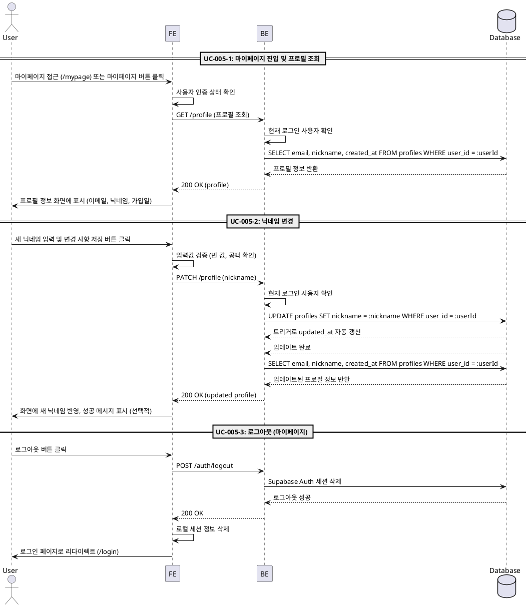

# UC-005: 마이페이지

## UC-005-1: 마이페이지 진입 및 프로필 조회

### Primary Actor
로그인 사용자

### Precondition
- 사용자가 로그인 상태
- 마이페이지(`/mypage`)에 접근 가능

### Trigger
사용자가 마이페이지에 접근 또는 채팅방 목록 페이지에서 '마이페이지' 버튼 클릭

### Main Scenario
1. 사용자가 마이페이지(`/mypage`) 접근
2. FE가 사용자 인증 상태 확인
3. FE가 프로필 조회 API 요청
4. BE가 현재 로그인 사용자 정보 확인
5. BE가 데이터베이스에서 사용자 프로필 조회
   - `profiles` 테이블에서 `user_id`로 조회
   - `email`, `nickname`, `created_at` 반환
6. BE가 프로필 정보 반환
7. FE가 프로필 정보 렌더링
   - 이메일 표시
   - 현재 닉네임 표시
   - 가입일 표시
   - 새 닉네임 입력 필드 표시
   - '변경 사항 저장' 버튼 표시
   - '로그아웃' 버튼 표시

### Edge Cases
- **비로그인 상태**: 로그인 페이지(`/login`)로 리다이렉트
- **프로필 조회 실패**: "프로필 정보를 불러올 수 없습니다" 오류 메시지 표시
- **네트워크 오류**: "네트워크 연결을 확인해주세요" 메시지 표시

### Business Rules
- 로그인 사용자만 마이페이지 접근 가능
- 비로그인 시 로그인 페이지로 리다이렉트
- 이메일은 수정 불가 (읽기 전용)
- 닉네임만 수정 가능

---

## UC-005-2: 닉네임 변경

### Primary Actor
로그인 사용자

### Precondition
- 사용자가 마이페이지에 위치
- 프로필 정보가 화면에 표시되어 있음

### Trigger
사용자가 새 닉네임을 입력하고 '변경 사항 저장' 버튼 클릭

### Main Scenario
1. 사용자가 새 닉네임 입력 필드에 텍스트 입력
2. 사용자가 '변경 사항 저장' 버튼 클릭
3. FE가 입력값 유효성 검증
   - 빈 값 또는 공백만 있는지 확인
   - 최대 길이 확인 (선택적)
4. FE가 닉네임 변경 API 요청
5. BE가 현재 로그인 사용자 확인
6. BE가 데이터베이스에서 사용자 프로필의 `nickname` 필드 업데이트
   - `updated_at` 자동 갱신 (트리거)
7. BE가 업데이트된 프로필 정보 반환
8. FE가 화면에 표시된 현재 닉네임을 새 닉네임으로 갱신
9. FE가 성공 메시지 표시 (선택적)
10. FE가 새 닉네임 입력 필드 초기화 (선택적)

### Edge Cases
- **빈 값 입력**: "닉네임을 입력해주세요" 메시지 표시
- **공백만 입력**: "유효한 닉네임을 입력해주세요" 메시지 표시
- **최대 길이 초과 (선택적)**: "닉네임은 {N}자 이하로 입력해주세요" 메시지 표시
- **업데이트 실패**: "닉네임 변경에 실패했습니다" 오류 메시지 표시
- **네트워크 오류**: "네트워크 연결을 확인해주세요" 메시지 표시

### Business Rules
- 닉네임은 필수 입력 (빈 값 불가)
- 닉네임은 공백만으로 구성될 수 없음
- 최대 길이 제한 (선택적)
- 변경 성공 시 즉시 화면 갱신
- `updated_at`은 트리거로 자동 갱신

---

## UC-005-3: 로그아웃 (마이페이지)

### Primary Actor
로그인 사용자

### Precondition
- 사용자가 로그인 상태
- 마이페이지에 위치

### Trigger
사용자가 '로그아웃' 버튼 클릭

### Main Scenario
1. 사용자가 '로그아웃' 버튼 클릭
2. FE가 Supabase Auth 로그아웃 API 호출
3. Supabase Auth가 세션 정보 삭제
4. FE가 로컬 세션 정보 삭제
5. FE가 로그인 페이지(`/login`)로 리다이렉트

### Edge Cases
- **로그아웃 실패**: "로그아웃에 실패했습니다" 오류 메시지 표시, 상태 유지
- **네트워크 오류**: "네트워크 연결을 확인해주세요" 메시지 표시

### Business Rules
- 로그아웃 성공 시 로그인 페이지로 이동
- 세션 정보 완전히 삭제
- 마이페이지에서 로그아웃 시 로그인 페이지로 리다이렉트 (채팅방 목록 페이지와 다른 동작)

---

## Sequence Diagram

